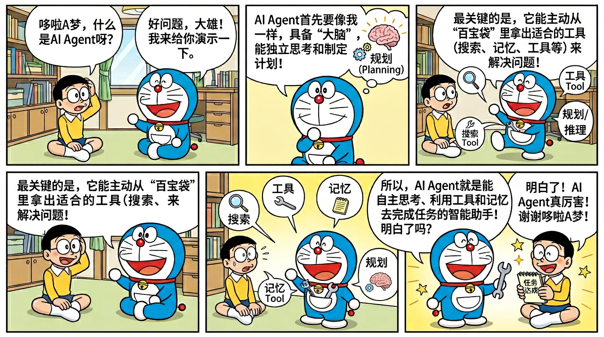

# 01 - 什么是 AI Agent

> 🎯 **本章目标**：理解 AI Agent 的核心概念、与 LLM 的本质区别、核心三要素、ReAct 框架，以及主流 Agent 框架对比。这是面试中最基础也最重要的一章。

---

## 目录

- [1.1 AI Agent 的定义](#11-ai-agent-的定义)
- [1.2 LLM vs AI Agent：本质区别](#12-llm-vs-ai-agent本质区别)
- [1.3 Agent 核心三要素](#13-agent-核心三要素)
- [1.4 ReAct 框架详解](#14-react-框架详解)
- [1.5 Agent 工作流程](#15-agent-工作流程)
- [1.6 主流 Agent 框架对比](#16-主流-agent-框架对比)
- [1.7 Agent 的发展历史](#17-agent-的发展历史)
- [1.8 面试话术](#18-面试话术)
- [1.9 面试常考点总结](#19-面试常考点总结)
- [1.10 练习题与思考题](#110-练习题与思考题)

---



*哆啦A梦带你理解 AI Agent：能自主思考、使用工具的智能助手*

## 1.1 AI Agent 的定义

### 什么是 AI Agent？

**AI Agent（智能体/智能代理）** 是一个以大语言模型（LLM）为"大脑"，能够**自主感知环境、制定计划、执行行动并根据反馈迭代调整**的智能系统。

用一句话概括：

> **AI Agent = LLM（大脑）+ Planning（规划）+ Memory（记忆）+ Tool Use（工具使用）**

### 形象类比

想象一个优秀的私人助理：

| 角色 | AI Agent 中的对应 |
|------|-------------------|
| 大脑/智商 | LLM（如 GPT-4、Claude、DeepSeek） |
| 思考和计划能力 | Planning（规划能力） |
| 记事本/记忆 | Memory（短期和长期记忆） |
| 手和工具 | Tool Use（调用 API、搜索、写代码等） |
| 眼睛和耳朵 | 感知层（接收用户输入和环境信息） |

### 学术定义

从学术角度，AI Agent 的概念最早源于人工智能和认知科学领域：

- **Russell & Norvig (2020)**：Agent 是通过传感器（sensors）感知环境并通过执行器（actuators）作用于环境的实体。
- **Wooldridge & Jennings (1995)**：Agent 具有自治性（autonomy）、社会性（social ability）、反应性（reactivity）和主动性（pro-activeness）。
- **LLM-based Agent (2023-)**：以大语言模型为核心推理引擎的新一代智能体，通过自然语言理解和生成来实现感知、规划和行动。

### Agent 的四大特征

```
┌─────────────────────────────────────────────────┐
│              AI Agent 四大特征                    │
├─────────────────────────────────────────────────┤
│                                                 │
│  1. 自主性 (Autonomy)                            │
│     → 不需要人类逐步指令，自主决策执行              │
│                                                 │
│  2. 反应性 (Reactivity)                          │
│     → 能感知环境变化并实时响应                     │
│                                                 │
│  3. 主动性 (Pro-activeness)                      │
│     → 能主动采取行动以达成目标                     │
│                                                 │
│  4. 社会性 (Social Ability)                      │
│     → 能与其他 Agent 或人类交互协作                │
│                                                 │
└─────────────────────────────────────────────────┘
```

### 不同维度理解 Agent

**从产品角度**：AI Agent 是一种能完成复杂任务的 AI 应用，用户给出目标后，Agent 自动分解任务、调用工具、生成结果。

**从技术角度**：AI Agent 是一个围绕 LLM 构建的系统，增加了记忆管理、工具调用、任务规划等模块，使 LLM 从"回答问题"升级为"解决问题"。

**从面试角度**：理解 Agent 不是一个单一模型，而是一个**系统架构**。这个架构以 LLM 为核心，通过模块化设计实现自主决策和行动。

---

## 1.2 LLM vs AI Agent：本质区别

这是面试中**最常问**的问题之一。很多面试官会直接问："LLM 和 Agent 有什么区别？"

### 核心区别一览表

| 维度 | LLM（大语言模型） | AI Agent（智能体） |
|------|-------------------|-------------------|
| **本质** | 语言模型，文本生成器 | 自主决策系统 |
| **能力** | 理解和生成文本 | 感知、规划、执行、反思 |
| **交互方式** | 单轮问答或多轮对话 | 自主循环，多步骤任务 |
| **是否有记忆** | 仅上下文窗口内 | 有短期记忆 + 长期记忆 |
| **能否使用工具** | 原生不能（需 Function Calling） | 可以调用各种外部工具 |
| **能否行动** | 只能生成文本 | 可以执行操作（发邮件、写文件等） |
| **任务复杂度** | 单步或简单多步 | 复杂多步骤任务 |
| **错误处理** | 无自我纠错机制 | 可根据反馈自我修正 |
| **主动性** | 被动响应 | 可主动发起行动 |
| **类比** | 一个知识渊博的大脑 | 一个有手有脚有记忆的人 |

### 形象对比

```
LLM（纯模型）:
用户: "帮我查一下北京今天天气"
LLM:  "我无法访问实时天气数据，但你可以通过..."  ← 只能生成文本

AI Agent:
用户: "帮我查一下北京今天天气"
Agent 思考: 我需要查询天气 → 调用天气 API → 获取结果 → 整理返回
Agent: "北京今天晴，气温 22°C，东北风 3-4 级，适合外出。" ← 实际行动了
```

### 关键区分点

**1. Agent 有"行动力"**

LLM 只是一个"大脑"，它只能思考和说话。而 Agent 有"手"——它可以调用工具、访问数据库、发送消息、操作文件系统。

**2. Agent 有"记忆"**

LLM 的"记忆"仅限于上下文窗口（如 128K tokens），窗口之外的信息就丢失了。Agent 有专门的记忆模块：
- **短期记忆**：当前对话的上下文
- **长期记忆**：跨会话持久化的信息（如 Nanobot 的 MEMORY.md）

**3. Agent 能"自主决策循环"**

LLM 是一问一答的模式。Agent 则进入一个自主循环：

```
观察(Observe) → 思考(Think) → 行动(Act) → 观察结果 → 继续思考 → ...
```

这个循环会一直持续，直到任务完成或达到最大迭代次数。

**4. Agent 能"分解任务"**

给 LLM 一个复杂任务，它可能一次性给出一个粗糙的答案。而 Agent 会把复杂任务拆解为子任务，逐步执行：

```
任务：帮我写一份项目调研报告

Agent 的处理方式：
1. 分析任务需求 → 确定报告结构
2. 搜索相关资料 → 调用搜索工具
3. 阅读和整理信息 → 总结关键点
4. 撰写报告初稿 → 生成文档
5. 检查和修改 → 自我审查
6. 返回最终报告
```

### 面试回答模板

> "LLM 本质上是一个文本生成模型，它只能根据输入生成输出文本。而 AI Agent 是以 LLM 为核心构建的自主决策系统。Agent 在 LLM 之上增加了三个关键能力：第一是 Planning，能自主分解和规划任务；第二是 Memory，有独立的记忆系统来持久化信息；第三是 Tool Use，能调用外部工具来执行真实操作。简单来说，LLM 是大脑，Agent 是一个有大脑、有记忆、有手脚的完整系统。"

---

## 1.3 Agent 核心三要素

AI Agent 的核心能力可以概括为三大要素。这个框架最早由 Lilian Weng 在其 2023 年的经典博文 *"LLM Powered Autonomous Agents"* 中系统总结。

```
                    ┌──────────────┐
                    │   LLM 大脑   │
                    └──────┬───────┘
                           │
            ┌──────────────┼──────────────┐
            │              │              │
     ┌──────▼──────┐ ┌────▼─────┐ ┌──────▼──────┐
     │  Planning   │ │  Memory  │ │  Tool Use   │
     │   (规划)    │ │  (记忆)  │ │ (工具使用)  │
     └─────────────┘ └──────────┘ └─────────────┘
```

### 1.3.1 Planning（规划）

**定义**：Agent 将复杂任务分解为可管理的子任务，并制定执行计划的能力。

**两种核心规划策略**：

#### (a) 任务分解（Task Decomposition）

将一个大任务分解为多个小任务，有以下常见策略：

| 策略 | 描述 | 示例 |
|------|------|------|
| **Chain of Thought (CoT)** | 逐步推理 | "让我一步步思考..." |
| **Tree of Thoughts (ToT)** | 探索多条推理路径 | 生成多个方案，选最优 |
| **Plan and Solve** | 先制定整体计划再执行 | 列出步骤1-5，然后逐步执行 |
| **ReAct** | 推理和行动交替 | 思考→行动→观察→思考→... |

**具体示例**：

```
用户任务："帮我分析竞品公司的最新财报并生成对比报告"

Agent 的任务分解：
├── 子任务1: 搜索目标公司的最新财报
│   ├── 1.1 确定搜索关键词
│   ├── 1.2 调用搜索工具
│   └── 1.3 下载财报PDF
├── 子任务2: 解析财报数据
│   ├── 2.1 提取收入数据
│   ├── 2.2 提取利润数据
│   └── 2.3 提取关键指标
├── 子任务3: 生成对比分析
│   ├── 3.1 计算同比变化
│   ├── 3.2 对比各公司数据
│   └── 3.3 生成图表描述
└── 子任务4: 撰写报告
    ├── 4.1 编写摘要
    ├── 4.2 编写正文
    └── 4.3 编写结论
```

#### (b) 反思与改进（Reflection & Refinement）

Agent 能对自己的行动结果进行评估和反思：

- **Self-Reflection**：LLM 评估自己的输出质量
- **Reflexion**：从失败中学习，将错误经验存入记忆
- **Chain of Hindsight**：回顾过去的决策，优化未来策略

```
执行结果不理想
    ↓
反思：哪一步出了问题？
    ↓
调整计划：修改搜索策略/换一个工具
    ↓
重新执行
    ↓
检查结果是否满意
```

### 1.3.2 Memory（记忆）

**定义**：Agent 存储和检索信息的能力，使其能在交互中保持上下文，并从历史经验中学习。

#### 记忆类型对比

| 记忆类型 | 描述 | 特点 | 实现方式 |
|----------|------|------|----------|
| **感觉记忆** | 原始输入的短暂保持 | 极短暂，几秒 | 用户输入的 raw text |
| **短期记忆/工作记忆** | 当前任务的上下文 | 有限容量，对应上下文窗口 | LLM 的上下文窗口 |
| **长期记忆** | 跨会话持久化信息 | 理论上无限 | 外部存储（文件/向量库/数据库） |

#### 长期记忆的实现方式

```
┌──────────────────────────────────────────────┐
│              长期记忆实现方案                   │
├──────────────────────────────────────────────┤
│                                              │
│  1. 文件存储（Nanobot 方案）                   │
│     MEMORY.md → 结构化的长期记忆               │
│     HISTORY.md → 完整的交互历史                │
│                                              │
│  2. 向量数据库                                │
│     存储 embedding，语义检索                   │
│     如 Pinecone、Milvus、Chroma               │
│                                              │
│  3. 知识图谱                                  │
│     实体-关系存储                              │
│     结构化知识表示                              │
│                                              │
│  4. 关系型数据库                               │
│     适合结构化数据存储                          │
│     如 PostgreSQL、SQLite                     │
│                                              │
└──────────────────────────────────────────────┘
```

#### Nanobot 的记忆系统（预览）

Nanobot 采用了简洁而优雅的双文件记忆方案：

```markdown
# MEMORY.md（长期记忆）
- 用户偏好：喜欢简洁回答，常用 Python
- 项目信息：正在开发电商后台系统
- 重要决策：数据库选择 PostgreSQL

# HISTORY.md（交互历史）
## 2026-04-01 10:30
用户请求分析代码性能问题...
Agent 使用 profiling 工具定位到瓶颈...
```

这种设计的优雅之处在于：
- 完全透明，用户可以直接查看和编辑记忆文件
- 无需额外的向量数据库等基础设施
- 以 Workspace 为中心，自然隔离不同项目的记忆

### 1.3.3 Tool Use（工具使用）

**定义**：Agent 调用外部工具和 API 来扩展自身能力的机制。

这是 Agent 和纯 LLM 的**最关键区别**——LLM 的知识有截止日期，不能上网搜索，不能操作文件，不能执行代码。而 Agent 通过工具调用获得了"行动力"。

#### 常见工具类型

| 工具类型 | 描述 | 示例 |
|----------|------|------|
| **信息检索** | 获取外部信息 | 搜索引擎、数据库查询、API 调用 |
| **代码执行** | 运行代码 | Python 解释器、Shell 命令 |
| **文件操作** | 读写文件 | 读取 PDF、写入 CSV、创建文档 |
| **通信工具** | 发送消息 | 邮件、Slack、飞书消息 |
| **专业工具** | 领域特定 | 图像生成、数据分析、翻译 |

#### 工具调用流程

```
1. LLM 理解用户意图
2. LLM 决定需要调用哪个工具
3. LLM 生成工具调用参数（JSON 格式）
4. 系统执行工具调用
5. 将工具返回结果提供给 LLM
6. LLM 根据结果继续推理或返回用户
```

#### 工具调用的实现方式

**Function Calling（原生 LLM 能力）**：
```json
{
  "name": "get_weather",
  "arguments": {
    "city": "北京",
    "date": "2026-04-02"
  }
}
```

**MCP 协议（标准化方案）**：

MCP（Model Context Protocol）是 Anthropic 提出的工具调用标准化协议，让工具可以跨不同 Agent 框架复用。Nanobot 原生支持 MCP。（详见第 5 章）

#### 面试中关于工具使用的常见问题

**Q: Agent 怎么知道该调用哪个工具？**

> A: 在 Agent 系统中，所有可用工具的描述（名称、功能、参数）会作为 system prompt 的一部分提供给 LLM。LLM 根据用户意图和工具描述，决定调用哪个工具并生成相应参数。这本质上是一个"函数选择"问题，LLM 通过理解自然语言描述来匹配最合适的工具。

**Q: 如果 Agent 调用工具出错了怎么办？**

> A: 好的 Agent 框架有错误处理机制。工具调用失败后，错误信息会返回给 LLM，LLM 会分析错误原因（如参数错误、权限不足），然后决定是修改参数重试、换一个工具，还是向用户报告错误。在 Nanobot 中，工具执行结果（包括错误）都会返回给 AgentRunner，由 LLM 决定下一步行动。

---

## 1.4 ReAct 框架详解

### 什么是 ReAct？

**ReAct = Reasoning + Acting**

ReAct 框架是 2022 年由 Yao et al. 在论文 *"ReAct: Synergizing Reasoning and Acting in Language Models"* 中提出的，它将推理（Reasoning）和行动（Acting）交替进行，是目前大多数 Agent 框架采用的核心范式。

### 为什么 ReAct 重要？

在 ReAct 之前，有两种主流方法：

1. **纯推理（Reasoning Only）**：如 Chain-of-Thought，LLM 只是在内部推理，不与外部世界交互
2. **纯行动（Acting Only）**：如简单的工具调用链，没有推理和反思

ReAct 将两者结合，让 Agent 在推理的同时能采取行动，并根据行动结果更新推理。

### ReAct 循环流程

```
┌──────────────────────────────────────────────────────────┐
│                    ReAct 循环流程                          │
│                                                          │
│   ┌──────────┐     ┌──────────┐     ┌──────────┐        │
│   │ Thought  │────→│  Action  │────→│Observation│        │
│   │  (思考)  │     │  (行动)  │     │  (观察)  │        │
│   └──────────┘     └──────────┘     └────┬─────┘        │
│        ↑                                  │              │
│        └──────────────────────────────────┘              │
│                                                          │
│   循环直到: 任务完成 / 达到最大迭代次数                      │
└──────────────────────────────────────────────────────────┘
```

### 详细示例

**用户请求**："帮我查一下 Apple 的最新股价，并告诉我最近一个月的涨跌情况"

```
=== 第 1 轮 ===
Thought: 用户想知道 Apple 的股价信息。我需要先查询 Apple 的当前股价，
         股票代码是 AAPL。我应该调用股票查询工具。

Action: search_stock(symbol="AAPL")

Observation: AAPL 当前股价 $245.32，今日涨幅 +1.2%

=== 第 2 轮 ===
Thought: 我已经获得了当前股价。接下来需要查询最近一个月的历史数据
         来分析涨跌情况。

Action: get_stock_history(symbol="AAPL", period="1month")

Observation: 一个月前价格 $231.50，最高 $248.90，最低 $225.10

=== 第 3 轮 ===
Thought: 现在我有了所有需要的数据。让我计算并整理结果：
         - 当前: $245.32
         - 一个月前: $231.50
         - 涨幅: (245.32-231.50)/231.50 = 5.97%
         - 月内最高: $248.90
         - 月内最低: $225.10
         我可以给用户一个完整的回答了。

Action: [返回最终答案给用户]

Final Answer: "Apple (AAPL) 当前股价 $245.32。
近一个月涨幅约 5.97%（从 $231.50 上涨至 $245.32）。
期间最高触及 $248.90，最低回落至 $225.10。整体呈上涨趋势。"
```

### ReAct 在 Nanobot 中的体现

Nanobot 的 `AgentRunner` 本质上实现了 ReAct 循环：

```python
# 简化的 ReAct 循环（伪代码）
for iteration in range(max_iterations):  # 最多 40 次
    # Thought + Action: LLM 思考并决定行动
    response = provider.chat_with_retry(messages)
    
    if response.has_tool_calls:
        # Action: 执行工具调用
        results = tool_registry.execute(response.tool_calls)
        # Observation: 将结果加入对话历史
        messages.append(tool_results_to_message(results))
    else:
        # 没有工具调用，说明 LLM 认为任务完成
        break
```

### ReAct vs 其他范式对比

| 范式 | 描述 | 优点 | 缺点 |
|------|------|------|------|
| **CoT (Chain-of-Thought)** | 纯推理链 | 推理能力强 | 无法与外界交互 |
| **Act-Only** | 直接行动 | 简单直接 | 缺乏推理和反思 |
| **ReAct** | 推理+行动交替 | 兼具推理和行动 | 可能过度推理 |
| **Plan-then-Act** | 先整体规划再执行 | 全局视角 | 计划可能与实际脱节 |
| **Reflexion** | ReAct + 自我反思 | 能从错误中学习 | 增加了延迟和成本 |

### 面试重点

> **面试官问："请解释 ReAct 框架"**
>
> 回答："ReAct 是 Reasoning + Acting 的缩写，核心思想是让 AI Agent 在推理（Thought）和行动（Action）之间交替循环。每一轮，LLM 先根据当前状态进行推理（Thought），决定下一步该做什么；然后执行具体行动（Action），比如调用工具；接着观察行动结果（Observation）；再进入下一轮推理。这个循环持续进行，直到任务完成或达到最大迭代次数。Nanobot 的 AgentRunner 就是一个经典的 ReAct 循环实现，默认最多迭代 40 次。"

---

## 1.5 Agent 工作流程

### 完整的 Agent 工作流程

下面描述一个典型 AI Agent 从接收用户输入到返回结果的完整流程：

```
┌─────────────────────────────────────────────────────────────┐
│                    Agent 完整工作流程                         │
│                                                             │
│  ┌─────────┐                                                │
│  │ 用户输入 │  "帮我分析这段代码的性能问题"                     │
│  └────┬────┘                                                │
│       ↓                                                     │
│  ┌─────────────────────────────┐                            │
│  │ 1. 感知层 (Perception)      │                            │
│  │    - 接收用户消息            │                            │
│  │    - 解析意图                │                            │
│  │    - 加载上下文              │                            │
│  └────────────┬────────────────┘                            │
│               ↓                                             │
│  ┌─────────────────────────────┐                            │
│  │ 2. 记忆检索 (Memory)        │                            │
│  │    - 读取长期记忆            │                            │
│  │    - 加载历史对话            │                            │
│  │    - 获取相关上下文          │                            │
│  └────────────┬────────────────┘                            │
│               ↓                                             │
│  ┌─────────────────────────────┐                            │
│  │ 3. 规划 (Planning)          │                            │
│  │    - 分析任务需求            │                            │
│  │    - 分解子任务              │                            │
│  │    - 选择工具                │                            │
│  └────────────┬────────────────┘                            │
│               ↓                                             │
│  ┌─────────────────────────────┐  ←─── 迭代循环             │
│  │ 4. 执行 (Execution)         │       (ReAct)              │
│  │    - 调用工具                │                            │
│  │    - 处理结果                │                            │
│  │    - 自我评估                │                            │
│  └────────────┬────────────────┘                            │
│               ↓                                             │
│  ┌─────────────────────────────┐                            │
│  │ 5. 记忆更新 (Memory Update) │                            │
│  │    - 保存重要信息            │                            │
│  │    - 更新交互历史            │                            │
│  └────────────┬────────────────┘                            │
│               ↓                                             │
│  ┌─────────────────────────────┐                            │
│  │ 6. 响应生成 (Response)      │                            │
│  │    - 整理执行结果            │                            │
│  │    - 生成自然语言回答        │                            │
│  │    - 返回给用户              │                            │
│  └─────────────────────────────┘                            │
│                                                             │
└─────────────────────────────────────────────────────────────┘
```

### 在 Nanobot 中的具体实现

```
用户消息 → Channel(Telegram/Discord/...) → MessageBus(Inbound Queue)
    → AgentLoop.run() 消费消息
    → ContextBuilder 构建 system prompt + 历史消息
    → AgentRunner 进入 ReAct 循环
        → Provider(LLM) 生成响应
        → ToolRegistry 执行工具调用
        → 将结果加入消息列表
        → 继续循环或结束
    → MemoryStore 保存记忆
    → MessageBus(Outbound Queue) → Channel → 用户
```

---

## 1.6 主流 Agent 框架对比

### 框架对比总览

| 维度 | **Nanobot** | **LangChain** | **CrewAI** | **AutoGPT** | **OpenClaw** |
|------|-------------|---------------|------------|-------------|--------------|
| **开发者** | 香港大学 HKUDS | Harrison Chase | João Moura | Toran Richards | 清华系团队 |
| **语言** | Python | Python/JS | Python | Python | Python |
| **代码量** | ~4,000 行 | ~50 万行 | ~3 万行 | ~10 万行 | ~43 万行 |
| **GitHub Stars** | 37K+ | 100K+ | 25K+ | 170K+ | 15K+ |
| **核心定位** | 超轻量级个人 Agent | Agent 开发框架/工具链 | 多 Agent 协作 | 自主通用 AI | 全栈 Agent 平台 |
| **MCP 支持** | 原生支持 | 通过扩展 | 有限 | 无原生支持 | 支持 |
| **记忆系统** | 文件系统(MEMORY.md) | 多种后端 | 内置 | 内置 | 多模态记忆 |
| **多平台** | 8+ 平台 | 需自行集成 | 无 | Web UI | 有限 |
| **学习曲线** | 低 | 高 | 中 | 中 | 高 |
| **适用场景** | 个人助理/小团队 | 复杂 AI 应用 | 多Agent协作 | 自主任务 | 企业级 |
| **首次发布** | 2026年2月 | 2022年10月 | 2023年12月 | 2023年3月 | 2025年 |

### 详细分析

#### Nanobot（本项目重点）

**优势**：
- 代码极简（~4000 行），一个周末就能读完全部源码
- 架构清晰，非常适合学习 Agent 设计思想
- MCP 原生支持，紧跟技术趋势
- 多平台支持（微信、飞书、钉钉、Telegram 等），接地气
- MIT 开源，无商业限制

**局限**：
- 单 Agent 为主，多 Agent 协作能力有限
- 生态不如 LangChain 丰富
- 发布时间较短，社区还在成长

#### LangChain

**优势**：
- 生态最丰富，几乎所有 LLM 和工具都有集成
- 文档详尽，社区庞大
- LCEL (LangChain Expression Language) 灵活强大

**局限**：
- 代码量大，抽象层过多，学习曲线陡峭
- "胶水代码"感重，过度封装
- 性能开销大

#### CrewAI

**优势**：
- 多 Agent 协作是其强项
- 角色定义直观
- 与 LangChain 集成好

**局限**：
- 单 Agent 场景下过于复杂
- 依赖 LangChain 生态

#### AutoGPT

**优势**：
- 先驱项目，引领了 Agent 热潮
- 完全自主运行的理念

**局限**：
- 实际可靠性有限
- Token 消耗大
- 容易陷入循环

### 面试推荐说法

> "我学习过多个 Agent 框架，重点研究了 Nanobot。选择 Nanobot 的原因有三：第一，它只有 4000 行 Python 代码，便于深入理解 Agent 的核心设计思想，而不是被框架的复杂抽象所困扰；第二，它虽然轻量但五脏俱全——记忆系统、MCP 协议、多平台支持、子 Agent 机制一应俱全；第三，它是 2026 年的新项目，代表了 Agent 框架设计的最新趋势。"

---

## 1.7 Agent 的发展历史

### AI Agent 发展时间线（2023-2026）

```
2023
├── 03月  AutoGPT 发布，引爆 AI Agent 热潮
├── 04月  BabyAGI 发布，简约 Agent 设计
├── 06月  Lilian Weng 发表 "LLM Powered Autonomous Agents"
│         → 系统定义了 Planning + Memory + Tool Use 三要素
├── 07月  MetaGPT 发布，多 Agent 软件开发
├── 10月  LangChain 发布 LangGraph
├── 11月  OpenAI 发布 GPTs（自定义 Agent）
└── 12月  CrewAI 发布，聚焦多 Agent 协作

2024
├── 01月  OpenAI 发布 Assistants API（内置工具调用）
├── 03月  Devin AI 发布（AI 软件工程师），引发 Agent 应用热潮
├── 05月  Claude 3 发布，强推理能力推动 Agent 发展
├── 06月  Function Calling 成为 LLM 标配
├── 08月  Cursor / Windsurf 等 AI IDE 爆火
├── 11月  Anthropic 发布 MCP 协议
│         → 定义了 AI 工具调用的标准化协议
└── 12月  Agent 框架百花齐放，生态日趋成熟

2025
├── 01月  OpenAI 发布 Operator（Web Agent）
├── 03月  MCP 协议被广泛采用
│         → OpenAI、Google、Microsoft 纷纷支持
├── 05月  Claude 3.5 的 Computer Use 推动 GUI Agent
├── 06月  企业级 Agent 平台兴起
├── 09月  多模态 Agent 成为趋势
└── 12月  Agent 在企业中规模落地

2026
├── 01月  Agent 成为 AI 应用主流范式
├── 02月  HKUDS/nanobot 发布 ← 我们学习的项目
│         → 超轻量级 Agent 框架，迅速获得 37K+ Stars
├── 03月  MCP 生态全面成熟
│         → 各类 MCP Server 生态丰富
└── 04月  你正在学习本指南！
```

### 关键里程碑解读

**2023：Agent 元年**
- AutoGPT 的发布标志着 LLM-based Agent 的诞生
- 学术界和工业界开始系统研究 Agent 架构

**2024：标准化之年**
- MCP 协议的发布是里程碑事件，解决了工具调用标准化问题
- Function Calling 成为 LLM 标配，Agent 有了更可靠的工具调用基础

**2025：落地之年**
- Agent 从概念验证走向生产落地
- 企业开始大规模采用 Agent 解决方案

**2026：成熟之年**
- Agent 成为 AI 应用的主流范式
- 框架设计趋于收敛，Nanobot 代表了"极简而完整"的设计哲学

---

## 1.8 面试话术

### 话术一：30 秒解释什么是 AI Agent

> "AI Agent 就是给大语言模型装上了'手脚和记忆'的智能系统。普通的 LLM 只能根据输入生成文本，就像一个只有大脑的人。而 Agent 在 LLM 之上增加了三个核心能力：规划（Planning）——把复杂任务分解成一步步的计划；记忆（Memory）——能记住之前交互的重要信息；工具使用（Tool Use）——能调用搜索引擎、执行代码、访问数据库等外部工具。这三个能力让 Agent 能够自主完成复杂任务，而不仅仅是回答问题。"

### 话术二：为什么 Agent 是 AI 的未来方向

> "单纯的 LLM 就像一个百科全书，能回答问题但不能帮你做事。Agent 则是能实际解决问题的 AI 系统。举个例子，你问 LLM '帮我订明天去上海的机票'，它只会告诉你怎么操作。但 Agent 可以真正地去搜索航班、比价、帮你下单。这种从'问答'到'行动'的转变，就是 Agent 的核心价值。从产业趋势看，各大公司都在布局 Agent，OpenAI 的 Operator、Google 的 Project Astra、还有我学习的 Nanobot 框架，都是这个方向的代表。"

### 话术三：解释你选择学习 Nanobot 的原因

> "我选择深入学习 Nanobot 框架，主要有三个原因。第一是'以小见大'，Nanobot 只有 4000 行 Python 代码，但它的架构设计涵盖了消息总线、AgentLoop、记忆系统、MCP 协议支持、多平台适配等所有核心模块，非常适合深入理解 Agent 的设计思想。第二是技术前沿性，它原生支持 MCP 协议，这是 2024 年 Anthropic 提出的工具调用标准化协议，代表了 Agent 技术的最新方向。第三是实用性，它支持微信、飞书、钉钉等国内平台，我可以直接用它搭建实际可用的 AI 助手。"

---

## 1.9 面试常考点总结

### 高频考点清单

| 编号 | 考点 | 考察频率 | 难度 |
|------|------|----------|------|
| 1 | LLM 和 Agent 的区别 | ⭐⭐⭐⭐⭐ | 低 |
| 2 | Agent 核心三要素 | ⭐⭐⭐⭐⭐ | 低 |
| 3 | ReAct 框架原理 | ⭐⭐⭐⭐ | 中 |
| 4 | Agent 的记忆系统设计 | ⭐⭐⭐⭐ | 中 |
| 5 | 工具调用的实现机制 | ⭐⭐⭐⭐ | 中 |
| 6 | Agent 框架对比 | ⭐⭐⭐ | 中 |
| 7 | Agent 的安全问题 | ⭐⭐⭐ | 高 |
| 8 | 多 Agent 协作 | ⭐⭐⭐ | 高 |
| 9 | Agent 的评测方法 | ⭐⭐ | 高 |
| 10 | Agent 的商业应用场景 | ⭐⭐⭐ | 低 |

### 必须能回答的 5 个问题

**Q1: 什么是 AI Agent？和 LLM 有什么区别？**

> 参考答案见 [1.1 节](#11-ai-agent-的定义) 和 [1.2 节](#12-llm-vs-ai-agent本质区别)

**Q2: Agent 的核心三要素是什么？分别是如何实现的？**

> 参考答案见 [1.3 节](#13-agent-核心三要素)

**Q3: 请解释 ReAct 框架的原理和工作流程。**

> 参考答案见 [1.4 节](#14-react-框架详解)

**Q4: 你了解哪些 Agent 框架？它们各有什么特点？**

> 参考答案见 [1.6 节](#16-主流-agent-框架对比)

**Q5: Agent 的记忆系统是怎么设计的？**

> 核心回答思路：分为短期记忆（上下文窗口）和长期记忆（外部存储）。短期记忆利用 LLM 的上下文窗口，但容量有限；长期记忆需要外部存储方案，如 Nanobot 的文件系统方案（MEMORY.md），或者向量数据库方案。好的记忆系统需要解决信息存储、检索、压缩和更新等问题。

---

## 1.10 练习题与思考题

### 基础题（确认理解）

**1. 填空题**

AI Agent 的核心三要素是 ______、______ 和 ______。

> 答案：Planning（规划）、Memory（记忆）、Tool Use（工具使用）

**2. 判断题**

"AI Agent 就是一个更强大的大语言模型。"这句话对吗？为什么？

> 答案：不对。Agent 不是一个模型，而是一个以 LLM 为核心的系统架构。它在 LLM 之上增加了规划、记忆和工具使用等模块。

**3. 简答题**

请用自己的话解释 ReAct 框架中 Thought、Action、Observation 三个步骤分别做什么。

### 进阶题（加深理解）

**4. 对比分析**

请对比 Nanobot 和 LangChain 的设计哲学差异。提示：从代码量、架构风格、目标用户三个维度分析。

> 思路：
> - Nanobot：极简（4000行）、Workspace 为中心、个人开发者
> - LangChain：全面（50万行+）、抽象层丰富、企业开发者
> - 核心差异：Nanobot 追求"够用就好"，LangChain 追求"无所不能"

**5. 设计题**

如果你要设计一个 Agent 的记忆系统，你会如何设计？请考虑以下问题：
- 如何决定哪些信息需要记住？
- 如何处理记忆容量限制？
- 如何在后续对话中检索相关记忆？

> 思路提示：可以参考 Nanobot 的方案（虚拟工具 save_memory + MEMORY.md），也可以设计向量数据库方案。关键是要考虑"存什么"、"怎么存"、"怎么取"三个问题。

**6. 场景题**

一个用户说："帮我调研一下 2026 年最受欢迎的 5 个 Python Web 框架，写一份对比报告。"

请描述一个 Agent 如何用 ReAct 框架处理这个任务，列出每一轮的 Thought、Action 和 Observation。

### 思考题（开放讨论）

**7.** 你认为 AI Agent 目前面临的最大挑战是什么？（可靠性？安全性？成本？）

**8.** 为什么 Nanobot 能用 4000 行代码实现其他框架数万行甚至数十万行才能实现的功能？这说明了什么设计原则？

**9.** 如果 Agent 在执行任务的过程中做出了错误的决策（比如调用了错误的工具），Agent 系统应该如何处理？

**10.** MCP 协议的出现会对 Agent 生态产生什么影响？是否会让不同 Agent 框架趋于同质化？

---

## 下一章

准备好了吗？让我们进入下一章，深入了解 Nanobot 项目本身。

➡️ [02 - Nanobot 项目概览](../02-nanobot-overview/README.md)

---

> 📝 **本章小结**：AI Agent 是以 LLM 为核心、具备规划、记忆和工具使用能力的自主决策系统。ReAct 框架（Reasoning + Acting）是大多数 Agent 的核心运行范式。理解这些基础概念，是学习任何 Agent 框架的前提。
