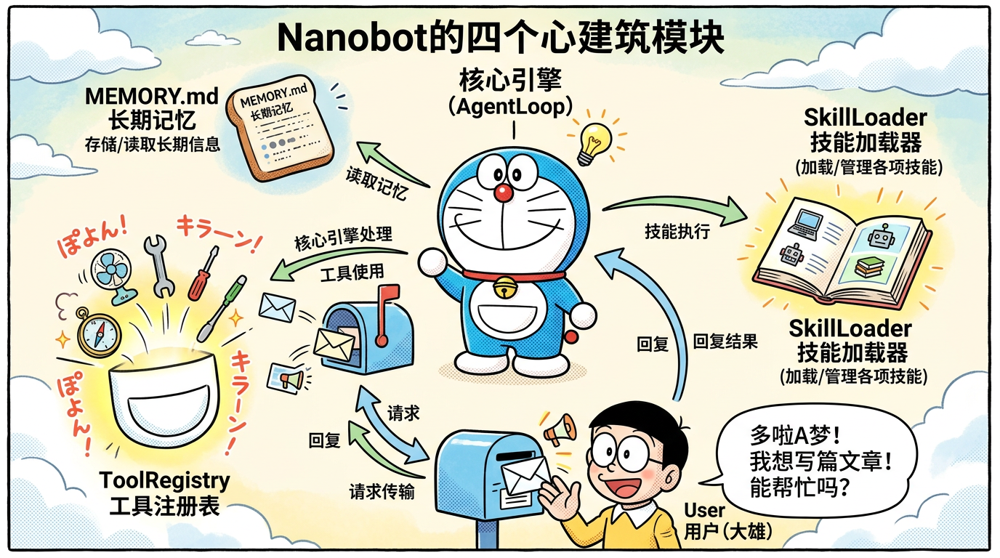

# 03 - 架构深入解析

> 🎯 **本章目标**：深入理解 Nanobot 的五层架构、四大核心模块、数据流以及 10 个关键设计模式。这一章是面试中展现"技术深度"的核心素材。

---

## 目录

- [3.1 整体架构概览](#31-整体架构概览)
- [3.2 四大核心模块详解](#32-四大核心模块详解)
- [3.3 数据流图](#33-数据流图)
- [3.4 模块间的协作关系](#34-模块间的协作关系)
- [3.5 关键设计模式](#35-关键设计模式)
- [3.6 架构对比](#36-架构对比)
- [3.7 面试高频题](#37-面试高频题)
- [3.8 本章总结](#38-本章总结)

---

## 3.1 整体架构概览

### 五层架构

Nanobot 的架构可以清晰地划分为五个层次，从上到下分别是：

```
┌─────────────────────────────────────────────────────────────────┐
│                                                                 │
│  Layer 5: UI 层 (User Interface)                                │
│  ┌──────────┬──────────┬────────┬────────┬───────┬──────────┐  │
│  │ Telegram │ Discord  │  飞书  │  钉钉  │ 微信  │   Web    │  │
│  └────┬─────┴────┬─────┴───┬────┴───┬────┴──┬────┴────┬─────┘  │
│       │          │         │        │       │         │         │
│═══════╪══════════╪═════════╪════════╪═══════╪═════════╪═════════│
│       │          │         │        │       │         │         │
│  Layer 4: Gateway 层 (消息网关)                                  │
│  ┌─────────────────────────────────────────────────────────┐    │
│  │           ChannelManager + MessageBus                   │    │
│  │   ┌──────────────────┐  ┌──────────────────────┐       │    │
│  │   │  Inbound Queue   │  │   Outbound Queue     │       │    │
│  │   │  (用户消息入队)   │  │   (回复消息出队)      │       │    │
│  │   └────────┬─────────┘  └──────────┬───────────┘       │    │
│  └────────────┼────────────────────────┼───────────────────┘    │
│               │                        │                        │
│═══════════════╪════════════════════════╪════════════════════════│
│               │                        ↑                        │
│  Layer 3: Core Agent 层 (核心智能体)                             │
│  ┌────────────▼────────────────────────┼───────────────────┐    │
│  │                                     │                   │    │
│  │   ┌──────────────┐   ┌─────────────┴──┐                │    │
│  │   │  AgentLoop   │──→│  AgentRunner   │                │    │
│  │   │  (消息消费)   │   │  (ReAct循环)   │                │    │
│  │   └──────────────┘   └───────┬────────┘                │    │
│  │                              │                          │    │
│  │         ┌────────────────────┼────────────────┐         │    │
│  │         │                    │                │         │    │
│  │   ┌─────▼──────┐   ┌───────▼────────┐  ┌────▼─────┐  │    │
│  │   │ContextBuilder│ │  MemoryStore   │  │SubAgent  │  │    │
│  │   │(上下文构建)  │  │  (记忆管理)    │  │Manager   │  │    │
│  │   └─────────────┘  └───────────────┘  └──────────┘  │    │
│  │                                                      │    │
│  └──────────────────────────────────────────────────────┘    │
│               │                                              │
│═══════════════╪══════════════════════════════════════════════│
│               │                                              │
│  Layer 2: Provider 层 (LLM 提供者)                            │
│  ┌────────────▼──────────────────────────────────────────┐   │
│  │  ┌────────┐ ┌─────────┐ ┌────────┐ ┌──────────────┐  │   │
│  │  │ OpenAI │ │Anthropic│ │DeepSeek│ │  Ollama/...  │  │   │
│  │  └────────┘ └─────────┘ └────────┘ └──────────────┘  │   │
│  └───────────────────────────────────────────────────────┘   │
│               │                                              │
│═══════════════╪══════════════════════════════════════════════│
│               │                                              │
│  Layer 1: Tool 层 (工具执行)                                  │
│  ┌────────────▼──────────────────────────────────────────┐   │
│  │  ┌───────────────┐  ┌──────────────────────────────┐  │   │
│  │  │  Built-in Tools│  │       MCP Tools              │  │   │
│  │  │  ·MessageTool  │  │  ·MCPToolWrapper             │  │   │
│  │  │  ·SpawnTool    │  │  ·mcp_{server}_{tool}        │  │   │
│  │  │  ·save_memory  │  │  ·远程/本地 MCP Server       │  │   │
│  │  └───────────────┘  └──────────────────────────────┘  │   │
│  └───────────────────────────────────────────────────────┘   │
│                                                              │
└──────────────────────────────────────────────────────────────┘
```

### 各层职责说明

| 层次 | 名称 | 核心职责 | 关键组件 |
|------|------|----------|----------|
| **Layer 5** | UI 层 | 面向用户的交互界面 | Telegram/Discord/飞书/钉钉/微信等 Channel 适配器 |
| **Layer 4** | Gateway 层 | 消息的统一收发 | MessageBus（双队列）、ChannelManager |
| **Layer 3** | Core Agent 层 | 核心推理和决策 | AgentLoop、AgentRunner、ContextBuilder、MemoryStore、SubagentManager |
| **Layer 2** | Provider 层 | LLM 调用封装 | OpenAI/Anthropic/DeepSeek 等 Provider |
| **Layer 1** | Tool 层 | 工具注册与执行 | ToolRegistry、MCPToolWrapper、内置工具 |

### 架构设计原则

Nanobot 的架构遵循以下核心原则：

**1. 关注点分离（Separation of Concerns）**

每一层只负责自己的职责，层与层之间通过明确的接口交互。Channel 不需要知道 AgentLoop 的实现细节，AgentLoop 不需要知道消息来自哪个平台。

**2. 依赖倒置（Dependency Inversion）**

高层模块不依赖低层模块的具体实现，而是依赖抽象接口。例如 AgentRunner 不直接依赖 OpenAI SDK，而是通过 Provider 抽象层调用 LLM。

**3. 单一职责（Single Responsibility）**

每个类只负责一件事：AgentLoop 负责消息消费和会话管理，AgentRunner 负责 ReAct 循环，ContextBuilder 负责构建 prompt，MemoryStore 负责记忆读写。

---



*Nanobot 四大核心模块：AgentLoop（核心引擎）、ToolRegistry（工具注册表）、MEMORY.md（长期记忆）、SkillLoader（技能加载器）*

## 3.2 四大核心模块详解

### 3.2.1 AgentLoop（智能体循环）——核心推理引擎

AgentLoop 是 Nanobot 的"心脏"，它负责：
- 从 MessageBus 的 Inbound Queue 消费消息
- 管理会话级别的串行执行（会话锁）
- 控制全局并发数（并发闸门）
- 创建 AgentRunner 来处理每个消息
- 保存每轮对话（_save_turn）

```
┌─────────────────────────────────────────────────────────┐
│                    AgentLoop 工作机制                     │
│                                                         │
│  MessageBus (Inbound Queue)                             │
│  ┌──────────────────────────────┐                       │
│  │ msg1 │ msg2 │ msg3 │ ...    │                       │
│  └──┬───────────────────────────┘                       │
│     │                                                   │
│     ▼                                                   │
│  run() ─── 持续消费消息                                  │
│     │                                                   │
│     ├── 获取会话锁 (_session_locks)                      │
│     │   └── 确保同一会话的消息串行处理                     │
│     │                                                   │
│     ├── 获取并发闸门 (_concurrency_gate)                  │
│     │   └── 默认最多 3 个并发会话                         │
│     │                                                   │
│     ├── 创建 AgentRunner                                │
│     │   └── 传入 provider, workspace, tools 等           │
│     │                                                   │
│     ├── AgentRunner.run()                               │
│     │   └── ReAct 循环（详见 3.2.2）                     │
│     │                                                   │
│     ├── _save_turn() 持久化                              │
│     │   └── 保存到 HISTORY.md                           │
│     │                                                   │
│     └── 发送响应到 Outbound Queue                        │
│                                                         │
└─────────────────────────────────────────────────────────┘
```

**关键设计决策**：

| 决策 | 设计 | 原因 |
|------|------|------|
| 会话锁 | `_session_locks[session_id]` | 防止同一用户的多条消息并发处理导致上下文混乱 |
| 并发闸门 | `asyncio.Semaphore(3)` | 控制全局并发，防止过多请求打垮 LLM API |
| 最大迭代 | 主 Agent 40 次，子 Agent 15 次 | 防止无限循环，同时给予足够的迭代空间 |
| 工具注册 | `_register_default_tools()` | 启动时注册内置工具，支持运行时动态添加 |

### 3.2.2 AgentRunner（ReAct 循环）——迭代执行器

AgentRunner 实现了完整的 ReAct 循环，它是 Agent "思考-行动-观察" 的执行者。

```
┌─────────────────────────────────────────────────────────┐
│                 AgentRunner 执行流程                      │
│                                                         │
│  ┌─────────────────────────────────────────────┐        │
│  │            for i in range(max_iterations):  │        │
│  │                                             │        │
│  │  ┌──────────────────────┐                   │        │
│  │  │ before_iteration()   │  ← Lifecycle Hook │        │
│  │  └──────────┬───────────┘                   │        │
│  │             ↓                               │        │
│  │  ┌──────────────────────┐                   │        │
│  │  │ provider.chat_with_  │                   │        │
│  │  │ retry(messages,tools)│  ← 调用 LLM      │        │
│  │  └──────────┬───────────┘                   │        │
│  │             ↓                               │        │
│  │  ┌──────────────────────┐                   │        │
│  │  │ 有 tool_calls?       │                   │        │
│  │  └──────┬──────┬────────┘                   │        │
│  │     Yes │      │ No                         │        │
│  │         ↓      ↓                            │        │
│  │  ┌──────────┐  ┌────────────┐               │        │
│  │  │before_   │  │ 任务完成   │               │        │
│  │  │execute_  │  │ break 退出 │               │        │
│  │  │tools()   │  └────────────┘               │        │
│  │  └────┬─────┘                               │        │
│  │       ↓                                     │        │
│  │  ┌──────────────────────┐                   │        │
│  │  │ ToolRegistry.execute │                   │        │
│  │  │ (逐一执行工具调用)    │                   │        │
│  │  └──────────┬───────────┘                   │        │
│  │             ↓                               │        │
│  │  ┌──────────────────────┐                   │        │
│  │  │ 截断工具结果          │                   │        │
│  │  │ (>16000字符时截断)   │                   │        │
│  │  └──────────┬───────────┘                   │        │
│  │             ↓                               │        │
│  │  ┌──────────────────────┐                   │        │
│  │  │ after_iteration()    │  ← Lifecycle Hook │        │
│  │  └──────────┬───────────┘                   │        │
│  │             │                               │        │
│  │             └── 继续循环 ──────────→ 下一轮  │        │
│  │                                             │        │
│  └─────────────────────────────────────────────┘        │
│                                                         │
└─────────────────────────────────────────────────────────┘
```

**Lifecycle Hooks 详解**：

| Hook | 触发时机 | 用途 |
|------|----------|------|
| `before_iteration` | 每轮迭代开始前 | 可用于日志记录、状态检查 |
| `before_execute_tools` | 工具执行前 | 可用于工具调用审查、安全检查 |
| `after_iteration` | 每轮迭代结束后 | 可用于结果记录、指标统计 |

**工具结果截断**：

AgentRunner 有一个重要的优化——`_TOOL_RESULT_MAX_CHARS = 16000`。当工具返回的结果超过 16000 个字符时，会被截断。这是因为：
- 过长的工具结果会占用大量上下文窗口
- LLM 处理超长文本的效果会下降
- 可以节省 Token 成本

### 3.2.3 MemoryStore（记忆系统）——MEMORY.md + HISTORY.md

MemoryStore 管理 Nanobot 的双层记忆系统。

```
┌─────────────────────────────────────────────────────────┐
│                  记忆系统架构                              │
│                                                         │
│  ┌─────────────────────────────────────────────┐        │
│  │              MemoryStore                    │        │
│  │                                             │        │
│  │  ┌────────────────┐   ┌────────────────┐   │        │
│  │  │  read_memory() │   │  save_memory() │   │        │
│  │  │  读取MEMORY.md │   │  写入MEMORY.md │   │        │
│  │  └────────────────┘   └────────────────┘   │        │
│  │                                             │        │
│  │  ┌────────────────┐   ┌─────────────────┐  │        │
│  │  │ append_history()│  │MemoryConsolidator│  │        │
│  │  │ 追加HISTORY.md │   │ 压缩旧历史记录   │  │        │
│  │  └────────────────┘   └─────────────────┘  │        │
│  └─────────────────────────────────────────────┘        │
│                                                         │
│  ┌─────────────────┐    ┌─────────────────┐             │
│  │   MEMORY.md     │    │   HISTORY.md    │             │
│  │                 │    │                 │             │
│  │ 结构化长期记忆   │    │ 完整交互历史     │             │
│  │                 │    │                 │             │
│  │ ·用户偏好       │    │ ·时间戳         │             │
│  │ ·项目信息       │    │ ·用户消息摘要    │             │
│  │ ·重要决策       │    │ ·Agent回复摘要   │             │
│  │ ·学到的教训     │    │ ·工具调用记录    │             │
│  │                 │    │                 │             │
│  │ 由 save_memory  │    │ 自动追加        │             │
│  │ 虚拟工具触发写入 │    │ 定期压缩        │             │
│  └─────────────────┘    └─────────────────┘             │
│                                                         │
└─────────────────────────────────────────────────────────┘
```

**save_memory 虚拟工具的巧妙设计**：

`save_memory` 不是一个真正的外部工具——它不调用任何 API 或启动任何进程。当 LLM 决定调用 `save_memory` 时，AgentRunner 直接在内部拦截这个调用，将内容写入 MEMORY.md 文件。

这种"虚拟工具"设计的好处：
- 对 LLM 来说，它和其他工具没有区别（统一的调用接口）
- 执行效率高（无网络开销）
- 实现简单（直接文件 I/O）

**MemoryConsolidator 压缩机制**：

当 HISTORY.md 增长到一定大小时，MemoryConsolidator 会：
1. 读取较旧的历史记录
2. 使用 LLM 生成压缩摘要
3. 用摘要替换详细记录
4. 保留近期的详细记录

这确保了记忆文件不会无限增长，同时保留了重要的历史信息。

### 3.2.4 MessageBus（消息总线）——双队列架构

MessageBus 是 Nanobot 的消息中枢，使用经典的**生产者-消费者模式**。

```
┌─────────────────────────────────────────────────────────┐
│                   MessageBus 架构                        │
│                                                         │
│  生产者 (Channels)              消费者 (AgentLoop)       │
│  ┌──────────┐                   ┌──────────────┐        │
│  │ Telegram │──┐                │              │        │
│  │ Channel  │  │  ┌──────────┐  │  AgentLoop   │        │
│  └──────────┘  ├─→│ Inbound  │─→│  .run()      │        │
│  ┌──────────┐  │  │  Queue   │  │              │        │
│  │ Discord  │──┤  └──────────┘  └──────┬───────┘        │
│  │ Channel  │  │                       │                │
│  └──────────┘  │                       │                │
│  ┌──────────┐  │                       ↓                │
│  │ 飞书     │──┘                ┌──────────────┐        │
│  │ Channel  │                   │  AgentRunner │        │
│  └──────────┘                   │  (处理消息)   │        │
│       ↑                         └──────┬───────┘        │
│       │                                │                │
│       │       ┌──────────┐             │                │
│       └───────│ Outbound │←────────────┘                │
│               │  Queue   │                              │
│               └──────────┘                              │
│                                                         │
│  消息类型:                                               │
│  · InboundMessage  = 用户发来的消息                       │
│  · OutboundMessage = Agent 要回复的消息                    │
│                                                         │
└─────────────────────────────────────────────────────────┘
```

**关键设计**：

| 设计 | 实现 | 作用 |
|------|------|------|
| 双队列 | Inbound + Outbound | 解耦消息收发，Channel 和 Agent 互不阻塞 |
| 异步队列 | `asyncio.Queue` | 非阻塞的消息传递，高并发支持 |
| 统一消息格式 | `InboundMessage` / `OutboundMessage` | 屏蔽平台差异，Agent 不关心消息来源 |
| 会话标识 | `session_id` | 标识消息所属会话，用于会话锁定 |

---

## 3.3 数据流图

### 完整消息处理流程

下面描述一条用户消息从发出到收到回复的完整数据流：

```
步骤 1: 用户发送消息
┌──────────────────────────────────────────────────────────┐
│ 用户在 Telegram 发送: "帮我查一下北京天气"                   │
└──────────────────────────┬───────────────────────────────┘
                           ↓
步骤 2: Channel 接收并转换
┌──────────────────────────────────────────────────────────┐
│ TelegramChannel.on_message()                             │
│ → 将 Telegram 消息转换为 InboundMessage                   │
│ → InboundMessage {                                       │
│     session_id: "tg_12345",                              │
│     user_id: "user_001",                                 │
│     text: "帮我查一下北京天气",                             │
│     channel: "telegram",                                 │
│     timestamp: 1711958400                                │
│   }                                                      │
└──────────────────────────┬───────────────────────────────┘
                           ↓
步骤 3: 进入 Inbound Queue
┌──────────────────────────────────────────────────────────┐
│ MessageBus.inbound.put(inbound_message)                  │
└──────────────────────────┬───────────────────────────────┘
                           ↓
步骤 4: AgentLoop 消费消息
┌──────────────────────────────────────────────────────────┐
│ AgentLoop.run():                                         │
│ → msg = await bus.inbound.get()                          │
│ → 获取会话锁: _session_locks["tg_12345"]                  │
│ → 获取并发闸门: _concurrency_gate.acquire()               │
│ → 加载 workspace 上下文                                   │
└──────────────────────────┬───────────────────────────────┘
                           ↓
步骤 5: ContextBuilder 构建 Prompt
┌──────────────────────────────────────────────────────────┐
│ ContextBuilder.build_system_prompt():                    │
│ → Identity: "你是一个 AI 助手..."                         │
│ → Bootstrap: 基础行为规范                                 │
│ → Memory: 读取 MEMORY.md 的内容                           │
│ → Skills: 加载匹配的 SKILL.md                             │
│                                                          │
│ ContextBuilder.build_messages():                         │
│ → [system_prompt] + [history] + [user_message]           │
└──────────────────────────┬───────────────────────────────┘
                           ↓
步骤 6: AgentRunner ReAct 循环
┌──────────────────────────────────────────────────────────┐
│ 第 1 轮迭代:                                              │
│ → LLM: "用户想查北京天气，我需要调用天气工具"               │
│ → tool_call: weather_api(city="北京")                     │
│ → 工具返回: {"temp": 22, "weather": "晴"}                 │
│                                                          │
│ 第 2 轮迭代:                                              │
│ → LLM: "我已经得到天气数据，可以回复用户了"                 │
│ → text: "北京今天天气晴朗，气温 22°C，适合外出。"           │
│ → 没有 tool_calls，循环结束                                │
└──────────────────────────┬───────────────────────────────┘
                           ↓
步骤 7: 保存记忆和历史
┌──────────────────────────────────────────────────────────┐
│ MemoryStore.append_history():                            │
│ → 将本轮对话摘要追加到 HISTORY.md                         │
│                                                          │
│ AgentLoop._save_turn():                                  │
│ → 持久化本轮对话数据                                      │
└──────────────────────────┬───────────────────────────────┘
                           ↓
步骤 8: 发送响应
┌──────────────────────────────────────────────────────────┐
│ MessageBus.outbound.put(outbound_message)                │
│ → OutboundMessage {                                      │
│     session_id: "tg_12345",                              │
│     text: "北京今天天气晴朗，气温 22°C，适合外出。",        │
│     channel: "telegram"                                  │
│   }                                                      │
└──────────────────────────┬───────────────────────────────┘
                           ↓
步骤 9: Channel 发送回复
┌──────────────────────────────────────────────────────────┐
│ TelegramChannel.send():                                  │
│ → 将 OutboundMessage 转换为 Telegram API 请求             │
│ → 发送到 Telegram 服务器                                  │
│ → 用户在 Telegram 收到回复                                │
└──────────────────────────────────────────────────────────┘
```

---

## 3.4 模块间的协作关系

### 依赖关系图

```
┌─────────────────────────────────────────────────┐
│              模块依赖关系                         │
│                                                 │
│  AgentLoop                                      │
│  ├── 依赖 → MessageBus (消费/推送消息)           │
│  ├── 依赖 → AgentRunner (委托执行)               │
│  ├── 依赖 → MemoryStore (保存历史)               │
│  └── 依赖 → ToolRegistry (注册工具)              │
│                                                 │
│  AgentRunner                                    │
│  ├── 依赖 → Provider (调用 LLM)                  │
│  ├── 依赖 → ToolRegistry (执行工具)              │
│  ├── 依赖 → ContextBuilder (构建 prompt)         │
│  └── 可选 → SubagentManager (创建子Agent)        │
│                                                 │
│  ContextBuilder                                 │
│  ├── 依赖 → MemoryStore (读取记忆)               │
│  ├── 依赖 → SkillLoader (加载技能)               │
│  └── 依赖 → Config (读取配置)                    │
│                                                 │
│  ToolRegistry                                   │
│  ├── 管理 → Built-in Tools (内置工具)            │
│  └── 管理 → MCPToolWrapper (MCP 工具)            │
│                                                 │
│  ChannelManager                                 │
│  ├── 管理 → 各 Channel 适配器                    │
│  └── 依赖 → MessageBus (消息收发)                │
│                                                 │
└─────────────────────────────────────────────────┘
```

### 创建顺序

Nanobot 启动时的组件创建顺序：

```
1. 解析配置文件 (nanobot.yml)
2. 创建 MessageBus
3. 创建 Provider (LLM 客户端)
4. 创建 ToolRegistry
5. 注册内置工具
6. 连接 MCP Servers → 注册 MCP 工具
7. 创建 MemoryStore
8. 创建 ContextBuilder
9. 创建 AgentLoop
10. 创建 ChannelManager → 注册各 Channel
11. 启动 AgentLoop (开始消费消息)
12. 启动各 Channel (开始接收消息)
```

---

## 3.5 关键设计模式

Nanobot 在 4000 行代码中应用了多种经典设计模式。这是面试中展现软件工程素养的好素材。

### 模式 1：异步消息总线 / 生产者-消费者模式

**应用场景**：MessageBus 的双队列设计

```python
# 生产者 (Channel)
async def on_message(self, raw_msg):
    inbound = InboundMessage(...)
    await self.bus.inbound.put(inbound)   # 生产

# 消费者 (AgentLoop)
async def run(self):
    while True:
        msg = await self.bus.inbound.get()  # 消费
        await self._process(msg)
```

**设计价值**：
- 解耦了消息的生产（Channel）和消费（AgentLoop）
- 支持多个生产者（多 Channel）同时工作
- 天然支持异步和并发
- 可以轻松增加消费者（水平扩展）

### 模式 2：注册表模式（Registry Pattern）

**应用场景**：Provider 注册和 ToolRegistry

```python
# Provider 注册表
PROVIDERS = {
    "openai": OpenAIProvider,
    "anthropic": AnthropicProvider,
    "deepseek": DeepSeekProvider,
    "ollama": OllamaProvider,
    # ...
}

# 使用时通过名称查找
provider_cls = PROVIDERS[config.provider.type]
provider = provider_cls(config.provider)

# 工具注册表
class ToolRegistry:
    def __init__(self):
        self._tools = {}
    
    def register(self, name, tool):
        self._tools[name] = tool
    
    def execute(self, name, args):
        return self._tools[name].run(args)
```

**设计价值**：
- 新增 Provider 只需注册，无需修改现有代码（开闭原则）
- 统一的查找和管理接口
- 支持运行时动态注册

### 模式 3：策略/适配器模式（Strategy/Adapter Pattern）

**应用场景**：Channel 适配器

```python
# 抽象接口
class BaseChannel:
    async def receive(self) -> InboundMessage: ...
    async def send(self, msg: OutboundMessage): ...

# 具体适配器
class TelegramChannel(BaseChannel):
    async def receive(self):
        raw = await self.telegram_api.get_update()
        return InboundMessage(text=raw.text, ...)
    
    async def send(self, msg):
        await self.telegram_api.send_message(msg.text)

class FeishuChannel(BaseChannel):
    async def receive(self):
        raw = await self.feishu_api.get_event()
        return InboundMessage(text=raw.content, ...)
    
    async def send(self, msg):
        await self.feishu_api.send_card(msg.text)
```

**设计价值**：
- AgentLoop 只面向 BaseChannel 接口编程，不关心具体平台
- 新增平台只需实现 BaseChannel 接口
- 统一了不同平台的消息格式差异

### 模式 4：包装器模式（Wrapper/Decorator Pattern）

**应用场景**：MCPToolWrapper

```python
class MCPToolWrapper:
    """将远程 MCP 工具包装为本地工具接口"""
    
    def __init__(self, server_name, tool_spec):
        self.name = f"mcp_{server_name}_{tool_spec.name}"
        self.description = tool_spec.description
        self.schema = self._normalize_schema(tool_spec.input_schema)
    
    async def run(self, args):
        # 将本地调用转换为 MCP 协议的远程调用
        result = await self.mcp_client.call_tool(
            self.original_name, args
        )
        return result
    
    def _normalize_schema(self, schema):
        """将 MCP schema 转换为 OpenAI 兼容格式"""
        # 处理 schema 差异
        return normalized_schema
```

**设计价值**：
- 外部 MCP 工具对 AgentRunner 来说和内置工具没有区别
- 封装了 MCP 协议的通信细节
- 处理了 schema 格式差异（MCP 格式 → OpenAI 格式）

### 模式 5：配置驱动组装（Configuration-Driven Assembly）

**应用场景**：nanobot.yml 驱动整个系统的构建

```yaml
# nanobot.yml
name: "我的AI助手"
provider:
  type: deepseek
  model: deepseek-chat
channels:
  - type: telegram
    token: ${TELEGRAM_TOKEN}
  - type: feishu
    app_id: ${FEISHU_APP_ID}
mcp_servers:
  - name: filesystem
    command: "npx @anthropic/mcp-server-filesystem /data"
memory:
  consolidation_threshold: 50
```

```python
# 框架根据配置文件自动组装
def build_from_config(config_path):
    config = load_yaml(config_path)
    bus = MessageBus()
    provider = PROVIDERS[config.provider.type](config.provider)
    tools = ToolRegistry()
    for mcp in config.mcp_servers:
        tools.register_mcp(mcp)
    for ch in config.channels:
        ChannelManager.add(CHANNELS[ch.type](ch, bus))
    return AgentLoop(bus, provider, tools)
```

**设计价值**：
- 用户无需写代码，通过配置文件定义 Agent
- 系统组装逻辑与业务逻辑分离
- 支持环境变量插值（`${VAR}`），安全管理密钥

### 模式 6：Workspace 为中心

**应用场景**：所有与项目相关的文件都在 workspace 目录中

```
workspace/
├── nanobot.yml         # Agent 配置
├── MEMORY.md           # 长期记忆
├── HISTORY.md          # 交互历史
├── .nanobot/
│   └── skills/         # 技能文件
│       ├── coding/SKILL.md
│       └── writing/SKILL.md
└── user_files/         # 用户的项目文件
    ├── src/
    └── docs/
```

**设计价值**：
- 自然隔离不同项目的上下文和记忆
- 所有配置和状态集中管理
- 版本控制友好（可以 git 管理整个 workspace）
- `restrict_to_workspace` 选项提供安全沙箱

### 模式 7：渐进披露（Progressive Disclosure）

**应用场景**：配置和功能的逐步展示

```yaml
# 最简配置（5 行）
name: "助手"
provider:
  type: openai
  model: gpt-4
  api_key: ${OPENAI_API_KEY}

# 进阶配置（按需添加）
channels:
  - type: telegram
    token: ${TOKEN}
mcp_servers:
  - name: tools
    command: "..."
memory:
  consolidation_threshold: 50
cron:
  - schedule: "0 9 * * *"
    message: "早安！"
```

**设计价值**：
- 新手 5 行配置即可启动
- 高级用户可以逐步添加高级功能
- 降低了入门门槛

### 模式 8：虚拟工具（Virtual Tool）

**应用场景**：save_memory 工具

```python
# save_memory 不是真正的外部工具
# 当 LLM 决定调用 save_memory 时：
if tool_call.name == "save_memory":
    # 直接在框架内部处理，不走 ToolRegistry
    memory_store.save(tool_call.args["content"])
    return "Memory saved successfully"
```

**设计价值**：
- 对 LLM 来说，save_memory 和其他工具没有区别
- 减少了不必要的 I/O 和网络开销
- 保持了工具调用接口的统一性

### 模式 9：会话并发控制

**应用场景**：AgentLoop 的会话锁和并发闸门

```python
class AgentLoop:
    def __init__(self):
        self._session_locks = {}          # 会话级别的锁
        self._concurrency_gate = asyncio.Semaphore(3)  # 全局并发限制
    
    async def _process(self, msg):
        session_id = msg.session_id
        
        # 1. 会话锁：同一会话串行
        if session_id not in self._session_locks:
            self._session_locks[session_id] = asyncio.Lock()
        
        async with self._session_locks[session_id]:
            # 2. 并发闸门：全局最多 3 个并发
            async with self._concurrency_gate:
                await self._run_agent(msg)
```

**设计价值**：
- 会话锁防止同一用户的消息并发处理（上下文一致性）
- 并发闸门防止全局过载（API 限流保护）
- 两层控制互不冲突，互补保护

### 模式 10：Prompt Cache 优化

**应用场景**：ContextBuilder 的 prompt 构建策略

```python
class ContextBuilder:
    def build_messages(self, user_msg, history):
        messages = []
        
        # System prompt 放在最前面，利用 LLM 的 prompt cache
        # 这部分跨请求几乎不变，可以被缓存
        system = self.build_system_prompt()  # Identity + Bootstrap + Memory + Skills
        messages.append({"role": "system", "content": system})
        
        # 历史消息
        for h in history:
            messages.append(h)
        
        # 当前用户消息放在最后
        messages.append({"role": "user", "content": user_msg})
        
        return messages
```

**设计价值**：
- 将不变的部分（system prompt）放在前面，利用 LLM API 的 Prompt Cache 功能
- 减少重复 Token 的计费
- 降低延迟（缓存命中时不需要重新处理）
- Claude、GPT-4 等都支持 Prompt Cache

---

## 3.6 架构对比

### Nanobot vs LangChain 架构对比

| 维度 | Nanobot | LangChain |
|------|---------|-----------|
| **核心抽象** | MessageBus + AgentLoop | Chain + Agent + Memory + Tool |
| **编排方式** | LLM 自主决策（隐式） | LangGraph 显式编排 / AgentExecutor |
| **消息传递** | 双队列 MessageBus | Callback 机制 |
| **工具注册** | ToolRegistry + MCPToolWrapper | BaseTool + Toolkit |
| **配置方式** | YAML 文件 | Python 代码 |
| **记忆实现** | MEMORY.md + HISTORY.md | ConversationBufferMemory / VectorStoreMemory 等 |
| **抽象层级** | 2-3 层 | 5-7 层 |
| **源码可读性** | 高（4K行，架构清晰） | 低（50万行+，抽象层多） |

**关键差异**：

```
LangChain 的做法：
  用户请求 → Prompt Template → Chain → Agent → Tool → Output Parser → Memory
                ↑ 每一步都有抽象层

Nanobot 的做法：
  用户消息 → MessageBus → AgentRunner(LLM + Tools 循环) → 响应
                ↑ 最小必要抽象
```

### Nanobot vs CrewAI 架构对比

| 维度 | Nanobot | CrewAI |
|------|---------|--------|
| **Agent 模型** | 单 Agent + SubAgent | 多 Agent 角色 |
| **任务分配** | LLM 自主决定 | 用户预定义角色和任务 |
| **协作方式** | SubAgent 后台并行 | Agent 间消息传递 |
| **适用场景** | 个人助手 | 团队协作模拟 |

---

## 3.7 面试高频题

### Q1: 请描述 Nanobot 的架构设计

> **标准回答**：
> 
> "Nanobot 采用五层架构设计。最上层是 UI 层，支持 Telegram、飞书、钉钉等 8+ 聊天平台；第四层是 Gateway 层，核心是 MessageBus 双队列（Inbound/Outbound），负责统一消息收发；第三层是核心的 Agent 层，包括 AgentLoop（消息消费和会话管理）、AgentRunner（ReAct 循环）、ContextBuilder（prompt 构建）、MemoryStore（记忆管理）等；第二层是 Provider 层，封装了 11+ LLM 供应商的调用；最底层是 Tool 层，包括内置工具和 MCP 工具。
> 
> 这个架构的核心设计思想是：通过 MessageBus 解耦消息收发，通过 AgentRunner 实现 ReAct 循环，通过 Provider 抽象层支持多种 LLM，通过 MCPToolWrapper 统一工具调用。整体只有 4000 行代码，但层次清晰、关注点分离，是非常优雅的架构设计。"

### Q2: Nanobot 用了哪些设计模式？

> **标准回答**：
> 
> "Nanobot 虽然代码精简，但运用了多种经典设计模式。主要包括：
> 
> 1. **生产者-消费者模式**：MessageBus 的双队列设计，Channel 是生产者，AgentLoop 是消费者；
> 2. **注册表模式**：Provider 注册表和 ToolRegistry，支持运行时动态注册；
> 3. **适配器模式**：Channel 适配器统一了不同平台的消息格式；
> 4. **包装器模式**：MCPToolWrapper 将远程 MCP 工具包装为本地工具接口；
> 5. **配置驱动组装**：通过 YAML 文件驱动系统构建；
> 6. **虚拟工具模式**：save_memory 不是真正的外部工具，而是框架内部拦截处理。
> 
> 这些模式的共同特点是降低耦合、提高扩展性。例如新增一个 LLM 供应商只需在 PROVIDERS 注册表中添加一项，不需要修改任何现有代码。"

### Q3: MessageBus 为什么用双队列而不是单队列？

> **标准回答**：
> 
> "双队列设计（Inbound + Outbound）实现了消息收发的完全解耦。Channel 只需要向 Inbound Queue 推送消息、从 Outbound Queue 消费消息，不需要直接和 AgentLoop 交互。这有几个好处：
> 
> 1. Channel 发送消息后不需要等待 Agent 处理完毕（异步非阻塞）；
> 2. 多个 Channel 可以同时向 Inbound Queue 推送消息，不会互相阻塞；
> 3. Agent 的处理速度和 Channel 的消息速度可以独立变化；
> 4. 未来可以轻松增加多个 AgentLoop 消费者来水平扩展。
> 
> 如果用单队列，Channel 需要等待 Agent 处理完毕才能收到响应，这会阻塞 Channel 接收新消息，降低整体吞吐量。"

### Q4: 会话锁和并发闸门的区别是什么？

> **标准回答**：
> 
> "两者解决的是不同层面的并发问题。
> 
> 会话锁（`_session_locks`）是细粒度的，按 session_id 分别加锁。它确保同一个用户的消息按顺序串行处理，不会出现两条消息同时处理导致上下文混乱的问题。不同用户之间互不影响。
> 
> 并发闸门（`_concurrency_gate`）是粗粒度的，是一个全局信号量（默认值 3）。它限制了同一时刻最多只有 3 个会话在并行处理，防止过多并发请求打垮 LLM API 或占用过多资源。
> 
> 两者是互补关系：会话锁保证数据一致性，并发闸门保证系统稳定性。"

---

## 3.8 本章总结

```
┌─────────────────────────────────────────────────────┐
│                   本章核心要点                        │
│                                                     │
│  五层架构                                            │
│  ├── UI 层 → Channel 适配器                          │
│  ├── Gateway 层 → MessageBus 双队列                  │
│  ├── Core Agent 层 → AgentLoop + AgentRunner         │
│  ├── Provider 层 → LLM 供应商抽象                    │
│  └── Tool 层 → ToolRegistry + MCPToolWrapper         │
│                                                     │
│  四大核心模块                                        │
│  ├── AgentLoop → 消息消费 + 会话管理                  │
│  ├── AgentRunner → ReAct 循环执行                    │
│  ├── MemoryStore → 双层记忆管理                      │
│  └── MessageBus → 异步消息传递                       │
│                                                     │
│  10 个设计模式                                       │
│  ├── 生产者-消费者、注册表、适配器                     │
│  ├── 包装器、配置驱动、Workspace中心                  │
│  ├── 渐进披露、虚拟工具                              │
│  └── 会话并发控制、Prompt Cache                      │
│                                                     │
└─────────────────────────────────────────────────────┘
```

---

## 下一章

理解了架构设计之后，接下来我们将深入源码，逐文件、逐函数地解读 Nanobot 的核心实现。

➡️ [04 - 源码逐行解读](../04-source-code-walkthrough/README.md)

---

> 📝 **本章小结**：Nanobot 的架构设计是"极简但不简单"。五层架构清晰分离了关注点，四大核心模块各司其职，10 个经典设计模式保证了代码的扩展性和可维护性。理解这些架构设计，你就掌握了面试中最有深度的技术素材。
