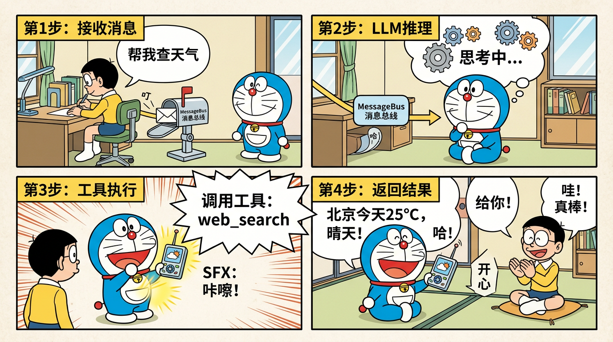

# 04 - 源码逐行解读

> 🎯 **本章目标**：逐文件、逐函数地解读 Nanobot 的核心源码。看完本章，你将能在面试中自信地说"我读过全部源码"。

---

## 目录

- [4.1 源码目录结构总览](#41-源码目录结构总览)
- [4.2 AgentLoop - loop.py](#42-agentloop---looppy)
- [4.3 AgentRunner - runner.py](#43-agentrunner---runnerpy)
- [4.4 ContextBuilder - context.py](#44-contextbuilder---contextpy)
- [4.5 MemoryStore - memory.py](#45-memorystore---memorypy)
- [4.6 SubagentManager - subagent.py](#46-subagentmanager---subagentpy)
- [4.7 工具系统 - tools/](#47-工具系统---tools)
- [4.8 MessageBus - bus/](#48-messagebus---bus)
- [4.9 Channel 适配层 - channels/](#49-channel-适配层---channels)
- [4.10 配置系统 - config/schema.py](#410-配置系统---configschemapy)
- [4.11 关键代码片段解读](#411-关键代码片段解读)
- [4.12 面试高频题](#412-面试高频题)
- [4.13 本章总结](#413-本章总结)

---

## 4.1 源码目录结构总览

```
nanobot/
├── __init__.py
├── __main__.py                 # 入口点 → 启动 CLI
├── cli.py                      # 命令行接口
│
├── agent/                      # 核心 Agent 模块
│   ├── __init__.py
│   ├── loop.py                 # ★ AgentLoop - 消息消费和会话管理
│   ├── runner.py               # ★ AgentRunner - ReAct 循环执行器
│   ├── context.py              # ★ ContextBuilder - Prompt 构建
│   ├── memory.py               # ★ MemoryStore - 记忆系统
│   ├── subagent.py             # SubagentManager - 子 Agent 管理
│   └── tools/                  # 工具子模块
│       ├── __init__.py
│       ├── registry.py         # ★ ToolRegistry - 工具注册表
│       ├── mcp.py              # ★ MCPToolWrapper - MCP 工具包装器
│       ├── message.py          # MessageTool - 消息回复工具
│       └── spawn.py            # SpawnTool - 子 Agent 生成工具
│
├── bus/                        # 消息总线
│   ├── __init__.py
│   └── message_bus.py          # ★ MessageBus - 双队列消息总线
│
├── channels/                   # 通道适配器
│   ├── __init__.py
│   ├── base.py                 # BaseChannel - 通道基类
│   ├── telegram.py             # Telegram 适配器
│   ├── discord.py              # Discord 适配器
│   ├── feishu.py               # 飞书适配器
│   ├── dingtalk.py             # 钉钉适配器
│   ├── wechat.py               # 微信适配器
│   ├── qq.py                   # QQ 适配器
│   ├── slack.py                # Slack 适配器
│   └── web.py                  # Web 适配器
│
├── providers/                  # LLM 供应商
│   ├── __init__.py
│   ├── base.py                 # BaseProvider - 供应商基类
│   ├── openai.py               # OpenAI 适配
│   ├── anthropic.py            # Anthropic/Claude 适配
│   ├── deepseek.py             # DeepSeek 适配
│   ├── dashscope.py            # 通义千问适配
│   ├── ollama.py               # Ollama 本地模型
│   ├── groq.py                 # Groq 适配
│   └── registry.py             # PROVIDERS 注册表
│
├── config/                     # 配置管理
│   ├── __init__.py
│   ├── schema.py               # 配置数据类定义
│   └── loader.py               # YAML 配置加载
│
└── utils/                      # 工具函数
    ├── __init__.py
    ├── logging.py              # 日志
    └── helpers.py              # 通用辅助函数
```

> 标注 ★ 的文件是核心文件，面试必须掌握。

---

## 4.2 AgentLoop - loop.py

### 文件定位

`nanobot/agent/loop.py` 是 Nanobot 的"心脏"，负责消息消费和会话管理。

### 核心类：AgentLoop

```python
class AgentLoop:
    """
    智能体主循环 - 从 MessageBus 消费消息，创建 AgentRunner 处理。
    管理会话锁和全局并发控制。
    """
    
    def __init__(
        self,
        bus: MessageBus,
        provider: BaseProvider,
        workspace: str,
        tool_registry: ToolRegistry,
        memory_store: MemoryStore,
        context_builder: ContextBuilder,
        max_iterations: int = 40,
        restrict_to_workspace: bool = True,
    ):
        self.bus = bus
        self.provider = provider
        self.workspace = workspace
        self.tool_registry = tool_registry
        self.memory_store = memory_store
        self.context_builder = context_builder
        self.max_iterations = max_iterations
        self.restrict_to_workspace = restrict_to_workspace
        
        # 会话锁：确保同一会话的消息串行处理
        self._session_locks: dict[str, asyncio.Lock] = {}
        
        # 并发闸门：控制全局最多同时处理的会话数
        self._concurrency_gate = asyncio.Semaphore(3)
```

### 构造函数参数详解

| 参数 | 类型 | 默认值 | 说明 |
|------|------|--------|------|
| `bus` | MessageBus | 必需 | 消息总线，用于收发消息 |
| `provider` | BaseProvider | 必需 | LLM 供应商，用于调用大模型 |
| `workspace` | str | 必需 | 工作空间路径 |
| `tool_registry` | ToolRegistry | 必需 | 工具注册表 |
| `memory_store` | MemoryStore | 必需 | 记忆存储 |
| `context_builder` | ContextBuilder | 必需 | 上下文构建器 |
| `max_iterations` | int | 40 | 主 Agent 最大迭代次数 |
| `restrict_to_workspace` | bool | True | 是否限制文件操作在 workspace 内 |

### run() 方法：核心消费循环

```python
async def run(self):
    """持续从 Inbound Queue 消费消息并处理。"""
    self._register_default_tools()
    
    while True:
        # 1. 从队列获取消息（阻塞等待）
        msg: InboundMessage = await self.bus.inbound.get()
        
        # 2. 异步处理，不阻塞主循环
        asyncio.create_task(self._handle_message(msg))

async def _handle_message(self, msg: InboundMessage):
    """处理单条消息（含会话锁和并发控制）。"""
    session_id = msg.session_id
    
    # 确保会话锁存在
    if session_id not in self._session_locks:
        self._session_locks[session_id] = asyncio.Lock()
    
    # 会话锁：同一会话串行
    async with self._session_locks[session_id]:
        # 并发闸门：全局最多 3 个并发
        async with self._concurrency_gate:
            await self._process_message(msg)
```

**关键点解读**：

1. **`asyncio.create_task`**：每条消息都创建一个独立的异步任务，不阻塞主循环继续消费下一条消息。
2. **双层并发控制**：会话锁保证同一用户串行，并发闸门保证全局不过载。
3. **无限循环**：`while True` 确保 AgentLoop 持续运行，永远在等待新消息。

### _register_default_tools() 方法

```python
def _register_default_tools(self):
    """注册框架内置的默认工具。"""
    # MessageTool: 允许 Agent 发送消息给用户
    self.tool_registry.register(
        MessageTool(bus=self.bus)
    )
    
    # SpawnTool: 允许 Agent 创建后台子 Agent
    self.tool_registry.register(
        SpawnTool(
            bus=self.bus,
            provider=self.provider,
            workspace=self.workspace,
        )
    )
    
    # save_memory: 虚拟工具，保存信息到长期记忆
    # 注意：这个工具的执行逻辑在 AgentRunner 中被拦截
    self.tool_registry.register_virtual(
        name="save_memory",
        description="Save important information to long-term memory",
        schema={"content": {"type": "string", "description": "Info to remember"}},
    )
```

### _save_turn() 方法

```python
async def _save_turn(self, msg: InboundMessage, response: str, tool_calls: list):
    """持久化单轮对话到 HISTORY.md。"""
    turn_summary = {
        "timestamp": datetime.now().isoformat(),
        "user": msg.text[:200],        # 截取用户消息前200字符
        "assistant": response[:500],    # 截取回复前500字符
        "tools_used": [tc.name for tc in tool_calls],
    }
    await self.memory_store.append_history(turn_summary)
```

### 面试要点

> 面试官："请描述 AgentLoop 的职责和工作流程。"
> 
> 要点：
> 1. AgentLoop 是消息消费者，持续从 MessageBus 的 Inbound Queue 获取消息
> 2. 使用会话锁保证同一用户的消息串行处理
> 3. 使用并发闸门（Semaphore=3）控制全局并发
> 4. 每条消息创建一个 AgentRunner 来执行 ReAct 循环
> 5. 处理完毕后保存历史（_save_turn）并发送响应到 Outbound Queue

---



*AgentLoop 工作流程：接收消息 → LLM推理 → 工具执行 → 返回结果*

## 4.3 AgentRunner - runner.py

### 文件定位

`nanobot/agent/runner.py` 实现了 Agent 的核心 ReAct 循环逻辑。

### 核心类：AgentRunner

```python
_TOOL_RESULT_MAX_CHARS = 16000  # 工具结果最大字符数

class AgentRunner:
    """
    单次消息处理的 ReAct 循环执行器。
    每条消息创建一个新的 AgentRunner 实例。
    """
    
    def __init__(
        self,
        provider: BaseProvider,
        tool_registry: ToolRegistry,
        context_builder: ContextBuilder,
        memory_store: MemoryStore,
        max_iterations: int = 40,
        is_subagent: bool = False,
    ):
        self.provider = provider
        self.tool_registry = tool_registry
        self.context_builder = context_builder
        self.memory_store = memory_store
        self.max_iterations = max_iterations
        self.is_subagent = is_subagent
        
        # 子 Agent 的迭代限制更严格
        if is_subagent:
            self.max_iterations = min(max_iterations, 15)
```

### run() 方法：ReAct 循环核心

```python
async def run(self, user_message: str, session_id: str) -> str:
    """执行完整的 ReAct 循环，返回最终响应。"""
    
    # 1. 构建初始消息列表
    messages = self.context_builder.build_messages(
        user_message=user_message,
        session_id=session_id,
    )
    
    # 2. 获取可用工具列表（转换为 LLM 兼容格式）
    tools = self.tool_registry.get_tool_schemas()
    
    final_response = ""
    tool_calls_history = []
    
    # 3. ReAct 循环
    for iteration in range(self.max_iterations):
        
        # --- Lifecycle Hook: before_iteration ---
        await self._before_iteration(iteration, messages)
        
        # --- 调用 LLM ---
        response = await self.provider.chat_with_retry(
            messages=messages,
            tools=tools if tools else None,
        )
        
        # --- 检查是否有工具调用 ---
        if not response.tool_calls:
            # 没有工具调用 = LLM 认为任务完成
            final_response = response.content
            break
        
        # --- 有工具调用 ---
        # 将 assistant 的响应加入消息列表
        messages.append({
            "role": "assistant",
            "content": response.content,
            "tool_calls": response.tool_calls,
        })
        
        # --- Lifecycle Hook: before_execute_tools ---
        await self._before_execute_tools(response.tool_calls)
        
        # --- 逐一执行工具调用 ---
        for tool_call in response.tool_calls:
            result = await self._execute_tool(tool_call)
            
            # 截断过长的工具结果
            if len(result) > _TOOL_RESULT_MAX_CHARS:
                result = result[:_TOOL_RESULT_MAX_CHARS] + "\n...(truncated)"
            
            # 将工具结果加入消息列表
            messages.append({
                "role": "tool",
                "tool_call_id": tool_call.id,
                "content": result,
            })
            
            tool_calls_history.append(tool_call)
        
        # --- Lifecycle Hook: after_iteration ---
        await self._after_iteration(iteration, messages)
    
    else:
        # 达到最大迭代次数仍未完成
        final_response = "I've reached the maximum number of iterations. Here's what I've done so far..."
    
    return final_response
```

### _execute_tool() 方法：工具执行（含 save_memory 拦截）

```python
async def _execute_tool(self, tool_call) -> str:
    """执行单个工具调用。"""
    tool_name = tool_call.function.name
    tool_args = json.loads(tool_call.function.arguments)
    
    # 拦截 save_memory 虚拟工具
    if tool_name == "save_memory":
        content = tool_args.get("content", "")
        await self.memory_store.save_memory(content)
        return "Memory saved successfully."
    
    # 正常工具执行
    try:
        result = await self.tool_registry.execute(tool_name, tool_args)
        return str(result)
    except Exception as e:
        return f"Error executing {tool_name}: {str(e)}"
```

### Lifecycle Hooks 详解

```python
async def _before_iteration(self, iteration: int, messages: list):
    """每轮迭代开始前的钩子。"""
    # 可扩展：日志记录、状态检查等
    logger.debug(f"Iteration {iteration + 1}/{self.max_iterations}")

async def _before_execute_tools(self, tool_calls: list):
    """工具执行前的钩子。"""
    # 可扩展：安全检查、审计日志等
    for tc in tool_calls:
        logger.info(f"Executing tool: {tc.function.name}")

async def _after_iteration(self, iteration: int, messages: list):
    """每轮迭代结束后的钩子。"""
    # 可扩展：指标统计、性能监控等
    pass
```

### 关键设计决策

| 决策 | 实现 | 理由 |
|------|------|------|
| 最大迭代 40 次 | `max_iterations=40` | 给 Agent 足够空间完成复杂任务，同时防止无限循环 |
| 子 Agent 15 次 | `min(max_iterations, 15)` | 子 Agent 任务较简单，限制更严格节省成本 |
| 工具结果截断 16000 字符 | `_TOOL_RESULT_MAX_CHARS` | 避免过长结果占用上下文窗口 |
| 错误不中断循环 | `try-except` 返回错误信息 | 让 LLM 自行决定如何处理错误 |
| 无工具调用即结束 | `if not response.tool_calls: break` | LLM 不调用工具说明任务已完成 |

---

## 4.4 ContextBuilder - context.py

### 文件定位

`nanobot/agent/context.py` 负责构建发送给 LLM 的完整消息列表。

### 核心类：ContextBuilder

```python
class ContextBuilder:
    """
    构建发送给 LLM 的消息列表。
    包括 system prompt、历史消息和运行时上下文。
    """
    
    def __init__(
        self,
        config: AgentConfig,
        memory_store: MemoryStore,
        skill_loader: SkillLoader,
    ):
        self.config = config
        self.memory_store = memory_store
        self.skill_loader = skill_loader
```

### build_system_prompt() 方法

```python
def build_system_prompt(self) -> str:
    """
    构建 system prompt。
    
    结构：Identity + Bootstrap + Memory + Skills
    
    将不变的部分放在前面，利用 Prompt Cache 优化。
    """
    parts = []
    
    # 1. Identity（身份定义）
    # 来自配置文件中的 identity 字段
    if self.config.identity:
        parts.append(f"# Identity\n{self.config.identity}")
    
    # 2. Bootstrap（基础行为规范）
    # 框架内置的默认行为指令
    bootstrap = self._get_bootstrap_instructions()
    parts.append(f"# Instructions\n{bootstrap}")
    
    # 3. Memory（长期记忆）
    # 从 MEMORY.md 读取
    memory = self.memory_store.read_memory()
    if memory:
        parts.append(f"# Memory\n{memory}")
    
    # 4. Skills（技能指令）
    # 从 SKILL.md 文件加载
    skills = self.skill_loader.load_skills()
    if skills:
        for skill in skills:
            parts.append(f"# Skill: {skill.name}\n{skill.instructions}")
    
    return "\n\n".join(parts)
```

### build_messages() 方法

```python
def build_messages(self, user_message: str, session_id: str) -> list:
    """
    构建完整的消息列表，发送给 LLM。
    
    消息结构：
    [system] → [history...] → [user_message]
    
    Prompt Cache 优化策略：
    - system prompt 放在最前面（跨请求几乎不变）
    - history 放在中间
    - user_message 放在最后（每次不同）
    """
    messages = []
    
    # System prompt（利用 Prompt Cache）
    system_prompt = self.build_system_prompt()
    messages.append({
        "role": "system",
        "content": system_prompt,
    })
    
    # 历史消息（最近 N 轮对话）
    history = self._get_conversation_history(session_id)
    messages.extend(history)
    
    # 当前用户消息
    messages.append({
        "role": "user",
        "content": user_message,
    })
    
    return messages
```

### Prompt Cache 优化策略解读

```
消息列表结构（为 Prompt Cache 优化）：

┌──────────────────────────────────────────────┐
│  [system] Identity + Bootstrap + Memory +     │ ← 几乎不变
│           Skills                              │    可被 Cache
├──────────────────────────────────────────────┤
│  [history] 最近的对话历史                      │ ← 缓慢变化
├──────────────────────────────────────────────┤
│  [user] 当前用户消息                           │ ← 每次不同
└──────────────────────────────────────────────┘

Prompt Cache 工作原理：
1. LLM API（如 Claude）会缓存消息的前缀部分
2. 如果两次请求的前缀相同，第二次不需要重新处理
3. 这可以减少约 90% 的 system prompt 处理时间
4. 节省 Token 成本（缓存命中的 Token 通常有折扣）
```

### 面试要点

> system prompt 的构建顺序：Identity → Bootstrap → Memory → Skills。这个顺序是有意为之的——Identity 和 Bootstrap 几乎不变（利于 Prompt Cache），Memory 和 Skills 偶尔变化，放在后面。

---

## 4.5 MemoryStore - memory.py

### 文件定位

`nanobot/agent/memory.py` 管理 Nanobot 的双层记忆系统。

### 核心类：MemoryStore

```python
class MemoryStore:
    """
    管理 Agent 的长期记忆（MEMORY.md）和交互历史（HISTORY.md）。
    """
    
    def __init__(self, workspace: str, provider: BaseProvider = None):
        self.workspace = workspace
        self.provider = provider  # 用于记忆压缩时调用 LLM
        self.memory_path = os.path.join(workspace, "MEMORY.md")
        self.history_path = os.path.join(workspace, "HISTORY.md")
```

### read_memory() 方法

```python
def read_memory(self) -> str:
    """读取 MEMORY.md 的全部内容。"""
    if not os.path.exists(self.memory_path):
        return ""
    
    with open(self.memory_path, "r", encoding="utf-8") as f:
        return f.read()
```

### save_memory() 方法

```python
async def save_memory(self, content: str):
    """
    保存内容到 MEMORY.md。
    
    这个方法由 save_memory 虚拟工具触发。
    LLM 决定什么时候需要记住什么信息。
    """
    # 追加模式写入
    with open(self.memory_path, "a", encoding="utf-8") as f:
        timestamp = datetime.now().strftime("%Y-%m-%d %H:%M")
        f.write(f"\n## {timestamp}\n{content}\n")
```

### append_history() 方法

```python
async def append_history(self, turn_summary: dict):
    """将单轮对话摘要追加到 HISTORY.md。"""
    with open(self.history_path, "a", encoding="utf-8") as f:
        f.write(f"\n### {turn_summary['timestamp']}\n")
        f.write(f"**User**: {turn_summary['user']}\n")
        f.write(f"**Assistant**: {turn_summary['assistant']}\n")
        if turn_summary.get('tools_used'):
            f.write(f"**Tools**: {', '.join(turn_summary['tools_used'])}\n")
        f.write("---\n")
```

### MemoryConsolidator 压缩机制

```python
class MemoryConsolidator:
    """
    当 HISTORY.md 增长到一定大小时，
    使用 LLM 压缩旧的历史记录。
    """
    
    CONSOLIDATION_THRESHOLD = 50  # 默认超过 50 条记录触发压缩
    
    def __init__(self, memory_store: MemoryStore, provider: BaseProvider):
        self.memory_store = memory_store
        self.provider = provider
    
    async def maybe_consolidate(self):
        """检查是否需要压缩，如需要则执行。"""
        history = self._read_history()
        entries = self._parse_entries(history)
        
        if len(entries) < self.CONSOLIDATION_THRESHOLD:
            return  # 还不需要压缩
        
        # 将旧记录（保留最近 10 条）压缩为摘要
        old_entries = entries[:-10]
        recent_entries = entries[-10:]
        
        # 使用 LLM 生成摘要
        summary = await self._summarize_with_llm(old_entries)
        
        # 重写 HISTORY.md
        self._rewrite_history(summary, recent_entries)
    
    async def _summarize_with_llm(self, entries: list) -> str:
        """使用 LLM 将多条历史记录压缩为摘要。"""
        prompt = (
            "Please summarize the following conversation history "
            "into a concise summary, preserving key information:\n\n"
            + "\n".join(entries)
        )
        response = await self.provider.chat_with_retry(
            messages=[{"role": "user", "content": prompt}]
        )
        return response.content
```

**压缩流程图**：

```
HISTORY.md 增长到 50+ 条
         ↓
MemoryConsolidator.maybe_consolidate()
         ↓
分离：旧记录（前 40 条）+ 近期记录（后 10 条）
         ↓
LLM 压缩旧记录为摘要
         ↓
重写 HISTORY.md：
  [摘要] + [近期 10 条详细记录]
         ↓
文件大小大幅减小，关键信息保留
```

---

## 4.6 SubagentManager - subagent.py

### 文件定位

`nanobot/agent/subagent.py` 管理子 Agent 的创建和执行。

### 核心类：SubagentManager

```python
class SubagentManager:
    """
    管理后台子 Agent 的创建和生命周期。
    子 Agent 由主 Agent 通过 SpawnTool 创建。
    """
    
    def __init__(
        self,
        provider: BaseProvider,
        workspace: str,
        tool_registry: ToolRegistry,
    ):
        self.provider = provider
        self.workspace = workspace
        self.tool_registry = tool_registry
        self._active_subagents: dict[str, asyncio.Task] = {}
```

### spawn() 方法

```python
async def spawn(self, task: str, session_id: str) -> str:
    """
    创建一个后台子 Agent 来执行任务。
    
    子 Agent 的限制：
    1. 最大迭代 15 次（vs 主 Agent 的 40 次）
    2. 不能使用 MessageTool（不能直接回复用户）
    3. 不能使用 SpawnTool（不能再创建子 Agent，防递归）
    """
    # 创建受限的工具集
    restricted_tools = self.tool_registry.clone()
    restricted_tools.remove("message")      # 移除 MessageTool
    restricted_tools.remove("spawn_agent")  # 移除 SpawnTool，防止递归
    
    # 创建子 Agent 的 Runner
    sub_runner = AgentRunner(
        provider=self.provider,
        tool_registry=restricted_tools,
        context_builder=self._build_sub_context(),
        memory_store=self.memory_store,
        max_iterations=15,
        is_subagent=True,
    )
    
    # 后台执行
    task_obj = asyncio.create_task(
        sub_runner.run(task, session_id)
    )
    
    subagent_id = str(uuid.uuid4())[:8]
    self._active_subagents[subagent_id] = task_obj
    
    return f"Subagent {subagent_id} spawned for task: {task}"
```

**关键设计**：

| 设计 | 说明 |
|------|------|
| 迭代限制 15 次 | 子 Agent 任务相对简单，15 次足够 |
| 移除 MessageTool | 子 Agent 不应直接与用户通信，结果通过主 Agent 返回 |
| 移除 SpawnTool | 防止子 Agent 创建子子 Agent，避免递归爆炸 |
| 后台异步执行 | `asyncio.create_task` 让子 Agent 不阻塞主 Agent |

---

## 4.7 工具系统 - tools/

### 4.7.1 ToolRegistry - registry.py

```python
class ToolRegistry:
    """
    统一的工具注册表，管理所有可用工具。
    支持内置工具和 MCP 远程工具。
    """
    
    def __init__(self):
        self._tools: dict[str, BaseTool] = {}
        self._virtual_tools: dict[str, dict] = {}
    
    def register(self, tool: BaseTool):
        """注册一个工具。"""
        self._tools[tool.name] = tool
    
    def register_virtual(self, name: str, description: str, schema: dict):
        """注册一个虚拟工具（仅元数据，执行逻辑在外部）。"""
        self._virtual_tools[name] = {
            "name": name,
            "description": description,
            "parameters": schema,
        }
    
    async def execute(self, name: str, args: dict) -> str:
        """执行指定的工具。"""
        if name in self._tools:
            return await self._tools[name].run(args)
        raise ToolNotFoundError(f"Tool '{name}' not registered")
    
    def get_tool_schemas(self) -> list[dict]:
        """获取所有工具的 schema 列表（用于 LLM）。"""
        schemas = []
        
        # 真实工具
        for tool in self._tools.values():
            schemas.append({
                "type": "function",
                "function": {
                    "name": tool.name,
                    "description": tool.description,
                    "parameters": tool.parameters_schema,
                }
            })
        
        # 虚拟工具
        for vt in self._virtual_tools.values():
            schemas.append({
                "type": "function",
                "function": vt,
            })
        
        return schemas
    
    def clone(self) -> 'ToolRegistry':
        """克隆工具注册表（用于子 Agent 的受限工具集）。"""
        new_registry = ToolRegistry()
        new_registry._tools = dict(self._tools)
        new_registry._virtual_tools = dict(self._virtual_tools)
        return new_registry
    
    def remove(self, name: str):
        """移除指定工具。"""
        self._tools.pop(name, None)
        self._virtual_tools.pop(name, None)
```

### 4.7.2 MCPToolWrapper - mcp.py

```python
class MCPToolWrapper(BaseTool):
    """
    将远程 MCP Server 提供的工具包装为本地工具。
    对 AgentRunner 来说，MCP 工具和内置工具没有区别。
    """
    
    def __init__(self, server_name: str, tool_spec: MCPToolSpec, client: MCPClient):
        # 工具名命名规则：mcp_{server}_{tool}
        self.name = f"mcp_{server_name}_{tool_spec.name}"
        self.description = tool_spec.description
        self.client = client
        self.original_name = tool_spec.name
        
        # 将 MCP schema 转换为 OpenAI 兼容格式
        self.parameters_schema = self._normalize_schema_for_openai(
            tool_spec.input_schema
        )
    
    async def run(self, args: dict) -> str:
        """调用远程 MCP Server 执行工具。"""
        result = await self.client.call_tool(
            name=self.original_name,
            arguments=args,
        )
        return self._format_result(result)
    
    @staticmethod
    def _normalize_schema_for_openai(mcp_schema: dict) -> dict:
        """
        将 MCP 的 JSON Schema 转换为 OpenAI 兼容格式。
        
        主要处理：
        - 移除 MCP 特有的字段
        - 确保 required 字段格式正确
        - 处理嵌套 schema 的差异
        """
        schema = dict(mcp_schema)
        schema.setdefault("type", "object")
        schema.setdefault("properties", {})
        
        # 移除 MCP 特有字段
        schema.pop("$schema", None)
        schema.pop("additionalProperties", None)
        
        return schema
```

**MCP 工具命名规则**：

```
MCP Server: "filesystem"
MCP Tool:   "read_file"
  ↓
Nanobot 中的工具名: "mcp_filesystem_read_file"

MCP Server: "github"  
MCP Tool:   "create_issue"
  ↓
Nanobot 中的工具名: "mcp_github_create_issue"
```

这种命名规则确保不同 MCP Server 的同名工具不会冲突。

### 4.7.3 MessageTool - message.py

```python
class MessageTool(BaseTool):
    """允许 Agent 主动发送消息给用户。"""
    
    name = "message"
    description = "Send a message to the user"
    parameters_schema = {
        "type": "object",
        "properties": {
            "content": {
                "type": "string",
                "description": "The message content to send",
            }
        },
        "required": ["content"],
    }
    
    def __init__(self, bus: MessageBus):
        self.bus = bus
    
    async def run(self, args: dict) -> str:
        content = args["content"]
        msg = OutboundMessage(text=content)
        await self.bus.outbound.put(msg)
        return "Message sent"
```

### 4.7.4 SpawnTool - spawn.py

```python
class SpawnTool(BaseTool):
    """允许主 Agent 创建后台子 Agent。"""
    
    name = "spawn_agent"
    description = "Spawn a background subagent to handle a task"
    parameters_schema = {
        "type": "object",
        "properties": {
            "task": {
                "type": "string",
                "description": "The task for the subagent to perform",
            }
        },
        "required": ["task"],
    }
    
    async def run(self, args: dict) -> str:
        return await self.subagent_manager.spawn(args["task"], self.session_id)
```

---

## 4.8 MessageBus - bus/

### 核心类：MessageBus

```python
class MessageBus:
    """
    异步消息总线，使用双 asyncio.Queue 实现。
    
    Inbound Queue:  Channel → AgentLoop
    Outbound Queue: AgentLoop → Channel
    """
    
    def __init__(self):
        self.inbound: asyncio.Queue[InboundMessage] = asyncio.Queue()
        self.outbound: asyncio.Queue[OutboundMessage] = asyncio.Queue()


@dataclass
class InboundMessage:
    """用户发来的消息。"""
    session_id: str        # 会话标识
    user_id: str           # 用户标识
    text: str              # 消息文本
    channel: str           # 来源通道（telegram/feishu/...）
    timestamp: float       # 时间戳
    metadata: dict = None  # 额外的元数据（如图片、附件等）


@dataclass
class OutboundMessage:
    """Agent 要发出的消息。"""
    session_id: str        # 目标会话
    text: str              # 回复文本
    channel: str           # 目标通道
    metadata: dict = None  # 额外数据（如按钮、卡片等）
```

**设计解读**：

```
为什么用 asyncio.Queue 而不是 Redis/RabbitMQ？

1. 单进程架构：Nanobot 设计为单进程运行，不需要跨进程通信
2. 极简原则：asyncio.Queue 零依赖，不需要额外的消息中间件
3. 性能足够：个人助手场景下，asyncio.Queue 的性能绰绰有余
4. 部署简单：不需要额外安装和维护消息队列服务

如果需要扩展到多进程或分布式，可以替换为 Redis Queue，
但对于 Nanobot 的目标场景（个人/小团队），这是不必要的。
```

---

## 4.9 Channel 适配层 - channels/

### 基类：BaseChannel

```python
class BaseChannel(ABC):
    """所有通道适配器的基类。"""
    
    def __init__(self, config: ChannelConfig, bus: MessageBus):
        self.config = config
        self.bus = bus
    
    @abstractmethod
    async def start(self):
        """启动通道，开始接收消息。"""
        pass
    
    @abstractmethod
    async def stop(self):
        """停止通道。"""
        pass
    
    async def _dispatch_inbound(self, text: str, user_id: str, session_id: str):
        """将接收到的消息分发到 MessageBus。"""
        msg = InboundMessage(
            session_id=session_id,
            user_id=user_id,
            text=text,
            channel=self.__class__.__name__.lower(),
            timestamp=time.time(),
        )
        await self.bus.inbound.put(msg)
    
    async def _consume_outbound(self):
        """持续消费 Outbound Queue 并发送。"""
        while True:
            msg: OutboundMessage = await self.bus.outbound.get()
            if msg.channel == self.channel_name:
                await self._send(msg)
    
    @abstractmethod
    async def _send(self, msg: OutboundMessage):
        """发送消息到具体平台。"""
        pass
```

### Telegram 适配器示例

```python
class TelegramChannel(BaseChannel):
    """Telegram 通道适配器。"""
    
    channel_name = "telegram"
    
    async def start(self):
        self.bot = TelegramBot(token=self.config.token)
        
        @self.bot.on_message()
        async def handle(update):
            await self._dispatch_inbound(
                text=update.message.text,
                user_id=str(update.message.from_user.id),
                session_id=f"tg_{update.message.chat.id}",
            )
        
        # 启动 Outbound 消费和 Telegram 轮询
        asyncio.create_task(self._consume_outbound())
        await self.bot.start_polling()
    
    async def _send(self, msg: OutboundMessage):
        chat_id = msg.session_id.replace("tg_", "")
        await self.bot.send_message(
            chat_id=int(chat_id),
            text=msg.text,
        )
```

### 飞书适配器示例

```python
class FeishuChannel(BaseChannel):
    """飞书通道适配器。"""
    
    channel_name = "feishu"
    
    async def start(self):
        self.client = FeishuClient(
            app_id=self.config.app_id,
            app_secret=self.config.app_secret,
        )
        
        # 飞书使用事件订阅机制
        @self.client.on_event("im.message.receive_v1")
        async def handle(event):
            content = json.loads(event.message.content)
            await self._dispatch_inbound(
                text=content.get("text", ""),
                user_id=event.sender.sender_id.user_id,
                session_id=f"feishu_{event.message.chat_id}",
            )
        
        asyncio.create_task(self._consume_outbound())
        await self.client.start()
    
    async def _send(self, msg: OutboundMessage):
        chat_id = msg.session_id.replace("feishu_", "")
        await self.client.send_message(
            receive_id=chat_id,
            msg_type="text",
            content=json.dumps({"text": msg.text}),
        )
```

---

## 4.10 配置系统 - config/schema.py

### 配置数据类

```python
@dataclass
class NanobotConfig:
    """Nanobot 顶层配置。"""
    name: str = "nanobot"
    identity: str = ""                    # Agent 身份描述
    provider: ProviderConfig = None       # LLM 配置
    channels: list[ChannelConfig] = None  # 通道配置
    mcp_servers: list[MCPConfig] = None   # MCP 服务器配置
    memory: MemoryConfig = None           # 记忆配置
    cron: list[CronConfig] = None         # 定时任务配置
    max_iterations: int = 40              # 最大迭代次数
    restrict_to_workspace: bool = True    # 限制在 workspace 内


@dataclass
class ProviderConfig:
    """LLM 供应商配置。"""
    type: str = "openai"           # Provider 类型
    model: str = "gpt-4"          # 模型名称
    api_key: str = ""             # API Key（支持 ${ENV_VAR} 格式）
    base_url: str = None          # 自定义 API 地址
    temperature: float = 0.7      # 温度参数
    max_tokens: int = 4096        # 最大输出 Token


@dataclass
class ChannelConfig:
    """通道配置。"""
    type: str                      # 通道类型（telegram/feishu/...）
    token: str = None              # 认证 Token
    app_id: str = None             # 应用 ID
    app_secret: str = None         # 应用密钥
    webhook_url: str = None        # Webhook URL


@dataclass
class MCPConfig:
    """MCP Server 配置。"""
    name: str                      # Server 名称
    command: str = None            # 本地 Server 启动命令（stdio 传输）
    args: list[str] = None         # 命令参数
    url: str = None                # 远程 Server URL（HTTP 传输）
    env: dict = None               # 环境变量


@dataclass
class MemoryConfig:
    """记忆系统配置。"""
    consolidation_threshold: int = 50  # 压缩触发阈值
    max_history_entries: int = 100     # 最大历史条目


@dataclass 
class CronConfig:
    """定时任务配置。"""
    schedule: str                  # Cron 表达式
    message: str                   # 要发送给 Agent 的消息
```

### 配置加载

```python
class ConfigLoader:
    """从 YAML 文件加载配置。"""
    
    @staticmethod
    def load(config_path: str) -> NanobotConfig:
        with open(config_path, "r") as f:
            raw = yaml.safe_load(f)
        
        # 环境变量替换：${VAR_NAME} → 实际值
        raw = ConfigLoader._resolve_env_vars(raw)
        
        return NanobotConfig(**raw)
    
    @staticmethod
    def _resolve_env_vars(data):
        """递归替换配置中的 ${ENV_VAR} 为实际环境变量值。"""
        if isinstance(data, str):
            # 匹配 ${VAR_NAME} 模式
            pattern = r'\$\{(\w+)\}'
            def replace(match):
                var_name = match.group(1)
                value = os.environ.get(var_name, "")
                if not value:
                    logger.warning(f"Environment variable {var_name} not set")
                return value
            return re.sub(pattern, replace, data)
        elif isinstance(data, dict):
            return {k: ConfigLoader._resolve_env_vars(v) for k, v in data.items()}
        elif isinstance(data, list):
            return [ConfigLoader._resolve_env_vars(item) for item in data]
        return data
```

---

## 4.11 关键代码片段解读

### 片段 1：完整的消息处理链路

```python
# 这段伪代码展示了一条消息从接收到响应的完整链路

# 1. Channel 接收用户消息
async def telegram_on_message(update):
    await bus.inbound.put(InboundMessage(
        session_id=f"tg_{update.chat.id}",
        text=update.text,
    ))

# 2. AgentLoop 消费消息
async def agent_loop_run():
    while True:
        msg = await bus.inbound.get()
        asyncio.create_task(handle(msg))

# 3. 会话锁 + 并发控制
async def handle(msg):
    async with session_locks[msg.session_id]:
        async with concurrency_gate:
            # 4. 构建上下文
            messages = context_builder.build_messages(msg.text, msg.session_id)
            tools = tool_registry.get_tool_schemas()
            
            # 5. ReAct 循环
            for i in range(40):
                response = await provider.chat_with_retry(messages, tools)
                
                if not response.tool_calls:
                    break  # 任务完成
                
                for tc in response.tool_calls:
                    if tc.name == "save_memory":
                        await memory_store.save_memory(tc.args["content"])
                        result = "Saved"
                    else:
                        result = await tool_registry.execute(tc.name, tc.args)
                    
                    messages.append({"role": "tool", "content": result})
            
            # 6. 保存历史
            await memory_store.append_history(...)
            
            # 7. 发送响应
            await bus.outbound.put(OutboundMessage(text=response.content))
```

### 片段 2：MCP 工具注册流程

```python
# MCP 工具是如何被注册到 ToolRegistry 的

async def register_mcp_servers(config, tool_registry):
    for mcp_config in config.mcp_servers:
        # 1. 创建 MCP Client
        if mcp_config.command:
            # stdio 传输（本地 Server）
            client = await MCPClient.connect_stdio(
                command=mcp_config.command,
                args=mcp_config.args,
                env=mcp_config.env,
            )
        elif mcp_config.url:
            # HTTP 传输（远程 Server）
            client = await MCPClient.connect_http(url=mcp_config.url)
        
        # 2. 获取 Server 提供的工具列表
        tools = await client.list_tools()
        
        # 3. 逐一包装并注册
        for tool_spec in tools:
            wrapper = MCPToolWrapper(
                server_name=mcp_config.name,
                tool_spec=tool_spec,
                client=client,
            )
            tool_registry.register(wrapper)
            # 注册后的工具名: mcp_{server_name}_{tool_name}
```

### 片段 3：Provider 注册表与工厂

```python
# PROVIDERS 注册表

PROVIDERS: dict[str, type[BaseProvider]] = {
    "openai": OpenAIProvider,
    "anthropic": AnthropicProvider,
    "deepseek": DeepSeekProvider,
    "dashscope": DashScopeProvider,
    "ollama": OllamaProvider,
    "groq": GroqProvider,
    "azure": AzureOpenAIProvider,
    "mistral": MistralProvider,
    "openrouter": OpenRouterProvider,
    "google": GoogleProvider,
}

def create_provider(config: ProviderConfig) -> BaseProvider:
    """工厂方法：根据配置创建对应的 Provider 实例。"""
    provider_type = config.type.lower()
    
    if provider_type not in PROVIDERS:
        raise ValueError(f"Unknown provider: {provider_type}")
    
    provider_cls = PROVIDERS[provider_type]
    return provider_cls(config)
```

---

## 4.12 面试高频题

### Q1: 请描述 AgentLoop 的执行流程

> **标准回答**：
> 
> "AgentLoop 的执行流程可以分为 5 个步骤：
> 
> 第一步，启动时调用 `_register_default_tools()` 注册内置工具（MessageTool、SpawnTool、save_memory 虚拟工具）。
> 
> 第二步，进入 `while True` 无限循环，持续从 MessageBus 的 Inbound Queue 获取消息。使用 `await bus.inbound.get()` 阻塞等待。
> 
> 第三步，收到消息后使用 `asyncio.create_task` 创建异步任务来处理，不阻塞主循环继续接收下一条消息。
> 
> 第四步，在处理任务中，先获取该会话的会话锁（保证同一会话串行），再获取全局并发闸门（默认最多 3 个并发），然后创建 AgentRunner 执行 ReAct 循环。
> 
> 第五步，AgentRunner 完成后，调用 `_save_turn()` 将对话摘要保存到 HISTORY.md，然后将响应消息推入 Outbound Queue，由 Channel 发送给用户。"

### Q2: save_memory 虚拟工具是怎么工作的？

> **标准回答**：
> 
> "save_memory 是一个'虚拟工具'——它在 ToolRegistry 中注册了名称、描述和参数 schema，让 LLM 知道有这个工具可以用。但它的执行逻辑不在 ToolRegistry 中，而是在 AgentRunner 的 `_execute_tool` 方法中被拦截处理。
> 
> 当 LLM 决定调用 save_memory 时，AgentRunner 检测到这个特殊的工具名，直接调用 MemoryStore.save_memory() 将内容写入 MEMORY.md 文件，而不走正常的 ToolRegistry.execute() 流程。
> 
> 这种设计的好处是：对 LLM 来说，save_memory 和其他工具没有任何区别，统一了调用接口；同时因为是内部直接处理，没有网络开销，执行效率更高。"

### Q3: 为什么工具结果要截断到 16000 字符？

> **标准回答**：
> 
> "工具结果截断到 16000 字符（`_TOOL_RESULT_MAX_CHARS`）是出于三个考虑：
> 
> 第一是上下文窗口限制，过长的工具结果会占用大量上下文空间，挤压了历史消息和系统 prompt 的空间；
> 
> 第二是 LLM 处理效果，研究表明 LLM 处理超长文本时效果会下降，特别是中间部分的信息容易被忽略（Lost in the Middle 问题）；
> 
> 第三是成本控制，Token 数量直接影响 API 调用费用，截断可以有效控制成本。
> 
> 16000 字符这个阈值是一个经验值——足以包含大多数工具返回的有用信息，同时不会过度占用上下文。"

### Q4: 如何新增一个 LLM 供应商（如文心一言）？

> **标准回答**：
> 
> "在 Nanobot 中新增 LLM 供应商非常简单，只需要三步：
> 
> 第一步，在 `providers/` 目录下创建 `wenxin.py`，实现 `BaseProvider` 接口，包括 `chat_with_retry()` 方法。
> 
> 第二步，在 `providers/registry.py` 的 PROVIDERS 字典中添加一行：`"wenxin": WenxinProvider`。
> 
> 第三步，用户在 `nanobot.yml` 中使用 `type: wenxin` 即可。
> 
> 不需要修改任何现有代码——这就是注册表模式（Registry Pattern）的好处。整个过程符合开闭原则：对扩展开放，对修改关闭。"

---

## 4.13 本章总结

```
┌──────────────────────────────────────────────────────┐
│                   核心文件速查表                       │
│                                                      │
│  文件                    │ 核心类           │ 职责    │
│  ─────────────────────────────────────────────────── │
│  agent/loop.py           │ AgentLoop        │ 消息消费│
│  agent/runner.py         │ AgentRunner      │ ReAct  │
│  agent/context.py        │ ContextBuilder   │ Prompt │
│  agent/memory.py         │ MemoryStore      │ 记忆   │
│  agent/subagent.py       │ SubagentManager  │ 子Agent│
│  agent/tools/registry.py │ ToolRegistry     │ 工具   │
│  agent/tools/mcp.py      │ MCPToolWrapper   │ MCP    │
│  bus/message_bus.py      │ MessageBus       │ 消息   │
│  channels/base.py        │ BaseChannel      │ 通道   │
│  config/schema.py        │ NanobotConfig    │ 配置   │
│                                                      │
│  总代码量：约 4000 行 Python                           │
│  核心文件：10 个                                       │
│  核心类：10 个                                         │
│                                                      │
└──────────────────────────────────────────────────────┘
```

### 源码阅读建议

```
推荐阅读顺序：

1. config/schema.py     → 理解配置结构
2. bus/message_bus.py    → 理解消息传递
3. agent/loop.py         → 理解消息消费
4. agent/runner.py       → 理解 ReAct 循环（核心！）
5. agent/context.py      → 理解 Prompt 构建
6. agent/memory.py       → 理解记忆系统
7. agent/tools/          → 理解工具系统
8. channels/             → 理解平台适配
9. providers/            → 理解 LLM 封装
```

---

## 下一章

接下来，我们将深入学习 MCP 协议——AI 界的"USB-C 接口"。

➡️ [05 - MCP 协议详解](../05-mcp-protocol/README.md)

---

> 📝 **本章小结**：通过逐文件解读，我们看到 Nanobot 的 4000 行代码如何构建出一个完整的 Agent 框架。核心是 10 个文件、10 个类，每个类职责清晰。掌握这些源码细节，你就能在面试中自信地说"我通读了全部源码"，并能深入讨论任何实现细节。
