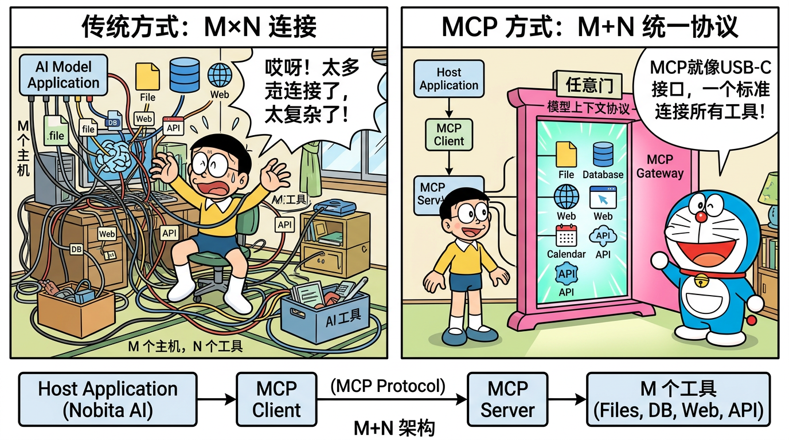

# 05 - MCP 协议详解

> 🎯 **本章目标**：深入理解 MCP（Model Context Protocol）协议的设计思想、三大核心原语、通信机制，以及它在 Nanobot 中的实现。MCP 是 2024-2026 年 AI 领域最重要的标准化协议之一，是面试热门话题。

---

## 目录

- [5.1 MCP 协议概述](#51-mcp-协议概述)
- [5.2 核心问题：M×N 困境](#52-核心问题mn-困境)
- [5.3 三角架构](#53-三角架构)
- [5.4 三大核心原语](#54-三大核心原语)
- [5.5 通信协议与传输层](#55-通信协议与传输层)
- [5.6 MCP vs Function Calling](#56-mcp-vs-function-calling)
- [5.7 MCP vs Skill vs Function Call 三者关系](#57-mcp-vs-skill-vs-function-call-三者关系)
- [5.8 MCP 在 Nanobot 中的实现](#58-mcp-在-nanobot-中的实现)
- [5.9 MCP 生态发展时间线](#59-mcp-生态发展时间线)
- [5.10 面试高频题与答案](#510-面试高频题与答案)
- [5.11 练习：写一个简单的 MCP Server](#511-练习写一个简单的-mcp-server)
- [5.12 本章总结](#512-本章总结)

---

## 5.1 MCP 协议概述

### 基本信息

| 项目 | 内容 |
|------|------|
| **全称** | Model Context Protocol（模型上下文协议） |
| **发布方** | Anthropic（Claude 的开发公司） |
| **发布时间** | 2024 年 11 月 |
| **协议类型** | 开放标准协议 |
| **通信协议** | JSON-RPC 2.0 |
| **传输方式** | stdio / HTTP+SSE / Streamable HTTP |
| **目标** | 标准化 AI 模型与外部工具/数据的交互方式 |

### 一句话定义

> **MCP 是 AI 应用连接外部工具和数据源的标准化协议，就像 USB-C 是设备连接的标准化接口一样。**

### 为什么 MCP 重要？

在 MCP 出现之前，每个 AI 应用（如 Claude Desktop、ChatGPT、各种 Agent 框架）都需要为每个工具和数据源编写专门的集成代码。这导致了大量的重复工作和碎片化的生态。

MCP 的出现就像当年 USB 接口统一了各种外设接口一样——它为 AI 应用提供了一个标准化的"接口协议"，让工具只需要实现一次 MCP 接口，就能被所有支持 MCP 的 AI 应用使用。

```
┌──────────────────────────────────────────────────────────┐
│                    类比：AI 界的 USB-C                     │
│                                                          │
│  USB-C 之前：                    MCP 之前：                │
│  ┌──────┐                       ┌──────────┐             │
│  │ 设备 │ → 专用线缆 → 电脑      │ AI 应用  │ → 专用代码    │
│  │ 设备 │ → 另一种线缆 → 电脑    │ AI 应用  │ → 另一套代码  │
│  │ 设备 │ → 又一种线缆 → 电脑    │ AI 应用  │ → 又一套代码  │
│  └──────┘                       └──────────┘             │
│                                                          │
│  USB-C 之后：                    MCP 之后：                │
│  ┌──────┐                       ┌──────────┐             │
│  │ 设备 │ ─┐                    │ AI 应用  │ ─┐           │
│  │ 设备 │ ─┤ USB-C ─ 电脑       │ AI 应用  │ ─┤ MCP ─ 工具│
│  │ 设备 │ ─┘                    │ AI 应用  │ ─┘           │
│  └──────┘                       └──────────┘             │
│                                                          │
└──────────────────────────────────────────────────────────┘
```

---



*MCP 就像任意门：统一标准连接所有工具，从 M×N 到 M+N*

## 5.2 核心问题：M×N 困境

### 问题描述

在 MCP 出现之前，AI 生态面临一个经典的 **M×N 连接问题**：

- **M 个 AI 应用**：Claude Desktop、ChatGPT、Cursor、Nanobot、LangChain 等
- **N 个工具/数据源**：GitHub、Slack、数据库、文件系统、搜索引擎等

如果每个应用都要为每个工具编写专门的集成代码，总共需要 **M × N** 个集成。

### M×N vs M+N

```
没有 MCP（M×N 连接）：
每个 AI 应用需要为每个工具单独写集成代码

AI 应用              工具/数据源
┌──────────┐        ┌──────────┐
│  Claude  │───────→│  GitHub  │
│  Desktop │──┐ ┌──→│          │
└──────────┘  │ │   └──────────┘
              │ │
┌──────────┐  │ │   ┌──────────┐
│  ChatGPT │──┼─┼──→│  Slack   │
│          │──┤ ├──→│          │
└──────────┘  │ │   └──────────┘
              │ │
┌──────────┐  │ │   ┌──────────┐
│ Nanobot  │──┘ └──→│  数据库  │
│          │───────→│          │
└──────────┘        └──────────┘

3 个应用 × 3 个工具 = 9 个集成

─────────────────────────────────────────

有 MCP（M+N 连接）：
每个应用实现 MCP Client，每个工具实现 MCP Server

AI 应用           MCP 协议        MCP Server
┌──────────┐                    ┌──────────┐
│  Claude  │──┐                 │  GitHub  │
│  Desktop │  │   ┌────────┐   │  Server  │──┐
└──────────┘  ├──→│  MCP   │←──┤          │  │
              │   │ Protocol│   └──────────┘  │
┌──────────┐  │   │        │   ┌──────────┐  │
│  ChatGPT │──┤   │标准化   │   │  Slack   │  │
│          │  │   │交互协议 │   │  Server  │──┤
└──────────┘  │   │        │   │          │  │
              │   └────────┘   └──────────┘  │
┌──────────┐  │                ┌──────────┐  │
│ Nanobot  │──┘                │  数据库  │   │
│          │                   │  Server  │──┘
└──────────┘                   └──────────┘

3 个应用 + 3 个工具 = 6 个实现（而不是 9 个）
```

**当规模增大时优势更明显**：

| 应用数(M) | 工具数(N) | 无 MCP (M×N) | 有 MCP (M+N) | 节省 |
|-----------|-----------|-------------|-------------|------|
| 3 | 3 | 9 | 6 | 33% |
| 5 | 10 | 50 | 15 | 70% |
| 10 | 20 | 200 | 30 | 85% |
| 20 | 50 | 1000 | 70 | 93% |
| 50 | 100 | 5000 | 150 | 97% |

---

## 5.3 三角架构

MCP 定义了三种角色，构成了一个清晰的三角架构：

```
┌───────────────────────────────────────────────────────────┐
│                    MCP 三角架构                             │
│                                                           │
│  ┌─────────────────────────────────────────────────────┐  │
│  │                   MCP Host                          │  │
│  │          (AI 应用 / Agent 框架)                      │  │
│  │                                                     │  │
│  │  ┌───────────────┐                                  │  │
│  │  │               │  例如：                           │  │
│  │  │   MCP Client  │  · Claude Desktop                │  │
│  │  │   (协议客户端) │  · Cursor IDE                    │  │
│  │  │               │  · Nanobot                       │  │
│  │  └───────┬───────┘  · ChatGPT                       │  │
│  │          │                                          │  │
│  └──────────┼──────────────────────────────────────────┘  │
│             │                                             │
│             │  JSON-RPC 2.0                               │
│             │  (stdio / HTTP+SSE / Streamable HTTP)       │
│             │                                             │
│  ┌──────────▼──────────────────────────────────────────┐  │
│  │                  MCP Server                         │  │
│  │             (工具/数据提供者)                         │  │
│  │                                                     │  │
│  │  例如：                                              │  │
│  │  · @anthropic/mcp-server-filesystem (文件系统)       │  │
│  │  · @anthropic/mcp-server-github (GitHub)            │  │
│  │  · @anthropic/mcp-server-postgres (数据库)          │  │
│  │  · 任何人编写的自定义 MCP Server                     │  │
│  └─────────────────────────────────────────────────────┘  │
│                                                           │
└───────────────────────────────────────────────────────────┘
```

### 三种角色详解

| 角色 | 职责 | 类比 | Nanobot 中的对应 |
|------|------|------|-----------------|
| **MCP Host** | 运行 AI 模型的宿主应用 | 电脑主机 | Nanobot 框架本身 |
| **MCP Client** | Host 内部的协议客户端 | USB 控制器 | MCPClient 类 |
| **MCP Server** | 提供工具/数据的服务 | USB 外设 | 外部 MCP Server 进程 |

### 重要概念澄清

**MCP Client 不是独立的应用**——它是嵌入在 MCP Host 内部的协议处理模块。一个 Host 可以有多个 Client，每个 Client 连接一个 Server。

```
Nanobot (Host)
├── MCP Client 1 ──→ filesystem MCP Server
├── MCP Client 2 ──→ github MCP Server
└── MCP Client 3 ──→ database MCP Server
```

---

## 5.4 三大核心原语

MCP 定义了三种核心原语（Primitive），代表了三种不同类型的交互：

```
┌──────────────────────────────────────────────────────────┐
│                  MCP 三大核心原语                          │
│                                                          │
│  ┌─────────────────────────────────────────────────────┐ │
│  │                                                     │ │
│  │  1. Tools (工具)                                    │ │
│  │     "可执行的操作"                                   │ │
│  │     控制方: 模型决定调用                              │ │
│  │     例如: read_file, search, create_issue           │ │
│  │                                                     │ │
│  ├─────────────────────────────────────────────────────┤ │
│  │                                                     │ │
│  │  2. Resources (资源)                                │ │
│  │     "可读取的数据"                                   │ │
│  │     控制方: 应用决定读取                              │ │
│  │     例如: file://readme.md, db://users/123          │ │
│  │                                                     │ │
│  ├─────────────────────────────────────────────────────┤ │
│  │                                                     │ │
│  │  3. Prompts (提示模板)                               │ │
│  │     "可复用的提示词模板"                              │ │
│  │     控制方: 用户选择使用                              │ │
│  │     例如: code_review, summarize, translate          │ │
│  │                                                     │ │
│  └─────────────────────────────────────────────────────┘ │
│                                                          │
└──────────────────────────────────────────────────────────┘
```

### 5.4.1 Tools（工具）

**定义**：MCP Server 暴露的可执行操作，由 AI 模型（LLM）自主决定是否调用。

**特征**：
- 模型控制：LLM 根据用户意图自主决定调用
- 有副作用：可能修改外部状态（写文件、发消息、创建 issue）
- 需要审慎执行：某些操作需要人类确认

**示例**：

```json
{
  "name": "read_file",
  "description": "Read the contents of a file from the filesystem",
  "inputSchema": {
    "type": "object",
    "properties": {
      "path": {
        "type": "string",
        "description": "The path of the file to read"
      }
    },
    "required": ["path"]
  }
}
```

**调用流程**：

```
1. MCP Client 通过 tools/list 获取可用工具列表
2. 工具描述被注入到 LLM 的 system prompt
3. LLM 根据用户意图决定调用某个工具
4. MCP Client 向 MCP Server 发送 tools/call 请求
5. MCP Server 执行工具并返回结果
6. 结果返回给 LLM 继续推理
```

### 5.4.2 Resources（资源）

**定义**：MCP Server 暴露的可读取数据，由应用程序（Host）决定何时读取。

**特征**：
- 应用控制：由 Host 应用决定读取，不是 LLM 决定
- 只读：不修改外部状态
- 类似 RESTful API 的 GET 请求

**示例**：

```json
{
  "uri": "file:///workspace/README.md",
  "name": "README.md",
  "description": "Project README file",
  "mimeType": "text/markdown"
}
```

**与 Tools 的区别**：

| 维度 | Tools | Resources |
|------|-------|-----------|
| 谁决定调用 | LLM 自主决定 | 应用程序决定 |
| 是否有副作用 | 可能有（写操作） | 没有（只读） |
| 类比 | API 的 POST/PUT | API 的 GET |
| 用途 | 执行操作 | 提供上下文数据 |

### 5.4.3 Prompts（提示模板）

**定义**：MCP Server 提供的可复用提示词模板，由用户选择使用。

**特征**：
- 用户控制：由用户在 UI 中选择使用
- 参数化：可以接受参数来定制提示
- 复用性：一次定义，多次使用

**示例**：

```json
{
  "name": "code_review",
  "description": "Review code for bugs and improvements",
  "arguments": [
    {
      "name": "code",
      "description": "The code to review",
      "required": true
    },
    {
      "name": "language",
      "description": "Programming language",
      "required": false
    }
  ]
}
```

### 三者对比表

| 维度 | Tools | Resources | Prompts |
|------|-------|-----------|---------|
| **控制方** | 模型 (LLM) | 应用 (Host) | 用户 |
| **主要用途** | 执行操作 | 提供数据 | 提示模板 |
| **有无副作用** | 可能有 | 无 | 无 |
| **调用方式** | LLM 生成 tool_call | 应用代码调用 | 用户 UI 选择 |
| **列举 API** | `tools/list` | `resources/list` | `prompts/list` |
| **执行 API** | `tools/call` | `resources/read` | `prompts/get` |
| **类比** | 动词（做事） | 名词（数据） | 模板（套路） |

---

## 5.5 通信协议与传输层

### JSON-RPC 2.0

MCP 使用 **JSON-RPC 2.0** 作为消息格式。每条消息都是一个 JSON 对象：

**请求格式**：
```json
{
  "jsonrpc": "2.0",
  "id": 1,
  "method": "tools/call",
  "params": {
    "name": "read_file",
    "arguments": {
      "path": "/workspace/README.md"
    }
  }
}
```

**响应格式**：
```json
{
  "jsonrpc": "2.0",
  "id": 1,
  "result": {
    "content": [
      {
        "type": "text",
        "text": "# My Project\n\nThis is the README..."
      }
    ]
  }
}
```

**错误格式**：
```json
{
  "jsonrpc": "2.0",
  "id": 1,
  "error": {
    "code": -32600,
    "message": "File not found: /workspace/nonexistent.md"
  }
}
```

### 传输层选项

MCP 支持三种传输方式，适用于不同场景：

```
┌──────────────────────────────────────────────────────────┐
│                   MCP 传输层选项                           │
│                                                          │
│  ┌───────────────────────────────────────────────────┐   │
│  │  1. stdio（标准输入/输出）                          │   │
│  │                                                   │   │
│  │  Host ←─ stdin/stdout ─→ Server 进程              │   │
│  │                                                   │   │
│  │  适用场景：本地工具                                 │   │
│  │  优点：简单、安全（进程隔离）、无需网络              │   │
│  │  缺点：只能本地，Server 与 Host 同机               │   │
│  │                                                   │   │
│  │  配置示例：                                        │   │
│  │  command: "npx @anthropic/mcp-server-filesystem"   │   │
│  └───────────────────────────────────────────────────┘   │
│                                                          │
│  ┌───────────────────────────────────────────────────┐   │
│  │  2. HTTP + SSE（Server-Sent Events）              │   │
│  │                                                   │   │
│  │  Host ── HTTP POST → Server                       │   │
│  │  Host ←─ SSE Stream ─ Server                      │   │
│  │                                                   │   │
│  │  适用场景：远程工具                                 │   │
│  │  优点：支持远程、可穿越防火墙                       │   │
│  │  缺点：SSE 是单向的、需要两个通道                   │   │
│  │                                                   │   │
│  │  配置示例：                                        │   │
│  │  url: "https://mcp.example.com/sse"               │   │
│  └───────────────────────────────────────────────────┘   │
│                                                          │
│  ┌───────────────────────────────────────────────────┐   │
│  │  3. Streamable HTTP（新标准，2025+）               │   │
│  │                                                   │   │
│  │  Host ←─ HTTP Stream ─→ Server                    │   │
│  │                                                   │   │
│  │  适用场景：统一的远程通信                           │   │
│  │  优点：简化了 HTTP+SSE 的双通道问题                 │   │
│  │  缺点：较新，部分实现尚未支持                       │   │
│  │                                                   │   │
│  │  配置示例：                                        │   │
│  │  url: "https://mcp.example.com/mcp"               │   │
│  └───────────────────────────────────────────────────┘   │
│                                                          │
└──────────────────────────────────────────────────────────┘
```

### 传输方式对比

| 维度 | stdio | HTTP + SSE | Streamable HTTP |
|------|-------|------------|-----------------|
| **部署位置** | 本地同机 | 可远程 | 可远程 |
| **安全性** | 进程隔离，高 | 需 HTTPS | 需 HTTPS |
| **性能** | 高（无网络开销） | 中 | 中 |
| **复杂度** | 低 | 中（双通道） | 低 |
| **状态** | 有状态 | 有状态 | 可无状态 |
| **适用场景** | 开发/个人 | 团队/企业 | 未来标准 |

---

## 5.6 MCP vs Function Calling

这是面试中**高频考题**。很多面试官会问："MCP 和 Function Calling 有什么区别？"

### 全面对比表

| 维度 | MCP | Function Calling |
|------|-----|-----------------|
| **定义** | 标准化的工具调用协议 | LLM 原生的函数调用能力 |
| **提出方** | Anthropic（开放标准） | OpenAI（后各厂商跟进） |
| **层级** | 应用层协议（Client-Server） | 模型能力（API 参数） |
| **标准化** | 统一标准，跨框架复用 | 各 LLM 厂商实现有差异 |
| **工具发现** | 动态：`tools/list` 运行时获取 | 静态：开发时定义 |
| **工具执行** | Server 端执行 | 客户端代码执行 |
| **传输方式** | stdio / HTTP / Streamable HTTP | N/A（API 内嵌） |
| **跨应用复用** | 一个 MCP Server 服务多个应用 | 每个应用需要自己实现 |
| **生态** | 统一的 MCP Server 生态 | 碎片化 |
| **适用场景** | Agent 框架、IDE、AI 助手 | 单次 API 调用 |

### 形象对比

```
Function Calling：
┌──────────┐
│ 你的应用  │
│          │
│  ┌──────┐│  "嘿 GPT，这里有个函数 get_weather(city)，需要的话调用它"
│  │ LLM  ││──→ LLM 返回: {"name": "get_weather", "args": {"city": "北京"}}
│  └──────┘│
│          │
│  你的代码 │──→ 你自己执行 get_weather("北京")
│  执行函数 │──→ 返回结果给 LLM
└──────────┘

→ 工具定义和执行都在你的应用内部
→ 换一个应用需要重新实现

─────────────────────────────────────────

MCP：
┌──────────┐           ┌──────────────────┐
│ 你的应用  │           │  MCP Server      │
│ (Host)   │           │  (天气服务)       │
│          │  tools/   │                  │
│  MCP     │──list───→ │  返回工具列表     │
│  Client  │           │                  │
│          │  tools/   │                  │
│          │──call───→ │  执行并返回结果   │
└──────────┘           └──────────────────┘

→ 工具定义和执行都在 MCP Server 中
→ 任何支持 MCP 的应用都可以使用这个 Server
```

### 关键区别总结

**1. Function Calling 是 "模型能力"，MCP 是 "应用协议"**

Function Calling 是 LLM API 的一个功能参数——你告诉模型有哪些函数可以调用，模型决定调用哪个并生成参数。但函数的实际执行需要你自己在代码中实现。

MCP 是一个完整的 Client-Server 协议——工具的定义和执行都在 MCP Server 中，Client 只需要遵循协议就能使用。

**2. MCP 解决的是"生态复用"问题**

Function Calling：每个应用都需要自己定义和实现工具。
MCP：一个 MCP Server 编写一次，所有支持 MCP 的应用都能使用。

**3. 两者不是替代关系，而是互补**

在实际的 Agent 框架中（如 Nanobot），MCP 和 Function Calling 是配合使用的：

```
1. MCP Client 从 MCP Server 获取工具列表
2. 将工具描述转换为 Function Calling 格式
3. 通过 Function Calling 让 LLM 决定调用哪个工具
4. 框架将 LLM 的决定转换为 MCP 的 tools/call 请求
5. MCP Server 执行并返回结果
```

---

## 5.7 MCP vs Skill vs Function Call 三者关系

在 Nanobot 中，有三种"扩展 Agent 能力"的方式。理解它们的区别和关系很重要：

### 三者对比

| 维度 | MCP Tool | Skill (SKILL.md) | Function Call |
|------|----------|-------------------|---------------|
| **本质** | 标准化外部工具 | Prompt 增强指令 | LLM 原生能力 |
| **定义位置** | MCP Server（外部进程） | SKILL.md 文件 | 代码中定义 |
| **运行位置** | MCP Server 执行 | LLM 内部（影响行为） | 客户端代码执行 |
| **影响方式** | 提供可调用的工具 | 修改 system prompt | 告诉 LLM 有哪些函数 |
| **动态性** | 运行时动态发现 | 启动时加载 | 编译时定义 |
| **跨框架复用** | 是（MCP 标准） | 否（Nanobot 特有） | 否（各框架不同） |

### 三者在 Nanobot 中的协作

```
┌─────────────────────────────────────────────────────────┐
│                三者在 Nanobot 中的关系                     │
│                                                         │
│  ContextBuilder.build_system_prompt():                  │
│  ┌─────────────────────────────────────────────┐        │
│  │  System Prompt                              │        │
│  │                                             │        │
│  │  # Identity                                 │        │
│  │  你是一个 AI 助手...                         │        │
│  │                                             │        │
│  │  # Skills  ← SKILL.md 的内容被嵌入          │        │
│  │  当用户要求代码审查时，请...                   │        │
│  │                                             │        │
│  │  # Memory                                   │        │
│  │  用户偏好：简洁回答...                        │        │
│  └─────────────────────────────────────────────┘        │
│                                                         │
│  tools 参数 (Function Calling 格式):                     │
│  ┌─────────────────────────────────────────────┐        │
│  │  [                                          │        │
│  │    {name: "message", ...},      ← 内置工具   │        │
│  │    {name: "spawn_agent", ...},  ← 内置工具   │        │
│  │    {name: "save_memory", ...},  ← 虚拟工具   │        │
│  │    {name: "mcp_fs_read", ...},  ← MCP 工具   │        │
│  │    {name: "mcp_gh_issue", ...}, ← MCP 工具   │        │
│  │  ]                                          │        │
│  └─────────────────────────────────────────────┘        │
│                                                         │
│  LLM 的输入 = System Prompt + History + Tools           │
│  → Skill 影响 LLM "怎么思考"                            │
│  → Tools (MCP + 内置) 决定 LLM "能做什么"                │
│  → Function Calling 是 LLM "选择工具" 的机制             │
│                                                         │
└─────────────────────────────────────────────────────────┘
```

### 面试回答

> "在 Nanobot 中，三者各有分工：Skill 是'思维方式'——通过 SKILL.md 注入到 system prompt，影响 LLM 如何思考和回应；MCP Tool 是'行动能力'——通过 MCP 协议接入外部工具，让 Agent 能做事；Function Calling 是'选择机制'——LLM 通过 Function Calling 能力来决定调用哪个工具。简单来说：Skill 教 Agent 怎么想，Tool 给 Agent 手脚，Function Calling 让 Agent 自己选择用哪只手。"

---

## 5.8 MCP 在 Nanobot 中的实现

### 整体集成架构

```
┌─────────────────────────────────────────────────────────┐
│              MCP 在 Nanobot 中的集成                      │
│                                                         │
│  nanobot.yml                                            │
│  ┌─────────────────────────────────┐                    │
│  │  mcp_servers:                   │                    │
│  │    - name: filesystem           │                    │
│  │      command: "npx ... /data"   │  ← stdio 传输     │
│  │    - name: github               │                    │
│  │      command: "npx ..."         │  ← stdio 传输     │
│  │    - name: remote_api           │                    │
│  │      url: "http://..."          │  ← HTTP 传输      │
│  └─────────────────────────────────┘                    │
│                    │                                    │
│                    ↓                                    │
│  启动时 (register_mcp_servers)                          │
│  ┌─────────────────────────────────┐                    │
│  │  对每个 MCP Server：             │                    │
│  │  1. 建立连接 (stdio/HTTP)        │                    │
│  │  2. 调用 tools/list 获取工具列表  │                    │
│  │  3. 为每个工具创建 MCPToolWrapper │                    │
│  │  4. 注册到 ToolRegistry          │                    │
│  └─────────────────────────────────┘                    │
│                    │                                    │
│                    ↓                                    │
│  运行时 (AgentRunner)                                   │
│  ┌─────────────────────────────────┐                    │
│  │  1. ToolRegistry 返回所有工具     │                    │
│  │     (内置 + MCP)                 │                    │
│  │  2. LLM 选择调用某个 MCP 工具     │                    │
│  │  3. MCPToolWrapper.run() 转发    │                    │
│  │     到 MCP Server 执行           │                    │
│  │  4. 返回结果给 LLM               │                    │
│  └─────────────────────────────────┘                    │
│                                                         │
└─────────────────────────────────────────────────────────┘
```

### MCPToolWrapper 核心实现

```python
class MCPToolWrapper(BaseTool):
    """将 MCP Server 的工具包装为 Nanobot 本地工具。"""
    
    def __init__(self, server_name: str, tool_spec, client):
        # 命名规则：mcp_{server}_{tool}
        self.name = f"mcp_{server_name}_{tool_spec.name}"
        self.description = tool_spec.description
        self.client = client
        self.original_name = tool_spec.name
        
        # 转换 schema 格式
        self.parameters_schema = self._normalize_schema_for_openai(
            tool_spec.input_schema
        )
    
    async def run(self, args: dict) -> str:
        """将本地工具调用转换为 MCP 协议调用。"""
        # 通过 MCP Client 调用远程 Server
        result = await self.client.call_tool(
            name=self.original_name,
            arguments=args,
        )
        return self._format_result(result)
    
    @staticmethod
    def _normalize_schema_for_openai(mcp_schema: dict) -> dict:
        """
        将 MCP 的 JSON Schema 转换为 OpenAI Function Calling 兼容格式。
        
        MCP 使用标准 JSON Schema，但 OpenAI 有一些限制：
        - 不支持 additionalProperties
        - 不支持 $schema 字段
        - required 必须是数组
        """
        schema = dict(mcp_schema) if mcp_schema else {}
        schema.setdefault("type", "object")
        schema.setdefault("properties", {})
        
        # 移除 OpenAI 不支持的字段
        for field in ("$schema", "additionalProperties"):
            schema.pop(field, None)
        
        # 确保 required 是数组
        if "required" in schema and not isinstance(schema["required"], list):
            schema["required"] = [schema["required"]]
        
        return schema
```

### 传输选择逻辑

```python
async def connect_mcp_server(config: MCPConfig) -> MCPClient:
    """根据配置选择合适的传输方式连接 MCP Server。"""
    
    if config.command:
        # 有 command → 使用 stdio 传输（本地 Server）
        client = await MCPClient.connect_stdio(
            command=config.command,
            args=config.args or [],
            env=config.env or {},
        )
    elif config.url:
        # 有 url → 使用 HTTP 传输（远程 Server）
        client = await MCPClient.connect_http(
            url=config.url,
        )
    else:
        raise ConfigError("MCP server must have either 'command' or 'url'")
    
    return client
```

### 工具名命名规则

```
MCP Server 名称：filesystem
MCP 工具原名：    read_file
在 Nanobot 中：   mcp_filesystem_read_file

MCP Server 名称：github  
MCP 工具原名：    create_issue
在 Nanobot 中：   mcp_github_create_issue

MCP Server 名称：database
MCP 工具原名：    query
在 Nanobot 中：   mcp_database_query
```

**为什么需要前缀？**
- 不同 MCP Server 可能有同名工具（如多个 Server 都有 `search` 工具）
- 前缀 `mcp_{server}_` 保证了全局唯一性
- LLM 看到工具名就知道它属于哪个 Server

---

## 5.9 MCP 生态发展时间线

```
MCP 生态发展时间线

2024年
├── 11月  Anthropic 发布 MCP 协议规范 v1.0
│         → 定义了 Tools、Resources、Prompts 三大原语
│         → 发布了 TypeScript 和 Python SDK
│         → 发布了首批官方 MCP Server（filesystem、GitHub 等）
│         → Claude Desktop 率先支持 MCP
│
├── 12月  社区开始贡献 MCP Server
│         → Cursor IDE 宣布支持 MCP
│         → 生态初步形成

2025年
├── 01月  MCP Server 生态快速增长
│         → 官方 Server 数量超过 20 个
│         → 社区贡献 Server 超过 100 个
│
├── 03月  OpenAI 宣布支持 MCP
│         → 标志着 MCP 成为行业标准
│         → Google 和 Microsoft 也宣布跟进
│
├── 05月  MCP 规范 v1.1 发布
│         → 增加 Streamable HTTP 传输
│         → 改进 Resources 订阅机制
│         → 增加认证和授权标准
│
├── 08月  企业级 MCP Server 涌现
│         → Salesforce、ServiceNow 等发布官方 MCP Server
│         → MCP Server 市场（Marketplace）出现
│
├── 10月  MCP 成为 Agent 框架标配
│         → 大多数主流 Agent 框架支持 MCP
│         → MCP Server 总数超过 1000 个
│
└── 12月  MCP 生态全面成熟
          → 认证和安全标准完善
          → 企业级部署方案成熟

2026年
├── 01月  MCP Server 数量爆发
│         → 各垂直领域都有专业的 MCP Server
│         → 开发者习惯"先找 MCP Server 再自己写"
│
├── 02月  Nanobot 发布（原生 MCP 支持）
│         → 从第一天就内置 MCP 支持
│         → MCPToolWrapper 无缝集成
│
├── 03月  MCP 规范 v1.2 发布
│         → 增加多模态支持（图像、音频）
│         → 增加工具组合（Tool Composition）
│
└── 04月  你正在学习 MCP！
          → MCP 已成为 AI 工具生态的事实标准
```

---

## 5.10 面试高频题与答案

### Q1: 什么是 MCP 协议？用一句话解释。

> "MCP 是 Anthropic 在 2024 年 11 月发布的 AI 工具调用标准化协议，它就像 AI 界的 USB-C 接口——让任何 AI 应用都能通过统一的协议使用任何工具，解决了 M 个应用 × N 个工具的集成碎片化问题。"

### Q2: MCP 解决了什么核心问题？

> "MCP 解决的核心问题是 M×N 连接困境。在 MCP 之前，M 个 AI 应用要使用 N 个工具，需要 M×N 个集成代码。MCP 通过标准化协议将其简化为 M+N——每个应用实现一次 MCP Client，每个工具实现一次 MCP Server，就能互相使用。当 M 和 N 增长到数十甚至数百时，节省的工作量是数量级的。"

### Q3: MCP 的三大核心原语是什么？

> "MCP 定义了三种核心原语：
> 
> 第一是 **Tools（工具）**，代表可执行的操作（如读文件、发消息、查数据库），由 LLM 自主决定是否调用，可能有副作用；
> 
> 第二是 **Resources（资源）**，代表可读取的数据（如文件内容、数据库记录），由应用程序决定读取，是只读的；
> 
> 第三是 **Prompts（提示模板）**，代表可复用的提示词模板（如代码审查模板、翻译模板），由用户选择使用。
> 
> 三者的关键区别在于控制方不同：Tools 由模型控制，Resources 由应用控制，Prompts 由用户控制。"

### Q4: MCP 和 Function Calling 有什么区别？

> "两者是不同层级的概念，是互补关系而不是替代关系。
> 
> Function Calling 是 LLM 的原生能力，你在 API 参数中告诉模型有哪些函数可以调用，模型决定调用哪个并生成参数，但函数的执行需要你自己在客户端代码中实现。
> 
> MCP 是一个 Client-Server 协议，工具的定义和执行都在 MCP Server 中完成，Client 只需要遵循协议就能使用任何 MCP Server 提供的工具。
> 
> 在实际的 Agent 框架中（如 Nanobot），两者配合使用：MCP 负责工具的'供给侧'——发现和执行工具；Function Calling 负责'选择侧'——让 LLM 自主选择调用哪个工具。框架的 MCPToolWrapper 就是连接两者的桥梁。"

### Q5: Nanobot 是如何集成 MCP 的？

> "Nanobot 通过 MCPToolWrapper 类集成 MCP。具体流程分两个阶段：
> 
> **启动阶段**：框架读取 nanobot.yml 中的 mcp_servers 配置，为每个 MCP Server 建立连接（根据配置选择 stdio 或 HTTP 传输），然后调用 tools/list 获取该 Server 提供的工具列表，为每个工具创建一个 MCPToolWrapper 实例并注册到 ToolRegistry。
> 
> **运行阶段**：当 LLM 决定调用某个 MCP 工具时（通过 Function Calling），AgentRunner 像执行普通工具一样调用 MCPToolWrapper.run()，MCPToolWrapper 内部将调用转换为 MCP 的 tools/call 请求发送给 MCP Server，收到结果后返回给 AgentRunner。
> 
> 关键设计是 MCPToolWrapper 的 `_normalize_schema_for_openai` 方法，它处理了 MCP JSON Schema 和 OpenAI Function Calling 格式之间的差异，让 MCP 工具对 LLM 来说和内置工具完全透明。"

### Q6: MCP 的 stdio 和 HTTP 传输有什么区别？

> "stdio 传输用于本地 MCP Server，Host 通过 stdin/stdout 与 Server 进程通信，优点是简单高效、无需网络、天然的进程隔离安全性，缺点是只能本地使用。
> 
> HTTP 传输用于远程 MCP Server，Client 通过 HTTP POST 发送请求、通过 SSE（Server-Sent Events）接收流式响应，优点是支持远程部署和共享，缺点是需要网络、需要额外的安全措施。
> 
> Nanobot 在配置中通过 command 字段触发 stdio 传输，通过 url 字段触发 HTTP 传输，自动选择合适的传输方式。"

---

## 5.11 练习：写一个简单的 MCP Server

### 目标

编写一个简单的 MCP Server，提供天气查询功能，然后在 Nanobot 中使用它。

### 步骤 1：创建 MCP Server

```python
# weather_server.py
# 一个简单的天气查询 MCP Server

import json
import sys
from typing import Any

def handle_request(request: dict) -> dict:
    """处理 MCP 请求。"""
    method = request.get("method")
    req_id = request.get("id")
    
    if method == "initialize":
        return {
            "jsonrpc": "2.0",
            "id": req_id,
            "result": {
                "protocolVersion": "2024-11-05",
                "capabilities": {"tools": {}},
                "serverInfo": {"name": "weather-server", "version": "1.0.0"},
            },
        }
    
    elif method == "tools/list":
        return {
            "jsonrpc": "2.0",
            "id": req_id,
            "result": {
                "tools": [
                    {
                        "name": "get_weather",
                        "description": "Get current weather for a city",
                        "inputSchema": {
                            "type": "object",
                            "properties": {
                                "city": {
                                    "type": "string",
                                    "description": "City name (e.g., Beijing, Shanghai)",
                                }
                            },
                            "required": ["city"],
                        },
                    }
                ]
            },
        }
    
    elif method == "tools/call":
        tool_name = request["params"]["name"]
        args = request["params"].get("arguments", {})
        
        if tool_name == "get_weather":
            city = args.get("city", "Unknown")
            # 模拟天气数据
            weather_data = {
                "Beijing": {"temp": 22, "weather": "晴", "wind": "东北风3级"},
                "Shanghai": {"temp": 25, "weather": "多云", "wind": "东南风2级"},
                "Guangzhou": {"temp": 30, "weather": "阵雨", "wind": "南风2级"},
            }
            
            data = weather_data.get(city, {"temp": 20, "weather": "未知", "wind": "未知"})
            result_text = f"{city}: {data['weather']}, {data['temp']}°C, {data['wind']}"
            
            return {
                "jsonrpc": "2.0",
                "id": req_id,
                "result": {
                    "content": [{"type": "text", "text": result_text}]
                },
            }
    
    return {"jsonrpc": "2.0", "id": req_id, "error": {"code": -32601, "message": "Method not found"}}


def main():
    """MCP Server 主循环（stdio 传输）。"""
    for line in sys.stdin:
        line = line.strip()
        if not line:
            continue
        
        try:
            request = json.loads(line)
            response = handle_request(request)
            sys.stdout.write(json.dumps(response) + "\n")
            sys.stdout.flush()
        except Exception as e:
            error_response = {
                "jsonrpc": "2.0",
                "id": None,
                "error": {"code": -32700, "message": str(e)},
            }
            sys.stdout.write(json.dumps(error_response) + "\n")
            sys.stdout.flush()


if __name__ == "__main__":
    main()
```

### 步骤 2：在 Nanobot 中配置

```yaml
# nanobot.yml
name: "天气助手"
provider:
  type: deepseek
  model: deepseek-chat
  api_key: ${DEEPSEEK_API_KEY}

mcp_servers:
  - name: weather
    command: "python weather_server.py"
```

### 步骤 3：测试

启动 Nanobot 后，发送消息 "北京今天天气怎么样？"，Agent 会：
1. 识别用户意图是查询天气
2. 调用 `mcp_weather_get_weather(city="Beijing")`
3. MCPToolWrapper 通过 stdio 发送 JSON-RPC 请求到 weather_server.py
4. 收到结果："Beijing: 晴, 22°C, 东北风3级"
5. LLM 整理后回复用户

### 使用 MCP SDK（推荐方式）

实际开发中，推荐使用官方 MCP SDK，而不是自己处理 JSON-RPC：

```python
# 使用 Python MCP SDK
from mcp.server import Server
from mcp.types import Tool, TextContent

server = Server("weather-server")

@server.list_tools()
async def list_tools():
    return [
        Tool(
            name="get_weather",
            description="Get current weather for a city",
            inputSchema={
                "type": "object",
                "properties": {
                    "city": {"type": "string", "description": "City name"},
                },
                "required": ["city"],
            },
        )
    ]

@server.call_tool()
async def call_tool(name: str, arguments: dict):
    if name == "get_weather":
        city = arguments["city"]
        return [TextContent(type="text", text=f"{city}: 晴, 22°C")]
    raise ValueError(f"Unknown tool: {name}")

if __name__ == "__main__":
    import asyncio
    from mcp.server.stdio import stdio_server
    asyncio.run(stdio_server(server))
```

---

## 5.12 本章总结

```
┌──────────────────────────────────────────────────────┐
│                   MCP 协议核心要点                     │
│                                                      │
│  基本概念                                             │
│  ├── MCP = AI 界的 USB-C 接口                         │
│  ├── 解决 M×N → M+N 的连接问题                        │
│  ├── Anthropic 2024年11月发布                          │
│  └── 已成为行业事实标准                                │
│                                                      │
│  三角架构                                             │
│  ├── MCP Host = AI 应用（如 Nanobot）                  │
│  ├── MCP Client = Host 内的协议客户端                  │
│  └── MCP Server = 工具提供者                           │
│                                                      │
│  三大原语                                             │
│  ├── Tools = 可执行操作（模型控制）                     │
│  ├── Resources = 可读数据（应用控制）                   │
│  └── Prompts = 提示模板（用户控制）                     │
│                                                      │
│  传输方式                                             │
│  ├── stdio = 本地传输（简单高效）                       │
│  ├── HTTP+SSE = 远程传输（可分布式）                    │
│  └── Streamable HTTP = 新标准                          │
│                                                      │
│  在 Nanobot 中                                        │
│  ├── MCPToolWrapper 包装远程工具                       │
│  ├── 命名规则: mcp_{server}_{tool}                     │
│  ├── _normalize_schema_for_openai 格式转换             │
│  └── 配置驱动的传输选择                                │
│                                                      │
│  vs Function Calling                                  │
│  ├── FC = 模型能力（选择工具）                          │
│  ├── MCP = 应用协议（提供工具）                         │
│  └── 两者互补，不是替代                                 │
│                                                      │
└──────────────────────────────────────────────────────┘
```

### 面试 Checklist

- [ ] 能用一句话解释 MCP
- [ ] 能说明 M×N 到 M+N 的转变
- [ ] 能画出三角架构（Host / Client / Server）
- [ ] 能列举三大原语及其控制方
- [ ] 能对比 MCP 和 Function Calling
- [ ] 能描述 MCP 在 Nanobot 中的实现
- [ ] 能解释 MCPToolWrapper 的作用
- [ ] 能说出 stdio 和 HTTP 传输的区别

---

## 下一章

理论知识已经足够，接下来让我们动手实践——安装 Nanobot 并创建你的第一个 Agent！

➡️ [06 - 安装与上手](../06-install-and-hands-on/README.md)

---

> 📝 **本章小结**：MCP 是 AI 工具生态标准化的里程碑协议。它通过 Host-Client-Server 三角架构和 Tools/Resources/Prompts 三大原语，解决了 AI 应用与工具之间的集成碎片化问题。在 Nanobot 中，MCPToolWrapper 是 MCP 与框架工具系统的桥梁。理解 MCP 不仅是面试热点，也是 AI 工程师的必备知识。
