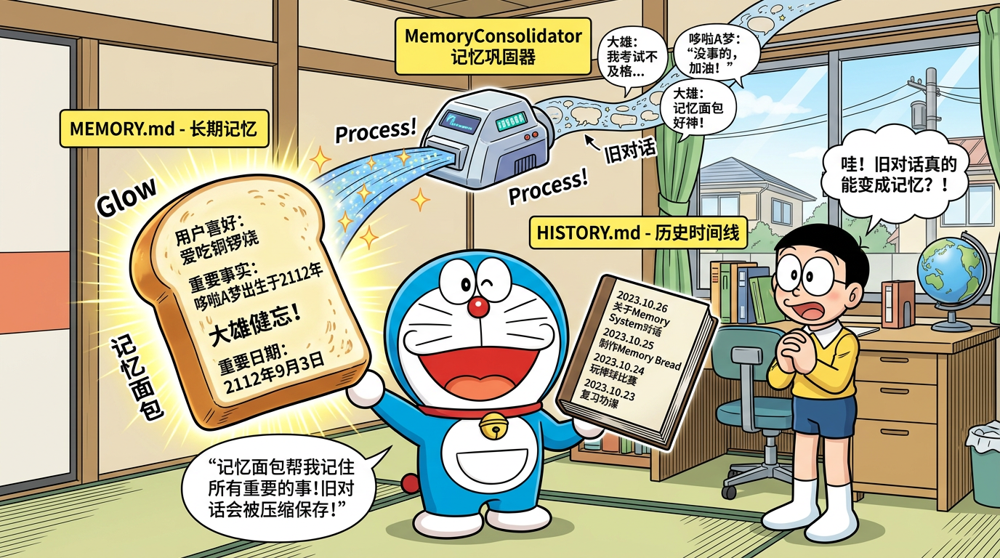

# 07 - 记忆系统实战

> **阅读时间**：约 2 小时  
> **前置知识**：[06 - 安装与上手](../06-install-and-hands-on/README.md)  
> **学习目标**：深入理解 Nanobot 的双层记忆架构、MemoryConsolidator 压缩机制、会话管理，掌握面试高频考点

---



*Nanobot 双层记忆：MEMORY.md（记忆面包 = 长期记忆）+ HISTORY.md（历史时间线）*

## 目录

- [7.1 为什么 Agent 需要记忆](#71-为什么-agent-需要记忆)
- [7.2 记忆系统的挑战](#72-记忆系统的挑战)
- [7.3 Nanobot 双层记忆架构](#73-nanobot-双层记忆架构)
- [7.4 MEMORY.md —— 长期记忆](#74-memorymd--长期记忆)
- [7.5 HISTORY.md —— 历史时间线](#75-historymd--历史时间线)
- [7.6 MemoryConsolidator 压缩机制](#76-memoryconsolidator-压缩机制)
- [7.7 短期记忆：Session 会话历史](#77-短期记忆session-会话历史)
- [7.8 记忆系统完整数据流](#78-记忆系统完整数据流)
- [7.9 记忆系统与其他框架对比](#79-记忆系统与其他框架对比)
- [7.10 实战练习](#710-实战练习)
- [7.11 面试高频题](#711-面试高频题)
- [7.12 本章小结](#712-本章小结)

---

## 7.1 为什么 Agent 需要记忆

### 7.1.1 无记忆 Agent 的问题

想象一个没有记忆的助手：

```
对话 1:
You: 我叫张三，是一名后端工程师
Agent: 你好张三！很高兴认识你。

对话 2（新会话）:
You: 我之前说我叫什么名字？
Agent: 抱歉，我不知道你的名字，这是我们的第一次对话。
```

这就是纯 LLM 的局限 —— **没有跨会话记忆**。每次对话都是全新的开始。

### 7.1.2 记忆赋予 Agent 的能力

| 能力 | 无记忆 | 有记忆 |
|------|--------|--------|
| 跨会话延续 | 每次重新开始 | 记住之前的对话 |
| 用户偏好 | 每次重新询问 | 自动适应 |
| 任务延续 | 无法暂停继续 | 支持长期项目 |
| 知识积累 | 不积累 | 持续学习 |
| 上下文理解 | 仅当前对话 | 理解历史背景 |

### 7.1.3 记忆系统的核心矛盾

设计 Agent 记忆系统需要平衡三个矛盾：

```
      完整性               成本
   (记住所有)          (节省 token)
       │                   │
       └────── 矛盾 ──────┘
               │
            实时性
        (快速检索)
```

1. **完整性 vs 成本**：记住所有信息需要巨大的上下文窗口，费用高昂
2. **完整性 vs 实时性**：存储所有信息使检索变慢
3. **成本 vs 实时性**：压缩信息虽然省钱，但可能丢失重要细节

> 💡 **面试要点**：能分析记忆系统的设计权衡，比只描述实现更能打动面试官。

---

## 7.2 记忆系统的挑战

### 7.2.1 LLM 的上下文窗口限制

```
模型上下文窗口对比：
┌──────────────────┬──────────────┐
│ 模型             │ 上下文窗口    │
├──────────────────┼──────────────┤
│ GPT-3.5          │ 4K / 16K     │
│ GPT-4o           │ 128K         │
│ Claude 3.5       │ 200K         │
│ DeepSeek-V3      │ 128K         │
│ Gemini 1.5 Pro   │ 2M           │
└──────────────────┴──────────────┘

128K tokens ≈ 约 10 万字 ≈ 一本短篇小说
```

看似很大，但实际上：
- System Prompt 占用 2000-5000 tokens
- 工具定义占用 3000-8000 tokens
- 技能摘要占用 1000-3000 tokens
- 长期记忆占用 500-2000 tokens
- **留给对话历史的空间其实有限**

### 7.2.2 信息遗忘的代价

如果简单地"截断"旧对话来适应窗口：
- 可能丢失用户的关键偏好
- 可能遗忘重要的任务上下文
- 可能重复询问已知信息（用户体验差）

### 7.2.3 业界常见方案

| 方案 | 优点 | 缺点 |
|------|------|------|
| 滑动窗口截断 | 实现简单 | 丢失早期信息 |
| 向量检索（RAG） | 精确检索 | 需要向量库，架构复杂 |
| 摘要压缩 | 保留关键信息 | 有信息损失 |
| 知识图谱 | 结构化存储 | 实现复杂，维护成本高 |
| **文件存储（Nanobot）** | **简单透明** | **依赖文件 I/O** |

---

## 7.3 Nanobot 双层记忆架构

Nanobot 采用了一种极简但有效的双层记忆架构：

```
┌─────────────────────────────────────────────────────────────┐
│                    Nanobot 记忆架构                          │
│                                                             │
│  ┌──────────────────────┐  ┌──────────────────────────────┐ │
│  │   MEMORY.md          │  │   HISTORY.md                 │ │
│  │   （长期记忆）         │  │   （历史时间线）              │ │
│  │                      │  │                              │ │
│  │ · 关键事实           │  │ · 时间戳 + 事件摘要          │ │
│  │ · 用户偏好           │  │ · 仅追加模式                 │ │
│  │ · 重要决策           │  │ · 不注入 System Prompt       │ │
│  │ · 项目状态           │  │ · 通过 read_file 按需检索    │ │
│  │                      │  │                              │ │
│  │ ✅ 始终注入上下文     │  │ ✅ 节省 token               │ │
│  │ ❌ 大小有限          │  │ ❌ 需要主动查询              │ │
│  └──────────────────────┘  └──────────────────────────────┘ │
│                                                             │
│  ┌──────────────────────────────────────────────────────────┐│
│  │   Session JSONL（短期记忆）                               ││
│  │   · 完整对话历史 · 工具调用记录 · 当前会话上下文          ││
│  └──────────────────────────────────────────────────────────┘│
└─────────────────────────────────────────────────────────────┘
```

### 关键设计决策

| 设计决策 | Nanobot 的选择 | 理由 |
|---------|---------------|------|
| 存储方式 | 纯文件（Markdown） | 透明、可编辑、无外部依赖 |
| 长期记忆 | 全量注入 | 确保 Agent 始终知道关键信息 |
| 历史时间线 | 按需检索 | 节省 token，历史通常不需要 |
| 压缩方式 | LLM 驱动摘要 | 利用 LLM 的理解能力 |
| 会话存储 | JSONL 格式 | 追加写入高效，便于流式处理 |

---

## 7.4 MEMORY.md —— 长期记忆

### 7.4.1 存储位置

```
<workspace>/memory/MEMORY.md
```

在 config.json 中通过 `workspace` 字段间接确定位置。

### 7.4.2 文件内容示例

```markdown
# Memory

## 用户信息
- 用户名：张三
- 职业：后端开发工程师，3 年经验
- 技术栈：Python, FastAPI, PostgreSQL, Redis
- 目标：准备 AI Agent 方向的面试

## 偏好
- 语言：简体中文
- 风格：喜欢看代码示例，偏好详细解释
- 工作环境：macOS, VS Code

## 项目上下文
- 当前正在学习 Nanobot 框架
- 已完成章节 01-06 的学习
- 重点关注记忆系统和工具系统

## 重要决策
- 2024-03-15：决定使用 DeepSeek 作为主要 LLM Provider
- 2024-03-16：确定面试重点为 Agent 架构设计
```

### 7.4.3 注入方式

MEMORY.md 的内容**始终**被注入到 System Prompt 中：

```python
# 简化的源码逻辑
def build_system_prompt(self):
    parts = []
    parts.append(self.base_instructions)
    
    # MEMORY.md 始终注入
    memory_path = os.path.join(self.workspace, "memory", "MEMORY.md")
    if os.path.exists(memory_path):
        memory_content = read_file(memory_path)
        parts.append(f"## Long-term Memory\n{memory_content}")
    
    return "\n".join(parts)
```

### 7.4.4 为什么用 Markdown 而不是数据库

| 对比维度 | Markdown 文件 | 数据库/向量库 |
|---------|-------------|-------------|
| 安装依赖 | 无（纯文件） | 需要安装配置 |
| 可读性 | 人类直接可读 | 需要查询工具 |
| 可编辑性 | 任何编辑器 | 需要专用接口 |
| Agent 理解 | 天然理解 Markdown | 需要转换 |
| 透明度 | 完全透明 | 黑盒 |
| 扩展性 | 有限 | 强 |
| 检索精度 | 全文匹配 | 语义检索 |

> 💡 **Nanobot 的哲学**："Agent 能读写 Markdown，用户也能读写 Markdown，为什么不让记忆就是 Markdown？"

### 7.4.5 MEMORY.md 的大小控制

MEMORY.md 不是无限增长的，它通过 MemoryConsolidator 进行动态管理：

- **新信息进入**：MemoryConsolidator 将新发现整合到 MEMORY.md
- **旧信息淘汰**：不再相关的信息在重写时被自然省略
- **大小目标**：保持在 500-2000 tokens 之间

---

## 7.5 HISTORY.md —— 历史时间线

### 7.5.1 存储位置

```
<workspace>/memory/HISTORY.md
```

### 7.5.2 文件内容示例

```markdown
# History

## 2024-03-15 14:30
用户自我介绍，是一名后端工程师，正在准备 AI Agent 面试。讨论了学习路线。

## 2024-03-15 16:45
帮助用户安装 Nanobot，解决了 API 连接超时问题（改用 DeepSeek Provider）。

## 2024-03-16 09:00
讲解了 Nanobot 的架构设计，用户对记忆系统特别感兴趣。创建了记忆系统的学习笔记。

## 2024-03-16 14:30
模拟面试练习：Agent 架构设计题。用户回答了 3 道题，在"记忆压缩机制"的描述上需要加强。
```

### 7.5.3 核心特性

**1. 仅追加模式（Append-Only）**

HISTORY.md 只会在末尾追加新条目，不会修改或删除已有内容：

```python
# 简化的源码逻辑
def append_history(self, entry: str):
    history_path = os.path.join(self.workspace, "memory", "HISTORY.md")
    with open(history_path, "a") as f:
        f.write(f"\n{entry}\n")
```

**2. 不整体注入上下文**

与 MEMORY.md 不同，HISTORY.md **不会**被注入到 System Prompt：

```
System Prompt 包含：
✅ MEMORY.md  → 始终注入
❌ HISTORY.md → 不注入（节省 token）
```

**3. 通过工具按需检索**

当 Agent 需要回忆过去的事件时，可以通过 `read_file` 或 `grep` 工具主动检索：

```
Agent 内部思考：
"用户问我之前讨论过什么...我需要查看历史记录"

[调用工具: read_file]
[路径: memory/HISTORY.md]

→ 获取历史时间线
→ 基于时间线回答用户问题
```

### 7.5.4 MEMORY.md vs HISTORY.md 对比

| 对比维度 | MEMORY.md | HISTORY.md |
|---------|-----------|------------|
| 性质 | 长期记忆（语义） | 历史时间线（事件） |
| 注入方式 | 始终注入 System Prompt | 不注入，按需检索 |
| 更新方式 | 整体重写（覆盖） | 仅追加（Append） |
| Token 消耗 | 每轮都消耗 | 仅检索时消耗 |
| 内容类型 | 关键事实、偏好 | 时间戳 + 事件摘要 |
| 大小控制 | MemoryConsolidator 管理 | 持续增长 |
| 类比 | 大脑的核心认知 | 日记本 |

---

## 7.6 MemoryConsolidator 压缩机制

MemoryConsolidator 是 Nanobot 记忆系统中最精妙的设计，也是**面试高频考点**。

### 7.6.1 触发条件

```python
# 简化的源码逻辑
def should_consolidate(self, messages: list) -> bool:
    total_tokens = estimate_prompt_tokens_chain(messages)
    return total_tokens > self.context_window_tokens
```

当 `estimate_prompt_tokens_chain`（估算的 Prompt 总 token 数）超过 `context_window_tokens`（配置的上下文窗口大小）时，触发压缩。

```
触发公式：
estimate_prompt_tokens_chain(当前对话链) > context_window_tokens

例如：
context_window_tokens = 128000
当前对话 tokens = 130000
→ 130000 > 128000 → 触发压缩！
```

### 7.6.2 压缩流程详解

```
完整的压缩流程：

Step 1: 检测触发
─────────────────────────────
estimate_prompt_tokens_chain() > context_window_tokens
           │
           ▼
Step 2: 构造压缩 Prompt
─────────────────────────────
"当前 MEMORY.md 内容" + "待处理的对话历史"
           │
           ▼
Step 3: 调用 LLM（tool_choice: save_memory）
─────────────────────────────
LLM 分析对话，提取关键信息
           │
           ▼
Step 4: LLM 返回 save_memory 工具调用
─────────────────────────────
{
  "tool": "save_memory",
  "arguments": {
    "history_entry": "时间戳摘要...",
    "memory_update": "新的完整 MEMORY.md 内容..."
  }
}
           │
           ▼
Step 5: 写入文件
─────────────────────────────
HISTORY.md ← 追加 history_entry
MEMORY.md  ← 覆盖为 memory_update
           │
           ▼
Step 6: 截断对话历史
─────────────────────────────
丢弃已被压缩的旧对话消息
```

### 7.6.3 save_memory 虚拟工具

`save_memory` 是一个**虚拟工具**——它不在工具注册表中暴露给 Agent 正常使用，仅在记忆压缩时通过 `tool_choice` 强制 LLM 调用。

```python
# save_memory 工具定义
save_memory_tool = {
    "type": "function",
    "function": {
        "name": "save_memory",
        "description": "Save consolidated memory",
        "parameters": {
            "type": "object",
            "properties": {
                "history_entry": {
                    "type": "string",
                    "description": "A timestamped summary for HISTORY.md"
                },
                "memory_update": {
                    "type": "string",
                    "description": "The complete new content for MEMORY.md"
                }
            },
            "required": ["history_entry", "memory_update"]
        }
    }
}
```

**两个参数的职责**：

| 参数 | 写入目标 | 写入方式 | 内容 |
|------|---------|---------|------|
| `history_entry` | HISTORY.md | 追加（Append） | 时间戳 + 对话摘要 |
| `memory_update` | MEMORY.md | 覆盖（Overwrite） | 新的完整 MEMORY.md |

### 7.6.4 压缩 Prompt 的构造

MemoryConsolidator 构造给 LLM 的压缩提示词大致如下：

```
你是一个记忆管理助手。你需要：

1. 分析当前的记忆内容和新的对话历史
2. 将新的重要信息整合到记忆中
3. 移除不再相关的旧信息
4. 生成一条历史时间线条目

当前 MEMORY.md 内容：
---
{current_memory}
---

需要处理的对话历史：
---
{conversation_to_consolidate}
---

请调用 save_memory 工具保存结果。
```

### 7.6.5 鲁棒性设计

MemoryConsolidator 的健壮性设计是源码中的一大亮点，也是面试加分项：

**1. JSON 归一化**

LLM 返回的 JSON 可能格式不规范（多余逗号、缺少引号等），Nanobot 会进行归一化处理：

```python
def normalize_json(raw_text: str) -> dict:
    """尝试修复和解析不规范的 JSON"""
    # 移除 markdown 代码块标记
    text = raw_text.strip()
    if text.startswith("```"):
        text = text.split("\n", 1)[1]
        text = text.rsplit("```", 1)[0]
    
    # 尝试直接解析
    try:
        return json.loads(text)
    except json.JSONDecodeError:
        # 尝试修复常见问题并重新解析
        text = fix_trailing_commas(text)
        text = fix_single_quotes(text)
        return json.loads(text)
```

**2. tool_choice 失败回退**

首先使用 `tool_choice: {"type": "function", "function": {"name": "save_memory"}}` 强制 LLM 调用 `save_memory`。如果失败（某些模型不支持 tool_choice），则回退到 `tool_choice: "auto"`：

```python
# 简化的回退逻辑
async def consolidate(self):
    try:
        # 首次尝试：强制调用 save_memory
        result = await self.llm.call(
            messages=consolidation_messages,
            tools=[save_memory_tool],
            tool_choice={"type": "function", "function": {"name": "save_memory"}}
        )
    except Exception:
        # 回退：使用 auto 模式
        result = await self.llm.call(
            messages=consolidation_messages,
            tools=[save_memory_tool],
            tool_choice="auto"
        )
```

**3. 连续 3 次失败的 Raw Archive**

如果 tool_choice 和 auto 模式都连续失败 3 次，启用最后的保底策略——Raw Archive：

```python
# 保底策略：直接将对话原文追加到 HISTORY.md
def raw_archive(self, messages: list):
    """当所有压缩策略都失败时，直接归档原始对话"""
    raw_text = format_messages_as_text(messages)
    timestamp = datetime.now().isoformat()
    
    entry = f"## {timestamp} [Raw Archive]\n{raw_text}\n"
    append_to_file("memory/HISTORY.md", entry)
    
    # 清除已归档的消息
    messages.clear()
```

```
容错链路：
tool_choice: save_memory  →  失败
         │
         ▼
tool_choice: auto         →  失败
         │
         ▼
直接 Raw Archive          →  保底成功
```

> 💡 **面试要点**：这种三级容错设计体现了工程鲁棒性思维。面试时可以展开讲："Nanobot 的记忆压缩有三级容错——先用 tool_choice 强制调用，失败后回退到 auto 模式让模型自主选择，如果连续 3 次都失败则直接归档原始对话。这确保了无论什么情况下记忆都不会丢失。"

### 7.6.6 压缩前后对比示例

**压缩前 —— 原始对话（约 5000 tokens）**：

```
User: 我叫张三，是后端工程师
Agent: 你好张三！...（详细自我介绍）

User: 帮我写一个 FastAPI 的 CRUD 接口
Agent: 好的，我来帮你写...（200行代码）

User: 这个接口怎么加上 JWT 认证？
Agent: 我们需要...（100行代码 + 详细解释）

User: 数据库用 PostgreSQL 还是 MySQL？
Agent: 对比分析...（长篇分析）

... 还有 20 轮对话 ...
```

**压缩后 —— MEMORY.md（约 500 tokens）**：

```markdown
# Memory

## 用户信息
- 姓名：张三
- 职业：后端工程师
- 技术栈偏好：FastAPI, PostgreSQL

## 项目上下文
- 正在构建一个 REST API 项目
- 已实现 CRUD 接口和 JWT 认证
- 数据库选择了 PostgreSQL

## 技术偏好
- 喜欢详细的代码示例
- 偏好使用类型注解
```

**压缩后 —— HISTORY.md（新增约 200 tokens）**：

```markdown
## 2024-03-15 14:30-16:00
帮助用户张三（后端工程师）构建 FastAPI REST API 项目。完成了 CRUD 接口、JWT 认证集成。对比分析后选择 PostgreSQL 作为数据库。用户偏好详细代码示例。
```

---

## 7.7 短期记忆：Session 会话历史

### 7.7.1 Session 的概念

Session 是一次"对话会话"的完整记录，存储为 JSONL（JSON Lines）格式。

```
<workspace>/sessions/<session_key>.jsonl
```

`session_key` 的格式为 `{channel}:{chat_id}`，例如：
- `cli:default.jsonl` —— CLI 交互的默认会话
- `telegram:123456.jsonl` —— Telegram 用户 123456 的会话
- `discord:guild_123:channel_456.jsonl` —— Discord 特定频道的会话

### 7.7.2 JSONL 格式

每行是一个完整的 JSON 对象，记录一个对话"回合"（turn）：

```jsonl
{"role":"user","content":"你好","timestamp":"2024-03-15T14:30:00Z"}
{"role":"assistant","content":"你好！有什么可以帮你的吗？","timestamp":"2024-03-15T14:30:05Z","tool_calls":null}
{"role":"user","content":"帮我创建一个 hello.py","timestamp":"2024-03-15T14:31:00Z"}
{"role":"assistant","content":"好的，我来帮你创建。","timestamp":"2024-03-15T14:31:03Z","tool_calls":[{"name":"write_file","arguments":{"path":"hello.py","content":"print('Hello, World!')"}}]}
{"role":"tool","content":"File written successfully","name":"write_file","timestamp":"2024-03-15T14:31:04Z"}
```

### 7.7.3 _save_turn() 方法

`_save_turn()` 是 Session 管理的核心方法，负责将每个对话回合持久化到 JSONL 文件：

```python
# 简化的源码逻辑
def _save_turn(self, message: dict):
    """保存一个对话回合到 JSONL 文件"""
    
    # 1. 清理 reasoning/thinking 标签
    content = message.get("content", "")
    content = self._strip_thinking_tags(content)
    
    # 2. 处理大图片（用占位符替换）
    if "media" in message:
        message = self._replace_large_images(message)
    
    # 3. 追加写入 JSONL
    session_path = self._get_session_path()
    with open(session_path, "a") as f:
        f.write(json.dumps(message, ensure_ascii=False) + "\n")
```

### 7.7.4 关键处理细节

**1. 清理 reasoning/thinking 标签**

某些模型（如 DeepSeek）会在回复中包含 `<thinking>...</thinking>` 内部推理标签。这些标签不应出现在持久化的会话记录中：

```python
def _strip_thinking_tags(self, content: str) -> str:
    """移除 LLM 内部推理标签"""
    import re
    # 移除 <thinking>...</thinking>
    content = re.sub(r'<thinking>.*?</thinking>', '', content, flags=re.DOTALL)
    # 移除 <reasoning>...</reasoning>
    content = re.sub(r'<reasoning>.*?</reasoning>', '', content, flags=re.DOTALL)
    return content.strip()
```

**2. 大图片占位符替换**

如果对话中包含大图片（base64 编码），直接存储会导致 JSONL 文件膨胀。Nanobot 用占位符替换：

```python
def _replace_large_images(self, message: dict) -> dict:
    """将大图片替换为占位符"""
    MAX_IMAGE_SIZE = 1024 * 100  # 100KB
    
    if "media" in message:
        for i, media_item in enumerate(message["media"]):
            if len(media_item.get("data", "")) > MAX_IMAGE_SIZE:
                message["media"][i] = {
                    "type": "image",
                    "placeholder": "[Large image omitted]",
                    "original_size": len(media_item["data"])
                }
    return message
```

### 7.7.5 Session 加载与恢复

当 Agent 重新启动时，会从 JSONL 文件恢复会话历史：

```python
def load_session(self, session_key: str) -> list:
    """从 JSONL 文件加载会话历史"""
    session_path = self._get_session_path(session_key)
    messages = []
    
    if os.path.exists(session_path):
        with open(session_path, "r") as f:
            for line in f:
                line = line.strip()
                if line:
                    messages.append(json.loads(line))
    
    return messages
```

---

## 7.8 记忆系统完整数据流

将三层记忆整合起来，完整数据流如下：

```
用户发送消息
    │
    ▼
┌──────────────────────────┐
│  加载 Session 会话历史    │ ← sessions/<key>.jsonl
│  加载 MEMORY.md          │ ← memory/MEMORY.md（注入 System Prompt）
└──────────────────────────┘
    │
    ▼
┌──────────────────────────┐
│  构建完整 Prompt          │
│  = System Prompt          │
│    + MEMORY.md            │
│    + Session History      │
│    + 当前用户消息          │
└──────────────────────────┘
    │
    ▼
┌──────────────────────────┐
│  estimate_prompt_tokens   │
│  检查是否超过窗口         │
└──────────────────────────┘
    │                │
    │ 未超过          │ 超过
    ▼                ▼
┌────────────┐  ┌──────────────────┐
│ 正常调用   │  │ MemoryConsolidator│
│ LLM API    │  │ 1. 压缩对话      │
└────────────┘  │ 2. 更新 MEMORY.md│
    │           │ 3. 追加 HISTORY.md│
    │           │ 4. 截断会话       │
    │           └──────────────────┘
    │                │
    ▼                ▼
┌──────────────────────────┐
│  Agent 回复               │
│  _save_turn() 持久化      │ → sessions/<key>.jsonl
└──────────────────────────┘
```

---

## 7.9 记忆系统与其他框架对比

### 7.9.1 主流方案对比

| 框架/方案 | 存储方式 | 检索方式 | 压缩方式 | 透明度 | 复杂度 |
|-----------|---------|---------|---------|--------|--------|
| **Nanobot** | **Markdown 文件** | **全文注入 + 文件检索** | **LLM 摘要** | **高** | **低** |
| LangChain | 向量数据库 | 向量相似度 | 无/手动 | 低 | 中 |
| AutoGPT | JSON 文件 | 向量检索 | 无 | 中 | 中 |
| MemGPT | 虚拟分页 | 分页检索 | LLM 编辑 | 中 | 高 |
| CrewAI | 共享内存 | 直接访问 | 无 | 低 | 低 |

### 7.9.2 向量库 vs 文件存储 vs 知识图谱

**向量库方案（如 LangChain + Chroma/Pinecone）**

```
优点：
✅ 语义检索精确（"找关于数据库的讨论" 即使没有"数据库"关键词也能找到）
✅ 适合大量非结构化文档
✅ 检索速度快（O(log n)）

缺点：
❌ 需要外部依赖（向量数据库）
❌ 向量化过程有信息损失
❌ 更新不直观（需要重新 embedding）
❌ 调试困难（向量不可读）
```

**文件存储方案（Nanobot）**

```
优点：
✅ 零外部依赖
✅ 完全透明（人类可读可编辑）
✅ Agent 原生理解（Markdown）
✅ 版本控制友好（git 可追踪）
✅ 实现简单

缺点：
❌ 不支持语义检索（只能关键词匹配）
❌ 全文注入消耗 token
❌ 不适合超大规模记忆
```

**知识图谱方案（如 Neo4j + LLM）**

```
优点：
✅ 结构化存储关系
✅ 复杂推理能力（多跳查询）
✅ 知识去重

缺点：
❌ 实现极其复杂
❌ 需要实体抽取和关系建模
❌ 维护成本高
❌ 不适合轻量级 Agent
```

### 7.9.3 Nanobot 方案的适用场景

```
适合 Nanobot 文件记忆的场景：
✅ 个人助手（单用户，记忆量小）
✅ 轻量级 Agent（快速原型）
✅ 开发学习（透明可调试）
✅ 记忆内容结构化（事实列表）

不太适合的场景：
❌ 海量文档检索（1000+ 页）
❌ 多用户共享知识库
❌ 需要复杂关系推理
❌ 实时高并发场景
```

---

## 7.10 实战练习

### 练习 1：观察记忆压缩过程

```bash
# 1. 创建测试 workspace
mkdir memory-test && cd memory-test
nanobot onboard

# 2. 设置较小的 context_window_tokens 以便快速触发压缩
# 编辑 config.json，将 context_window_tokens 改为 4000
```

修改 config.json：

```json
{
  "agents": {
    "defaults": {
      "context_window_tokens": 4000
    }
  }
}
```

```bash
# 3. 启动 Agent 并进行大量对话
nanobot

# 对话示例（快速填充上下文）：
# You: 写一篇500字的关于Python的文章
# You: 再写一篇关于JavaScript的
# You: 比较一下两种语言的优缺点

# 4. 观察压缩触发
# 当 token 数超过 4000 时，Agent 会触发记忆压缩
# 你会看到 MEMORY.md 和 HISTORY.md 被更新

# 5. 检查结果
cat memory/MEMORY.md
cat memory/HISTORY.md
```

### 练习 2：手动编辑长期记忆

```bash
# 你可以直接编辑 MEMORY.md 来"植入"记忆
cat > memory/MEMORY.md << 'EOF'
# Memory

## 用户信息
- 我是一个资深的 Kubernetes 管理员
- 我管理着 50 个集群
- 我偏好使用 Helm Charts

## 项目
- 正在迁移微服务到 Service Mesh（Istio）
EOF

# 重新启动 Agent
nanobot
# You: 给我一些关于我当前项目的建议
# Agent 应该知道你在做 Istio 迁移
```

### 练习 3：分析 Session JSONL

```bash
# 查看会话记录
cat sessions/cli:default.jsonl | python -m json.tool --no-ensure-ascii

# 统计对话轮次
wc -l sessions/cli:default.jsonl

# 搜索特定内容
grep "write_file" sessions/cli:default.jsonl
```

---

## 7.11 面试高频题

### 题目 1：Nanobot 的记忆系统是如何设计的？

> **参考回答**：
>
> "Nanobot 采用了**双层文件记忆 + 会话历史**的三级记忆架构。
>
> **第一层是 MEMORY.md 长期记忆**，存储在 workspace/memory/MEMORY.md，包含用户的关键事实、偏好、重要决策等。它的特点是**始终注入 System Prompt**，确保 Agent 每次对话都能访问这些核心信息。
>
> **第二层是 HISTORY.md 历史时间线**，采用仅追加模式记录每次对话的时间戳摘要。它**不会被注入上下文**，只在需要时通过 read_file 工具按需检索，这样可以节省大量 token。
>
> **第三层是 Session JSONL 会话历史**，以 JSON Lines 格式记录完整的对话内容，包括用户消息、Agent 回复和工具调用。
>
> 这三层之间通过 **MemoryConsolidator** 连接：当会话 token 数超过 context_window_tokens 时，MemoryConsolidator 调用 LLM 将对话压缩为新的 MEMORY.md 内容和 HISTORY.md 条目，然后截断旧的会话历史。
>
> 这种设计的核心优势是**零外部依赖**——不需要向量数据库，纯文件存储，用户和 Agent 都可以直接读写，完全透明。"

### 题目 2：如何处理上下文窗口溢出？

> **参考回答**：
>
> "Nanobot 通过 **MemoryConsolidator** 处理上下文溢出，核心流程是：
>
> 1. **检测**：每次构建 Prompt 前，用 `estimate_prompt_tokens_chain` 估算总 token 数
> 2. **压缩**：超过阈值时，将'当前 MEMORY.md + 待压缩对话'发给 LLM，通过 `tool_choice` 强制调用 `save_memory` 虚拟工具
> 3. **save_memory** 返回两个结果：`history_entry`（追加到 HISTORY.md）和 `memory_update`（覆盖 MEMORY.md）
> 4. **截断**：丢弃已压缩的旧对话消息
>
> 容错方面有三级保障：先用 tool_choice 强制调用，失败后回退 auto 模式，连续 3 次失败则直接 Raw Archive 原始对话。这确保了无论 LLM 行为如何，记忆都不会丢失。"

### 题目 3：长期记忆与短期记忆的区别？

> **参考回答**：
>
> "在 Nanobot 中：
>
> **长期记忆（MEMORY.md）** 是经过 LLM 提炼的核心信息，类似人的'核心认知'——你知道自己叫什么名字、在哪里工作。它每轮对话都会被注入 System Prompt，所以 Agent 始终'知道'这些信息，但代价是消耗 token。它通过 MemoryConsolidator 整体重写更新，旧的不重要信息在重写时自然被淘汰。
>
> **短期记忆（Session JSONL）** 是当前会话的完整对话记录，类似人的'工作记忆'。它包含所有细节但生命周期有限——当 token 超限时，旧的对话会被压缩到长期记忆后截断。
>
> 两者的桥梁是 MemoryConsolidator：它把短期记忆中的关键信息'晋升'到长期记忆，把细节'沉淀'到 HISTORY.md 时间线。"

### 题目 4：为什么不用向量数据库？

> **参考回答**：
>
> "Nanobot 选择文件存储而非向量数据库，是一个有意识的权衡：
>
> 1. **零依赖**：不需要安装 Chroma/Pinecone/Weaviate，降低部署门槛
> 2. **透明度**：Markdown 文件人人可读，用户可以直接编辑记忆，这是向量库做不到的
> 3. **Agent 原生理解**：LLM 天然理解 Markdown，不需要向量化/反向量化
> 4. **版本控制**：可以用 git 追踪记忆变化历史
>
> 当然这也有局限性——不支持语义检索，不适合大规模知识库。但对于 Nanobot 定位的个人助手场景，文件存储完全够用且更优雅。
>
> 如果要我改进，我会在保持文件存储的基础上增加一个轻量级的索引层，比如用 TF-IDF 对 HISTORY.md 建索引，在保持简单性的同时提升检索能力。"

### 题目 5：如果让你改进 Nanobot 的记忆系统，你会怎么做？

> **参考回答**：
>
> "我会从三个方向考虑改进：
>
> 1. **增加语义检索层**：在保持 Markdown 文件存储的基础上，用轻量级的 embedding 模型（如 sentence-transformers）对 HISTORY.md 的条目建向量索引。这样 Agent 可以按语义检索历史，而不仅仅是关键词匹配。
>
> 2. **记忆分级策略**：参考操作系统的多级缓存设计——L1 是 MEMORY.md（热数据，始终注入），L2 是最近的 HISTORY.md 条目（温数据，按需加载），L3 是归档历史（冷数据，仅精确查询时检索）。
>
> 3. **记忆质量评估**：在 MemoryConsolidator 中加入一个验证步骤——压缩后让 LLM 对比原始对话和压缩结果，检查是否遗漏了关键信息。如果遗漏严重则重新压缩。"

---

## 7.12 本章小结

### 核心知识点

```
Nanobot 记忆系统 = MEMORY.md + HISTORY.md + Session JSONL

MEMORY.md（长期记忆）
├── 始终注入 System Prompt
├── MemoryConsolidator 整体重写
└── 关键事实、偏好、状态

HISTORY.md（历史时间线）
├── 仅追加模式
├── 不注入（节省 token）
└── 通过 read_file 按需检索

Session JSONL（短期记忆）
├── 完整对话记录
├── _save_turn() 持久化
└── 清理 thinking 标签 + 图片占位符

MemoryConsolidator（压缩器）
├── 触发：token 超过 context_window_tokens
├── 流程：构造 Prompt → save_memory 工具调用
└── 容错：tool_choice → auto → Raw Archive
```

### 面试记忆清单

| 考点 | 一句话回答 |
|------|-----------|
| 记忆架构 | 双层文件记忆 + 会话历史的三级架构 |
| MEMORY.md | 长期记忆，始终注入 System Prompt |
| HISTORY.md | 历史时间线，仅追加，按需检索 |
| 压缩触发 | token 数超过 context_window_tokens |
| 压缩工具 | save_memory 虚拟工具（history_entry + memory_update） |
| 容错机制 | tool_choice → auto → Raw Archive 三级回退 |
| 为什么用文件 | 零依赖、透明可编辑、Agent 原生理解 |

---

> **下一章**：[08 - 技能与工具](../08-skills-and-tools/README.md) —— 深入理解 Nanobot 的 Skill 系统和工具链