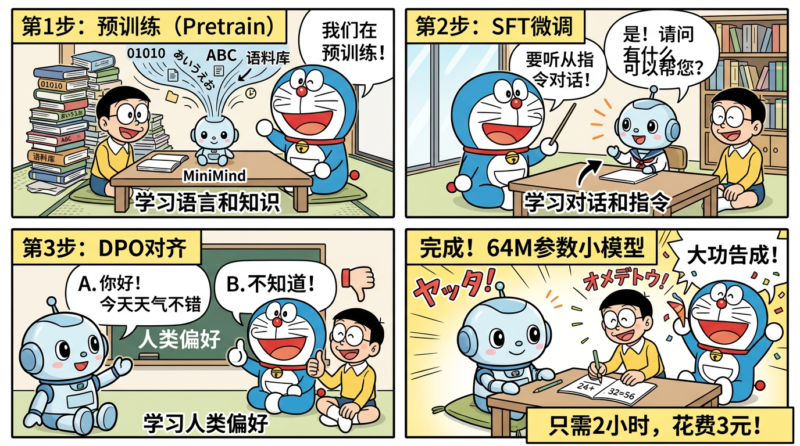

# 第12章：MiniMind 完全指南 —— 从零训练大语言模型

> **定位**：本章是面向校招/社招面试的深度学习指南，以 GitHub 45K+ Stars 的开源项目 [jingyaogong/minimind](https://github.com/jingyaogong/minimind) 为蓝本，系统讲解"从零训练一个大语言模型"的全部流程。内容覆盖**模型架构、训练流水线、代码实现、复现步骤、面试高频题**，力求做到"读完即可上手、面试能答"。

---



*MiniMind 训练四部曲：预训练 → SFT微调 → DPO对齐 → 完成！只需2小时，花费3元*

## 目录

- [第一部分：项目概述](#第一部分项目概述)
- [第二部分：模型架构深度解析](#第二部分模型架构深度解析)
- [第三部分：训练流水线完整解析](#第三部分训练流水线完整解析)
- [第四部分：完整复现步骤](#第四部分完整复现步骤)
- [第五部分：关键文件速查表](#第五部分关键文件速查表)
- [第六部分：面试常见问题](#第六部分面试常见问题)

---

## 第一部分：项目概述

### 1.1 MiniMind 是什么？

MiniMind 是一个完全从零开始训练大语言模型（LLM）的开源项目，由 [jingyaogong](https://github.com/jingyaogong) 发起。它的核心目标是：

> **用最低的成本（约3元人民币电费 + 2小时训练时间），在单张 NVIDIA 3090 显卡上，从零完成一个可以对话的语言模型。**

这不是一个"微调别人模型"的项目，而是真正从**数据预处理 → Tokenizer训练 → 预训练 → SFT → RLHF/DPO** 全链路走通的教学级项目。

### 1.2 核心卖点

| 特性 | 说明 |
|------|------|
| **极低门槛** | 单卡 3090（24GB）即可完成全流程训练 |
| **极低成本** | 预训练约2小时，电费约3元人民币 |
| **全流程覆盖** | Pretrain → SFT → LoRA → 蒸馏 → DPO → RLAIF → Agentic RL |
| **代码极简** | 核心模型代码约300行，易于阅读和理解 |
| **对齐主流** | 架构对齐 Qwen3 风格，学一个等于学一类 |
| **推理轻量** | 推理显存占用约 0.5GB，CPU 也能跑 |

### 1.3 参数规模

MiniMind 提供了多种规模的模型配置：

| 模型 | 参数量 | 架构 | 说明 |
|------|--------|------|------|
| MiniMind-Dense (Small) | ~26M | Dense Transformer | 最小配置，用于快速实验 |
| MiniMind-Dense (Base) | ~64M | Dense Transformer | 默认配置，推荐入门 |
| MiniMind-MoE | ~198M（激活~64M） | MoE Transformer | 混合专家架构 |

其中 **64M Dense** 是最推荐的入门配置，它在保持模型能力的同时，训练成本极低。

### 1.4 GitHub 数据

- **Stars**: 45,000+（截至2026年初）
- **License**: Apache 2.0（商用友好）
- **语言**: Python（PyTorch）
- **社区活跃度**: 持续更新，Issues/PR 活跃

### 1.5 项目意义：为什么要学 MiniMind？

#### 对求职者的价值

1. **理解全流程**：面试官经常问"你了解大模型训练的全流程吗？"，MiniMind 让你能够完整回答从数据到部署的每一步。
2. **深入架构细节**：不是调 API，而是真正理解 Transformer 的每一个组件——RoPE、GQA、RMSNorm、SwiGLU、MoE。
3. **对齐工业界**：架构对齐 Qwen3 风格，学到的知识可以直接迁移到对主流模型的理解。
4. **训练技巧**：LoRA、蒸馏、DPO、PPO/GRPO 等技术的实战经验，面试中极具说服力。
5. **低成本可复现**：不需要 A100 集群，个人电脑就能跑，非常适合写进简历。

#### 对学习者的价值

1. **代码可读**：核心模型代码约300行，远比 HuggingFace Transformers 的数万行代码容易理解。
2. **文档完善**：项目自带详细的中文文档和架构图。
3. **循序渐进**：从最简单的预训练开始，逐步增加复杂度。

#### 这个项目在行业中的定位

```
┌─────────────────────────────────────────────────────┐
│                  大模型生态定位图                      │
├─────────────────────────────────────────────────────┤
│                                                     │
│  工业级模型（千亿参数）                                │
│  ├── GPT-4, Claude, Gemini                          │
│  ├── LLaMA-3 (405B), Qwen-3 (72B)                  │
│  └── 需要数千张 GPU, 数百万美元                       │
│                                                     │
│  中等规模开源（数十亿参数）                            │
│  ├── LLaMA-3 (8B), Qwen-3 (7B)                     │
│  ├── Mistral (7B), Phi-3 (3.8B)                     │
│  └── 需要多卡或 A100, 数万美元                        │
│                                                     │
│  教学级项目（数千万参数）          ← MiniMind 在这里   │
│  ├── MiniMind (64M/198M)                            │
│  ├── nanoGPT, TinyLlama                             │
│  └── 单卡 3090, 几元电费                              │
│                                                     │
└─────────────────────────────────────────────────────┘
```

---

## 第二部分：模型架构深度解析

### 2.1 整体架构：Decoder-only Transformer

MiniMind 采用 **Decoder-only Transformer** 架构，这与 GPT、LLaMA、Qwen 等主流大模型一致。

```
输入 Token IDs
      │
      ▼
┌──────────────┐
│  Embedding   │  ← 词嵌入层 (vocab_size × d_model)
└──────┬───────┘
       │
       ▼
┌──────────────┐
│  RMSNorm     │  ← Pre-Norm（在注意力之前做归一化）
├──────────────┤
│  GQA Attn    │  ← 分组查询注意力 + RoPE
├──────────────┤
│  Residual +  │  ← 残差连接
├──────────────┤
│  RMSNorm     │  ← Pre-Norm
├──────────────┤
│  FFN/MoE     │  ← SwiGLU 前馈网络 / MoE层
├──────────────┤
│  Residual +  │  ← 残差连接
└──────┬───────┘
       │  × N_layers (默认8层)
       ▼
┌──────────────┐
│  RMSNorm     │  ← 最终归一化
├──────────────┤
│  Linear Head │  ← 输出投影 (d_model → vocab_size)
└──────┬───────┘
       │
       ▼
  Logits (词表概率分布)
```

### 2.2 详细参数表

以下是 MiniMind 默认配置（对齐 Qwen3 风格）的完整参数：

| 参数名 | 默认值 | 含义 |
|--------|--------|------|
| `len_vocab` | 6400 | 词表大小（BPE + ByteLevel） |
| `max_pos` | 32768 | 最大位置编码长度（支持32K上下文） |
| `rope_theta` | 1e6 | RoPE 旋转角度的基底频率 |
| `n_layers` | 8 | Transformer 层数 |
| `d_model` | 768 | 隐藏层维度 |
| `kv_heads` | 4 | Key/Value 头数 |
| `q_heads` | 8 | Query 头数（GQA: q_heads > kv_heads） |
| `d_ff` | 2048 | FFN 中间层维度 |
| `dropout` | 0.0 | Dropout 概率（训练时通常设为0） |
| `use_moe` | false | 是否使用 MoE 架构 |
| `n_experts` | 4 | MoE 专家数量 |
| `top_k_experts` | 1 | MoE 激活专家数（top-1路由） |

### 2.3 RoPE 旋转位置编码

#### 2.3.1 为什么需要位置编码？

Transformer 的自注意力机制本身是**置换不变的（permutation invariant）**——它不知道 token 的顺序。位置编码的作用就是把"位置信息"注入到模型中。

#### 2.3.2 RoPE 的核心思想

RoPE（Rotary Position Embedding）的核心思想是：**通过旋转向量来编码位置信息**。

对于位置 \(m\) 处的向量 \(\mathbf{x}\)，RoPE 将其分成两两一对，然后对每一对应用一个旋转矩阵：

$$
\text{RoPE}(\mathbf{x}, m) = 
\begin{pmatrix}
x_0 \cos(m\theta_0) - x_1 \sin(m\theta_0) \\
x_0 \sin(m\theta_0) + x_1 \cos(m\theta_0) \\
x_2 \cos(m\theta_1) - x_3 \sin(m\theta_1) \\
x_2 \sin(m\theta_1) + x_3 \cos(m\theta_1) \\
\vdots
\end{pmatrix}
$$

其中频率定义为：

$$
\theta_i = \frac{1}{\text{rope\_theta}^{2i/d}} = \frac{1}{1000000^{2i/d}}
$$

MiniMind 使用 `rope_theta = 1e6`（与 Qwen3 对齐），这个较大的基底频率有助于长序列外推。

#### 2.3.3 RoPE 的关键性质

**相对位置编码**：两个位置 \(m\) 和 \(n\) 的注意力分数只取决于 \(m - n\)，而不是绝对位置。

$$
\langle \text{RoPE}(\mathbf{q}, m), \text{RoPE}(\mathbf{k}, n) \rangle = f(\mathbf{q}, \mathbf{k}, m - n)
$$

这意味着模型自然地学会了"距离"的概念。

#### 2.3.4 代码实现

```python
def precompute_rope_freqs(dim, max_pos=32768, theta=1e6):
    """预计算 RoPE 频率表"""
    # 频率序列: theta_i = 1 / (theta^(2i/dim))
    freqs = 1.0 / (theta ** (torch.arange(0, dim, 2).float() / dim))
    # 位置序列
    t = torch.arange(max_pos)
    # 外积得到 [max_pos, dim//2] 的频率矩阵
    freqs = torch.outer(t, freqs)
    # 转为复数形式: cos(θ) + i·sin(θ)
    freqs_cis = torch.polar(torch.ones_like(freqs), freqs)
    return freqs_cis

def apply_rope(xq, xk, freqs_cis):
    """将 RoPE 应用到 query 和 key 上"""
    # 将实数张量视为复数张量
    xq_complex = torch.view_as_complex(xq.float().reshape(*xq.shape[:-1], -1, 2))
    xk_complex = torch.view_as_complex(xk.float().reshape(*xk.shape[:-1], -1, 2))
    
    # 复数乘法 = 旋转
    xq_out = torch.view_as_real(xq_complex * freqs_cis).flatten(-2)
    xk_out = torch.view_as_real(xk_complex * freqs_cis).flatten(-2)
    
    return xq_out.type_as(xq), xk_out.type_as(xk)
```

#### 2.3.5 直觉理解

把每一对维度想象成一个**二维平面上的钟摆**：
- 不同维度对的频率不同（就像不同速度的钟表）
- 位置越靠后，钟摆旋转的角度越大
- 两个 token 的"距离"由它们的旋转角度之差决定
- 低频维度编码长距离依赖，高频维度编码局部关系

### 2.4 GQA（Grouped-Query Attention）

#### 2.4.1 注意力机制的三种变体

```
MHA (Multi-Head Attention):         GQA (Grouped-Query Attention):     MQA (Multi-Query Attention):
   每个头独立的 Q, K, V               Q头分组共享K,V                      所有Q头共享同一K,V

   Q1 → K1, V1                       Q1 ─┐                              Q1 ─┐
   Q2 → K2, V2                       Q2 ─┤→ K1, V1                      Q2 ─┤
   Q3 → K3, V3                       Q3 ─┐                              Q3 ─┤→ K1, V1
   Q4 → K4, V4                       Q4 ─┤→ K2, V2                      Q4 ─┤
   Q5 → K5, V5                       Q5 ─┐                              Q5 ─┤
   Q6 → K6, V6                       Q6 ─┤→ K3, V3                      Q6 ─┤
   Q7 → K7, V7                       Q7 ─┐                              Q7 ─┤
   Q8 → K8, V8                       Q8 ─┤→ K4, V4                      Q8 ─┘
   
   KV参数: 8组                        KV参数: 4组                         KV参数: 1组
   质量: 最高                          质量: 接近MHA                       质量: 略有下降
   效率: 最低                          效率: 中等（推荐）                   效率: 最高
```

#### 2.4.2 MiniMind 的 GQA 配置

在 MiniMind 中：
- **Q 头数 = 8**（`q_heads = 8`）
- **KV 头数 = 4**（`kv_heads = 4`）
- 每 2 个 Q 头共享 1 组 KV

#### 2.4.3 为什么用 GQA？

| 维度 | MHA | GQA | MQA |
|------|-----|-----|-----|
| KV Cache 大小 | 8 × d_head | 4 × d_head | 1 × d_head |
| 参数量 | 最多 | 减少约 33% | 最少 |
| 推理速度 | 最慢 | 快 | 最快 |
| 模型质量 | 基准 | 接近 MHA | 略有损失 |
| 工业应用 | GPT-3 | LLaMA-2/3, Qwen | FastChat |

GQA 是在**质量和效率之间的最佳平衡点**，这也是为什么 LLaMA、Qwen 等主流模型都采用了 GQA。

#### 2.4.4 KV Cache 节省计算

假设序列长度为 \(L\)，头维度为 \(d_h\)，batch size 为 \(B\)：

| 方案 | KV Cache 内存 | 公式 |
|------|---------------|------|
| MHA (8 heads) | \(2 \times B \times 8 \times L \times d_h\) | 基准 |
| GQA (4 kv_heads) | \(2 \times B \times 4 \times L \times d_h\) | **减少 50%** |
| MQA (1 head) | \(2 \times B \times 1 \times L \times d_h\) | 减少 87.5% |

对于 MiniMind 的配置：
- \(d_h = d_{model} / q_{heads} = 768 / 8 = 96\)
- 在 batch=1, seq_len=2048 时：
  - MHA KV Cache: \(2 \times 8 \times 2048 \times 96 \times 2\) bytes ≈ 6MB
  - GQA KV Cache: \(2 \times 4 \times 2048 \times 96 \times 2\) bytes ≈ 3MB

虽然在小模型上差距不大，但当模型规模扩大到数十亿参数时，KV Cache 的节省将非常可观。

#### 2.4.5 GQA 核心代码

```python
class Attention(nn.Module):
    def __init__(self, args):
        super().__init__()
        self.q_heads = args.q_heads      # 8
        self.kv_heads = args.kv_heads    # 4
        self.head_dim = args.d_model // args.q_heads  # 96
        self.n_rep = self.q_heads // self.kv_heads    # 2 (每组KV被2个Q共享)
        
        self.wq = nn.Linear(args.d_model, self.q_heads * self.head_dim, bias=False)
        self.wk = nn.Linear(args.d_model, self.kv_heads * self.head_dim, bias=False)
        self.wv = nn.Linear(args.d_model, self.kv_heads * self.head_dim, bias=False)
        self.wo = nn.Linear(self.q_heads * self.head_dim, args.d_model, bias=False)
    
    def forward(self, x, freqs_cis, mask=None):
        B, L, _ = x.shape
        
        q = self.wq(x).view(B, L, self.q_heads, self.head_dim)
        k = self.wk(x).view(B, L, self.kv_heads, self.head_dim)
        v = self.wv(x).view(B, L, self.kv_heads, self.head_dim)
        
        q, k = apply_rope(q, k, freqs_cis)
        
        # 将 KV 头扩展以匹配 Q 头数
        k = k.repeat_interleave(self.n_rep, dim=2)  # [B,L,4,96] → [B,L,8,96]
        v = v.repeat_interleave(self.n_rep, dim=2)
        
        # 标准注意力计算
        q = q.transpose(1, 2)  # [B, q_heads, L, head_dim]
        k = k.transpose(1, 2)
        v = v.transpose(1, 2)
        
        scores = torch.matmul(q, k.transpose(-2, -1)) / (self.head_dim ** 0.5)
        if mask is not None:
            scores = scores + mask
        attn = F.softmax(scores, dim=-1)
        
        output = torch.matmul(attn, v)
        output = output.transpose(1, 2).contiguous().view(B, L, -1)
        return self.wo(output)
```

### 2.5 RMSNorm vs LayerNorm

#### 2.5.1 LayerNorm 回顾

传统 LayerNorm 的公式：

$$
\text{LayerNorm}(\mathbf{x}) = \frac{\mathbf{x} - \mu}{\sigma} \cdot \gamma + \beta
$$

其中 \(\mu\) 是均值，\(\sigma\) 是标准差，\(\gamma\) 和 \(\beta\) 是可学习参数。

#### 2.5.2 RMSNorm 公式

RMSNorm 去掉了均值中心化和偏置项，只保留缩放：

$$
\text{RMSNorm}(\mathbf{x}) = \frac{\mathbf{x}}{\text{RMS}(\mathbf{x})} \cdot \gamma
$$

其中：

$$
\text{RMS}(\mathbf{x}) = \sqrt{\frac{1}{d} \sum_{i=1}^{d} x_i^2 + \epsilon}
$$

#### 2.5.3 为什么用 RMSNorm？

| 对比项 | LayerNorm | RMSNorm |
|--------|-----------|---------|
| 均值计算 | 需要 | 不需要 |
| 偏置参数 | 有 \(\beta\) | 无 |
| 计算量 | 较大 | **减少约 10-15%** |
| 效果 | 基准 | **几乎无损** |
| 采用者 | GPT-2, BERT | **LLaMA, Qwen, MiniMind** |

研究发现，LayerNorm 中的均值中心化对训练的贡献很小，去掉后不影响效果但能加速计算。

#### 2.5.4 代码实现

```python
class RMSNorm(nn.Module):
    def __init__(self, dim, eps=1e-6):
        super().__init__()
        self.eps = eps
        self.weight = nn.Parameter(torch.ones(dim))
    
    def forward(self, x):
        rms = torch.sqrt(torch.mean(x ** 2, dim=-1, keepdim=True) + self.eps)
        return x / rms * self.weight
```

#### 2.5.5 Pre-Norm vs Post-Norm

MiniMind 使用 **Pre-Norm**（先归一化，再做注意力/FFN），这也是现代 LLM 的标准做法：

```
Pre-Norm (MiniMind/LLaMA/Qwen):      Post-Norm (原始Transformer/BERT):
   x → RMSNorm → Attn → + x            x → Attn → + x → LayerNorm
   x → RMSNorm → FFN  → + x            x → FFN  → + x → LayerNorm
```

Pre-Norm 的优势：训练更稳定，梯度流更平滑，不容易出现训练崩溃。

### 2.6 SwiGLU 激活函数

#### 2.6.1 从 ReLU 到 SwiGLU

```
ReLU:     f(x) = max(0, x)
GELU:     f(x) = x · Φ(x)                    ← GPT-2/BERT 使用
SiLU:     f(x) = x · σ(x) = x / (1 + e^(-x))  ← 也叫 Swish
SwiGLU:   f(x, y) = SiLU(x) ⊙ y             ← LLaMA/Qwen/MiniMind 使用
```

#### 2.6.2 SwiGLU 的数学定义

$$
\text{SwiGLU}(\mathbf{x}) = \text{SiLU}(\mathbf{x} W_1) \odot (\mathbf{x} W_3)
$$

其中 \(\odot\) 是逐元素乘法（Hadamard积），SiLU 定义为：

$$
\text{SiLU}(x) = x \cdot \sigma(x) = \frac{x}{1 + e^{-x}}
$$

#### 2.6.3 FFN 的完整结构

```python
class FeedForward(nn.Module):
    def __init__(self, args):
        super().__init__()
        # SwiGLU 需要3个线性层（比标准FFN多一个）
        self.w1 = nn.Linear(args.d_model, args.d_ff, bias=False)  # gate 投影
        self.w2 = nn.Linear(args.d_ff, args.d_model, bias=False)  # 输出投影
        self.w3 = nn.Linear(args.d_model, args.d_ff, bias=False)  # up 投影
    
    def forward(self, x):
        # SwiGLU: SiLU(xW1) ⊙ (xW3) → W2
        return self.w2(F.silu(self.w1(x)) * self.w3(x))
```

注意 SwiGLU 需要 **3 个权重矩阵**（W1, W2, W3），比标准 FFN 的 2 个多一个，所以 `d_ff` 通常会做相应调整。

#### 2.6.4 为什么 SwiGLU 更好？

1. **门控机制**：`W3` 分支提供了数据相关的门控，允许模型选择性地激活不同的特征。
2. **平滑非线性**：SiLU 比 ReLU 更平滑，梯度更连续。
3. **实验验证**：在 PaLM、LLaMA 的实验中，SwiGLU 始终优于 ReLU 和 GELU。

### 2.7 MoE 混合专家架构

#### 2.7.1 MoE 核心思想

MoE（Mixture of Experts）的思想是：**用多个小型 FFN（专家）替代一个大型 FFN，每次只激活其中一部分**。

```
标准 Dense FFN:                    MoE FFN (4 experts, top-1):
   
   x → [  大FFN  ] → y              x → Router → 选择 Expert_2
                                          │
                                     ┌────┴────┐
                                     │ Expert_1 │ (未激活)
                                     │ Expert_2 │ → y  ← 只有这个被激活
                                     │ Expert_3 │ (未激活)
                                     │ Expert_4 │ (未激活)
                                     └─────────┘
```

#### 2.7.2 MiniMind MoE 配置

| 参数 | 值 | 说明 |
|------|-----|------|
| `n_experts` | 4 | 专家数量 |
| `top_k_experts` | 1 | 每次激活的专家数（top-1 路由） |
| 总参数量 | ~198M | 因为有4个FFN |
| 激活参数量 | ~64M | 每次只用1个FFN，约等于Dense版本 |

#### 2.7.3 路由器（Router/Gate）

路由器决定每个 token 应该被分配到哪个专家：

```python
class MoEGate(nn.Module):
    def __init__(self, args):
        super().__init__()
        self.gate = nn.Linear(args.d_model, args.n_experts, bias=False)
        self.top_k = args.top_k_experts  # 1
    
    def forward(self, x):
        # 计算每个专家的得分
        logits = self.gate(x)  # [B, L, n_experts]
        
        # 选出 top-k 专家
        scores = F.softmax(logits, dim=-1)
        top_k_scores, top_k_indices = torch.topk(scores, self.top_k, dim=-1)
        
        # 归一化得分
        top_k_scores = top_k_scores / top_k_scores.sum(dim=-1, keepdim=True)
        
        return top_k_scores, top_k_indices, logits
```

#### 2.7.4 MoE 前馈层

```python
class MoEFeedForward(nn.Module):
    def __init__(self, args):
        super().__init__()
        self.experts = nn.ModuleList([
            FeedForward(args) for _ in range(args.n_experts)
        ])
        self.gate = MoEGate(args)
    
    def forward(self, x):
        scores, indices, gate_logits = self.gate(x)
        # scores: [B, L, top_k], indices: [B, L, top_k]
        
        output = torch.zeros_like(x)
        for i, expert in enumerate(self.experts):
            mask = (indices == i).any(dim=-1)  # 哪些token分配到了专家i
            if mask.any():
                expert_input = x[mask]
                expert_output = expert(expert_input)
                # 加权累加
                weight = scores[mask][indices[mask] == i]
                output[mask] += weight.unsqueeze(-1) * expert_output
        
        return output, gate_logits
```

#### 2.7.5 负载均衡问题

MoE 的一个核心挑战是**负载不均衡**：某些专家被频繁选择（热门专家），而其他专家几乎不被使用（冷门专家）。

**解决方案：辅助负载均衡损失（Auxiliary Load Balancing Loss）**

$$
\mathcal{L}_{\text{balance}} = N \cdot \sum_{i=1}^{N} f_i \cdot P_i
$$

其中：
- \(N\) 是专家数量
- \(f_i\) 是实际分配到专家 \(i\) 的 token 比例
- \(P_i\) 是路由器对专家 \(i\) 的平均概率

当负载均衡时，\(f_i = P_i = 1/N\)，损失最小。

#### 2.7.6 MoE 训练效率问题

MiniMind 实测 **MoE 训练速度比 Dense 慢约 50%**，原因包括：

1. **路由计算开销**：额外的 gate 网络前向+反向
2. **专家选择的不规则访问**：不同 token 分配到不同专家，导致 GPU 利用率低
3. **辅助损失计算**：负载均衡损失增加了额外计算
4. **通信开销**（多卡场景）：不同专家可能在不同 GPU 上

但 MoE 的优势在于：**总参数量增加但激活参数不变，模型容量更大，推理成本不变**。

### 2.8 YaRN 长度外推

#### 2.8.1 问题背景

模型在训练时使用了固定的最大序列长度（如 32768），那么推理时如果输入超过这个长度怎么办？

#### 2.8.2 YaRN 的核心思想

YaRN（Yet another RoPE extensioN）通过修改 RoPE 的频率来实现长度外推：

1. **低频维度**（编码长距离）：不做修改，保持原始频率
2. **高频维度**（编码局部关系）：线性内插，降低频率
3. **中间维度**：在两种策略之间平滑过渡

```python
def yarn_get_freqs(dim, max_pos, theta, scale_factor, 
                   alpha=1, beta=32):
    """YaRN频率修改"""
    freqs = 1.0 / (theta ** (torch.arange(0, dim, 2).float() / dim))
    
    low_freq_wavelen = max_pos / alpha
    high_freq_wavelen = max_pos / beta
    
    new_freqs = []
    for freq in freqs:
        wavelen = 2 * math.pi / freq
        if wavelen < high_freq_wavelen:
            new_freqs.append(freq)
        elif wavelen > low_freq_wavelen:
            new_freqs.append(freq / scale_factor)
        else:
            smooth = (max_pos / wavelen - alpha) / (beta - alpha)
            new_freqs.append(
                (1 - smooth) * freq / scale_factor + smooth * freq
            )
    
    return torch.tensor(new_freqs)
```

#### 2.8.3 MiniMind 中的 YaRN 配置

| 参数 | 值 | 说明 |
|------|-----|------|
| `rope_theta` | 1e6 | 较大的基底频率本身就有助于外推 |
| `max_pos` | 32768 | 训练时的最大位置 |
| YaRN scale | 可配置 | 用于推理时扩展到更长序列 |

`rope_theta = 1e6` 的设计使得 RoPE 的最低频率周期非常长，从而天然具备一定的外推能力。YaRN 在此基础上进一步优化。

---

## 第三部分：训练流水线完整解析

### 3.1 数据处理

#### 3.1.1 数据格式说明

MiniMind 使用了5种不同的数据格式，对应不同的训练阶段：

**1. 预训练数据（Pretrain）**

```json
{"text": "长江是中国最长的河流，全长约6300公里，发源于青藏高原..."}
{"text": "Python是一种广泛使用的高级编程语言，由Guido van Rossum于1991年首次发布..."}
```

每行一个 JSON 对象，只有一个 `text` 字段，包含连续文本。

**2. 监督微调数据（SFT）**

```json
{
  "conversations": [
    {"role": "system", "content": "你是一个有帮助的AI助手。"},
    {"role": "user", "content": "什么是机器学习？"},
    {"role": "assistant", "content": "机器学习是人工智能的一个分支..."},
    {"role": "user", "content": "它有哪些主要类别？"},
    {"role": "assistant", "content": "机器学习主要分为三大类：监督学习、无监督学习和强化学习..."}
  ]
}
```

支持多轮对话，包含 `system`、`user`、`assistant`、`tool` 四种角色。

**3. DPO 偏好数据**

```json
{
  "chosen": [
    {"role": "user", "content": "解释量子纠缠"},
    {"role": "assistant", "content": "量子纠缠是量子力学中的一种现象，当两个粒子...（高质量回答）"}
  ],
  "rejected": [
    {"role": "user", "content": "解释量子纠缠"},
    {"role": "assistant", "content": "量子纠缠就是两个东西连在一起...（低质量回答）"}
  ]
}
```

每条数据包含**同一问题的两个回答**：chosen（偏好的）和 rejected（不偏好的）。

**4. RLAIF 数据**

存储在 `rlaif.jsonl` 中，格式与 SFT 类似，但通常由 AI 生成并经过打分筛选。

**5. Agentic RL 数据**

存储在 `agent_rl.jsonl` 中，包含多轮工具调用轨迹：

```json
{
  "conversations": [
    {"role": "user", "content": "今天北京天气怎么样？"},
    {"role": "assistant", "content": "<tool_call>get_weather(city='北京')</tool_call>"},
    {"role": "tool", "content": "北京今天晴，气温15-25度"},
    {"role": "assistant", "content": "今天北京天气晴朗，气温在15到25度之间，适合户外活动。"}
  ]
}
```

#### 3.1.2 数据下载

MiniMind 的训练数据可以从以下平台下载：

| 平台 | 链接 | 说明 |
|------|------|------|
| ModelScope | `modelscope download` | 国内访问快 |
| HuggingFace | `huggingface-cli download` | 国际通用 |
| 百度网盘 | 见项目 README | 备用下载 |

```bash
# ModelScope 下载示例
pip install modelscope
modelscope download --dataset minimind/minimind_dataset --local_dir ./dataset

# HuggingFace 下载示例
pip install huggingface_hub
huggingface-cli download --repo-type dataset minimind/minimind_dataset --local-dir ./dataset
```

#### 3.1.3 Tokenizer：BPE + ByteLevel

MiniMind 使用了 **BPE（Byte-Pair Encoding）+ ByteLevel** 的分词方案：

| 参数 | 值 | 说明 |
|------|-----|------|
| 词表大小 | 6400 | 远小于主流模型（32K-100K） |
| 算法 | BPE | 字节对编码 |
| 兜底策略 | ByteLevel | 未知字符退化为字节级别 |

**词表大小 6400 的设计考量**：

- **优点**：
  - Embedding 层参数极少：6400 × 768 ≈ 5M，而 Qwen 的 152K × d_model 远大于此
  - 训练更快：softmax 在 6400 维上计算量很小
  - 适合教学：简化了分词器相关的复杂性
  
- **缺点**：
  - 压缩率低：同样的文本需要更多 token
  - 生成速度慢：同样的内容需要生成更多 token
  - 表达能力有限：无法高效编码罕见词汇

**Tokenizer 训练代码概要**：

```python
from tokenizers import Tokenizer, models, trainers, pre_tokenizers

tokenizer = Tokenizer(models.BPE())
tokenizer.pre_tokenizer = pre_tokenizers.ByteLevel(add_prefix_space=False)

trainer = trainers.BpeTrainer(
    vocab_size=6400,
    special_tokens=["<unk>", "<s>", "</s>"]
)

tokenizer.train(files=["train_data.txt"], trainer=trainer)
tokenizer.save("tokenizer.json")
```

### 3.2 预训练（Pretrain）

#### 3.2.1 训练目标

预训练的目标是**因果语言模型（Causal Language Model）**，即**给定前面的 token，预测下一个 token**：

$$
\mathcal{L}_{\text{pretrain}} = -\sum_{t=1}^{T} \log P(x_t | x_1, x_2, \ldots, x_{t-1}; \theta)
$$

这就是所谓的 **Next Token Prediction**。

```
输入:   [BOS] 今 天 天 气 真
标签:    今   天 天 气 真 好
                              ↑ 每个位置预测下一个token
```

#### 3.2.2 核心训练流程

```python
# 伪代码：预训练核心循环
for epoch in range(num_epochs):
    for batch in dataloader:
        input_ids = batch['input_ids']       # [B, L]
        
        # 前向传播
        logits = model(input_ids[:, :-1])    # [B, L-1, vocab_size]
        targets = input_ids[:, 1:]           # [B, L-1]
        
        # 计算交叉熵损失
        loss = F.cross_entropy(
            logits.view(-1, vocab_size),
            targets.view(-1),
            ignore_index=pad_token_id
        )
        
        # 反向传播
        optimizer.zero_grad()
        loss.backward()
        torch.nn.utils.clip_grad_norm_(model.parameters(), max_norm=1.0)
        optimizer.step()
        scheduler.step()
```

#### 3.2.3 关键超参数

| 超参数 | 推荐值 | 说明 |
|--------|--------|------|
| `learning_rate` | 5e-4 | 学习率（使用 cosine 衰减） |
| `batch_size` | 32~64 | 根据显存调整 |
| `max_seq_len` | 512~2048 | 预训练序列长度 |
| `warmup_steps` | 500~1000 | 学习率预热步数 |
| `weight_decay` | 0.01 | 权重衰减 |
| `grad_clip` | 1.0 | 梯度裁剪 |
| `num_epochs` | 2~5 | 训练轮数 |

#### 3.2.4 学习率调度

MiniMind 使用 **cosine 退火**策略：

$$
\eta_t = \eta_{\min} + \frac{1}{2}(\eta_{\max} - \eta_{\min})(1 + \cos(\frac{t}{T}\pi))
$$

```
学习率
  │
η_max ──────╮
  │          ╲
  │           ╲
  │            ╲
  │             ╲
  │              ╲──────── → t
η_min ──────────────────── 
  │    warmup   cosine decay
  └──────────────────────── 步数
```

#### 3.2.5 训练输出

预训练完成后的模型权重保存为：

```
out/pretrain_768.pth
```

此时模型具备了基本的语言建模能力（能续写文本），但还不会对话。

### 3.3 监督微调（SFT）

#### 3.3.1 SFT 的目的

预训练后的模型只会"续写"，SFT 的目的是教会模型：
1. **指令跟随**：理解并执行用户指令
2. **对话格式**：学会多轮对话的格式
3. **工具调用格式**：学会生成工具调用指令（function calling）

#### 3.3.2 Chat Template

MiniMind 使用类似 ChatML 的对话模板：

```
<s>system
你是一个有帮助的AI助手。</s>
<s>user
什么是机器学习？</s>
<s>assistant
机器学习是人工智能的一个分支，它使计算机能够从数据中学习...</s>
```

训练时，**只对 assistant 的回复部分计算损失**（masked loss），system 和 user 的部分不参与损失计算。

```
Token:   <s> system ... </s> <s> user ... </s> <s> assistant ... </s>
Loss:     ✗    ✗   ✗    ✗   ✗    ✗  ✗    ✗   ✗     ✓      ✓    ✓
                                                    ↑ 只对assistant回复计算loss
```

#### 3.3.3 全参微调代码要点

```python
# SFT 训练的关键差异（相比预训练）：
# 1. 数据格式：对话格式，带角色标签
# 2. 损失掩码：只对 assistant 部分计算损失
# 3. 学习率：通常比预训练小（如 1e-5 ~ 5e-5）

def compute_sft_loss(logits, labels, loss_mask):
    """只对 assistant 回复部分计算交叉熵损失"""
    shift_logits = logits[..., :-1, :].contiguous()
    shift_labels = labels[..., 1:].contiguous()
    shift_mask = loss_mask[..., 1:].contiguous()
    
    loss = F.cross_entropy(
        shift_logits.view(-1, shift_logits.size(-1)),
        shift_labels.view(-1),
        reduction='none'
    )
    
    loss = (loss * shift_mask.view(-1)).sum() / shift_mask.sum()
    return loss
```

#### 3.3.4 训练输出

```
out/full_sft_768.pth
```

此时模型已经能进行基本的对话了。

### 3.4 LoRA 微调

#### 3.4.1 LoRA 原理

LoRA（Low-Rank Adaptation）的核心思想：**冻结原始权重 W₀，只训练一个低秩增量 ΔW = BA**。

$$
W' = W_0 + \Delta W = W_0 + BA
$$

其中：
- \(W_0 \in \mathbb{R}^{d \times d}\)：原始权重（冻结）
- \(B \in \mathbb{R}^{d \times r}\)：低秩矩阵
- \(A \in \mathbb{R}^{r \times d}\)：低秩矩阵
- \(r \ll d\)：秩（rank），通常 r = 4, 8, 16

```
标准微调:                          LoRA 微调:
   参数量: d × d                      参数量: d × r + r × d = 2dr
   (如768×768=590K)                   (如768×8+8×768=12.3K, 减少98%)
   
   x → [  W₀ + ΔW  ] → y             x → [ W₀ (冻结) ] → y₁
                                       x → [ B·A (可训) ] → y₂
                                       y = y₁ + α/r · y₂
```

#### 3.4.2 手写 LoRA 实现

MiniMind 的一大亮点是**手写 LoRA 实现，不依赖 peft 库**：

```python
class LoRALinear(nn.Module):
    def __init__(self, original_linear, rank=8, alpha=16):
        super().__init__()
        self.original = original_linear
        self.rank = rank
        self.alpha = alpha
        self.scaling = alpha / rank
        
        in_features = original_linear.in_features
        out_features = original_linear.out_features
        
        # 初始化低秩矩阵
        self.lora_A = nn.Parameter(torch.zeros(rank, in_features))
        self.lora_B = nn.Parameter(torch.zeros(out_features, rank))
        
        # A 用 Kaiming 初始化, B 用零初始化
        nn.init.kaiming_uniform_(self.lora_A, a=math.sqrt(5))
        nn.init.zeros_(self.lora_B)
        
        # 冻结原始权重
        self.original.weight.requires_grad = False
        if self.original.bias is not None:
            self.original.bias.requires_grad = False
    
    def forward(self, x):
        original_out = self.original(x)
        lora_out = (x @ self.lora_A.T @ self.lora_B.T) * self.scaling
        return original_out + lora_out
```

#### 3.4.3 关键超参数

| 超参数 | 推荐值 | 说明 |
|--------|--------|------|
| `rank (r)` | 8 | 低秩维度，越大表达能力越强 |
| `alpha (α)` | 16 | 缩放因子，通常设为 2r |
| `target_modules` | q_proj, v_proj | 应用 LoRA 的模块 |
| `learning_rate` | 1e-4 ~ 3e-4 | 通常比全参微调大 |

#### 3.4.4 LoRA 合并

训练完成后，可以将 LoRA 权重合并回原始模型：

```python
# scripts/convert_model.py 中的合并逻辑
def merge_lora_weights(model, lora_state_dict):
    for name, module in model.named_modules():
        if isinstance(module, nn.Linear):
            lora_A_key = f"{name}.lora_A"
            lora_B_key = f"{name}.lora_B"
            if lora_A_key in lora_state_dict:
                A = lora_state_dict[lora_A_key]
                B = lora_state_dict[lora_B_key]
                scaling = alpha / rank
                # 合并: W' = W₀ + (α/r) · B @ A
                module.weight.data += scaling * (B @ A)
    return model
```

合并后的模型可以直接使用，无需额外的 LoRA 适配层，推理速度与原始模型完全一致。

### 3.5 知识蒸馏

#### 3.5.1 蒸馏的核心思想

让一个**小模型（学生）**学习一个**大模型（教师）**的行为，从而让小模型获得超出其规模的能力。

```
教师模型 (大模型)          学生模型 (MiniMind)
  ┌─────────┐               ┌─────────┐
  │ Teacher │ ──soft labels──→│ Student │
  └─────────┘               └─────────┘
       ↓                         ↓
  P_teacher(y|x)            P_student(y|x)
  (概率分布更丰富)           (学习教师的概率分布)
```

#### 3.5.2 白盒蒸馏 vs 黑盒蒸馏

| 对比项 | 白盒蒸馏 | 黑盒蒸馏 |
|--------|----------|----------|
| 需要教师模型内部信息 | 是（logits） | 否（只需输出文本） |
| 损失函数 | CE + KL散度 | 只有CE |
| 信息量 | 更丰富（概率分布） | 较少（只有token） |
| 典型场景 | 可获取教师模型权重 | API-only场景 |
| MiniMind | ✓ 使用 | |

MiniMind 使用的是**白盒蒸馏**，损失函数为：

$$
\mathcal{L}_{\text{distill}} = (1 - \lambda) \cdot \mathcal{L}_{\text{CE}}(y, \hat{y}) + \lambda \cdot T^2 \cdot \text{KL}(P_T || P_S)
$$

其中：
- \(\mathcal{L}_{\text{CE}}\)：学生模型与真实标签的交叉熵
- \(\text{KL}(P_T || P_S)\)：教师与学生概率分布的 KL 散度
- \(T\)：温度参数（temperature），控制概率分布的平滑程度
- \(\lambda\)：平衡系数

#### 3.5.3 温度参数的作用

$$
P_i = \frac{\exp(z_i / T)}{\sum_j \exp(z_j / T)}
$$

| 温度 T | 效果 |
|--------|------|
| T = 1 | 原始 softmax 分布 |
| T > 1 | 分布更平滑，暴露更多"暗知识" |
| T → ∞ | 趋近均匀分布 |

```
T=1:  [0.9, 0.05, 0.03, 0.02]  ← 只看到 top-1
T=3:  [0.5, 0.2,  0.18, 0.12]  ← 看到类别间的相对关系
T=10: [0.3, 0.25, 0.23, 0.22]  ← 几乎均匀
```

温度 T > 1 时，教师模型的概率分布更加平滑，学生可以学到更多关于类别间相对关系的信息（所谓的"暗知识"）。

#### 3.5.4 蒸馏训练代码

```python
# trainer/train_distillation.py 核心逻辑
def distillation_loss(student_logits, teacher_logits, labels, 
                       temperature=3.0, alpha=0.5):
    # 硬标签损失（学生 vs 真实标签）
    hard_loss = F.cross_entropy(student_logits, labels)
    
    # 软标签损失（学生 vs 教师）
    soft_student = F.log_softmax(student_logits / temperature, dim=-1)
    soft_teacher = F.softmax(teacher_logits / temperature, dim=-1)
    soft_loss = F.kl_div(soft_student, soft_teacher, reduction='batchmean')
    
    # 加权组合
    loss = (1 - alpha) * hard_loss + alpha * (temperature ** 2) * soft_loss
    return loss
```

### 3.6 DPO 偏好优化

#### 3.6.1 DPO 原理

DPO（Direct Preference Optimization）是一种**不需要训练奖励模型（Reward Model）**的对齐方法。它直接从偏好数据中优化策略。

核心公式：

$$
\mathcal{L}_{\text{DPO}} = -\mathbb{E}_{(x, y_w, y_l)} \left[ \log \sigma \left( \beta \log \frac{\pi_\theta(y_w|x)}{\pi_{\text{ref}}(y_w|x)} - \beta \log \frac{\pi_\theta(y_l|x)}{\pi_{\text{ref}}(y_l|x)} \right) \right]
$$

其中：
- \(y_w\)：偏好的回答（chosen/winner）
- \(y_l\)：不偏好的回答（rejected/loser）
- \(\pi_\theta\)：当前策略（学生模型）
- \(\pi_{\text{ref}}\)：参考策略（冻结的SFT模型）
- \(\beta\)：温度参数（控制偏离参考策略的程度）
- \(\sigma\)：sigmoid 函数

#### 3.6.2 直觉理解

DPO 的直觉很简单：

```
目标：让模型更倾向于生成 chosen 回答，而非 rejected 回答

具体做法：
  - 增大 π(chosen) / π_ref(chosen) 的比值 → 模型更喜欢好回答
  - 减小 π(rejected) / π_ref(rejected) 的比值 → 模型更不喜欢坏回答
  - 但不要偏离参考模型太远 → β 控制偏离程度
```

#### 3.6.3 DPO vs RLHF(PPO) 对比

| 维度 | DPO | RLHF(PPO) |
|------|-----|-----------|
| 需要 Reward Model | 不需要 | 需要 |
| 训练稳定性 | 更稳定 | 需要仔细调参 |
| 计算资源 | 较少（只需1个模型+1个ref） | 较多（Actor+Critic+RM+Ref） |
| 在线学习 | 否（离线） | 是（在线采样） |
| 效果 | 与PPO相当 | 理论上限更高 |
| 实现复杂度 | 简单 | 复杂 |
| 适用场景 | 数据充足时 | 需要在线探索时 |

#### 3.6.4 DPO 训练代码

```python
# trainer/train_dpo.py 核心逻辑
def dpo_loss(policy_chosen_logps, policy_rejected_logps,
             ref_chosen_logps, ref_rejected_logps,
             beta=0.1):
    """
    计算 DPO 损失
    logps: 对数概率 log π(y|x)
    """
    chosen_rewards = beta * (policy_chosen_logps - ref_chosen_logps)
    rejected_rewards = beta * (policy_rejected_logps - ref_rejected_logps)
    
    loss = -F.logsigmoid(chosen_rewards - rejected_rewards).mean()
    
    # 监控指标
    chosen_reward = chosen_rewards.detach().mean()
    rejected_reward = rejected_rewards.detach().mean()
    reward_margin = (chosen_reward - rejected_reward).item()
    
    return loss
```

#### 3.6.5 数据格式要点

```json
{
  "chosen": [
    {"role": "user", "content": "如何提高学习效率？"},
    {"role": "assistant", "content": "提高学习效率可以从以下几个方面入手：\n1. **番茄工作法**：每25分钟专注学习，休息5分钟...\n2. **主动回忆**：学完后尝试不看笔记回忆要点...\n3. **间隔重复**：使用Anki等工具安排复习时间..."}
  ],
  "rejected": [
    {"role": "user", "content": "如何提高学习效率？"},
    {"role": "assistant", "content": "多学习就行了。"}
  ]
}
```

### 3.7 RLAIF（PPO / GRPO / CISPO）

#### 3.7.1 PPO（Proximal Policy Optimization）

PPO 是 RLHF 中最经典的强化学习算法。

**核心组件**：

```
┌─────────────────────────────────────────────────┐
│                PPO 训练框架                       │
├─────────────────────────────────────────────────┤
│                                                 │
│  Actor (策略网络)  ── 生成回复 ──→  回复文本      │
│       ↑                              │           │
│       │                              ↓           │
│  更新策略 ←── GAE ←── Reward Model ── 打分       │
│       ↑           ↑                              │
│       │           │                              │
│  Critic (价值网络)──→ 估计状态价值               │
│                                                 │
│  Reference Model ── 计算 KL 惩罚                 │
│                                                 │
└─────────────────────────────────────────────────┘
```

**PPO 目标函数**：

$$
\mathcal{L}_{\text{PPO}} = \mathbb{E}_t \left[ \min \left( r_t(\theta) \hat{A}_t, \text{clip}(r_t(\theta), 1-\epsilon, 1+\epsilon) \hat{A}_t \right) \right]
$$

其中：

$$
r_t(\theta) = \frac{\pi_\theta(a_t|s_t)}{\pi_{\theta_{\text{old}}}(a_t|s_t)}
$$

- \(r_t\)：概率比（probability ratio）
- \(\hat{A}_t\)：优势函数估计（GAE）
- \(\epsilon\)：裁剪范围（通常 0.1~0.2）

**GAE（Generalized Advantage Estimation）**：

$$
\hat{A}_t = \sum_{l=0}^{\infty} (\gamma \lambda)^l \delta_{t+l}
$$

其中 \(\delta_t = r_t + \gamma V(s_{t+1}) - V(s_t)\) 是 TD 误差。

#### 3.7.2 GRPO（Group Relative Policy Optimization）

GRPO 是 DeepSeek 提出的改进方法，核心思想是**去掉 Critic 网络，使用组内相对排名来估计优势**。

**关键改进**：

```
PPO:                              GRPO:
  需要 Critic 网络                   不需要 Critic 网络
  单独的 A = r + γV' - V           一组回复 {y₁,...,yG}
  单样本估计，方差大                 组内排名估计优势
  
GRPO 的优势估计：
  对同一 prompt 采样 G 个回复：y₁, y₂, ..., yG
  对每个回复用 Reward Model 打分：r₁, r₂, ..., rG
  
  标准化奖励:
  Â_i = (r_i - mean(r)) / std(r)     ← 组内相对排名
```

$$
\hat{A}_i = \frac{r_i - \text{mean}(\{r_1, \ldots, r_G\})}{\text{std}(\{r_1, \ldots, r_G\})}
$$

**GRPO 优势**：
1. 不需要训练 Critic 网络，节省内存和计算
2. 组内相对排名更稳定，降低方差
3. 实现更简单

**GRPO 的退化组问题**：当一组样本的奖励方差极小（所有回复质量接近）时，标准化后的优势几乎为 0，导致无法有效学习。这在小模型上更容易出现，因为小模型的生成多样性本身就较低。

#### 3.7.3 CISPO（Clipped Importance Sampling Policy Optimization）

CISPO 解决的是 PPO 中的一个微妙问题：**ratio clip 导致的断梯度**。

**PPO 的问题**：当 ratio 被 clip 时，梯度为 0，模型无法继续优化。

```
PPO clip 示意:
  
  目标 = min(r·A, clip(r, 1-ε, 1+ε)·A)
  
  当 A > 0 且 r > 1+ε 时：
    clip 生效 → 梯度 = 0 → 模型"停滞"
    
  CISPO 的改进：
    使用更平滑的裁剪策略，避免硬截断
```

#### 3.7.4 Reward Model

MiniMind 使用 **InternLM2-1.8B-Reward** 作为奖励模型：

| 参数 | 值 |
|------|-----|
| 模型 | InternLM2-1.8B-Reward |
| 参数量 | 1.8B |
| 输出 | 标量奖励分数 |
| 用途 | 为 PPO/GRPO 提供奖励信号 |

#### 3.7.5 小模型上的挑战：奖励稀疏

在 MiniMind 这样的小模型上做 RLAIF，面临的核心挑战是**奖励稀疏**：

1. **模型能力有限**：64M 参数的模型生成质量波动大
2. **奖励信号稀疏**：大部分回复得到的奖励差异不大
3. **探索困难**：模型缺乏足够的"探索能力"来发现高奖励的回答
4. **奖励溢出**：Reward Model 可能对不同质量的回复给出相近的分数

**应对策略**：
- 使用更大的采样组（GRPO 中增大 G）
- 降低 KL 惩罚系数
- 使用更敏感的 Reward Model
- 结合 SFT 数据做混合训练

### 3.8 Agentic RL

#### 3.8.1 概述

Agentic RL 是 MiniMind 中最前沿的训练方式，它让模型学会**多轮工具调用（Tool Use）**，并通过**延迟奖励（Delayed Reward）**来优化整个调用轨迹。

```
传统 RLAIF:                      Agentic RL:
  prompt → 单次回复 → 奖励          prompt → 多轮交互 → 最终奖励
                                     │
                                     ├── 回合1: assistant调用工具A
                                     ├── 回合2: tool返回结果
                                     ├── 回合3: assistant调用工具B
                                     ├── 回合4: tool返回结果
                                     └── 回合5: assistant给出最终回答 → 奖励
```

#### 3.8.2 轨迹级优化

与传统 RLAIF 不同，Agentic RL 优化的是**整个轨迹（trajectory）**：

$$
\mathcal{L}_{\text{agent}} = -\mathbb{E}_{\tau \sim \pi_\theta} \left[ R(\tau) \sum_{t \in \tau_{\text{assistant}}} \log \pi_\theta(a_t | s_t) \right]
$$

其中 \(\tau\) 是完整的多轮交互轨迹，\(R(\tau)\) 是轨迹的最终奖励。

#### 3.8.3 延迟奖励

在 Agentic RL 中，**只有在任务完成后才给出奖励**，中间步骤没有即时反馈。这带来了**信用分配（credit assignment）**问题：哪个步骤对最终结果的贡献最大？

```
轨迹:  [调用工具A] → [调用工具B] → [生成回答] → 奖励 r=0.8

问题: r=0.8 应该归功于哪个步骤？
- 调用工具A选对了？
- 调用工具B的参数正确？
- 最终回答的整合能力？
```

#### 3.8.4 Rollout 与训练分离

Agentic RL 通常采用 **rollout（采样）与训练分离**的架构：

```
┌──────────────────┐       ┌──────────────────┐
│   Rollout Phase  │       │  Training Phase  │
├──────────────────┤       ├──────────────────┤
│                  │       │                  │
│  环境 (工具/API) │       │  收集的轨迹数据  │
│      ↕           │  ───→ │      ↓           │
│  模型 (推理模式) │       │  策略梯度更新    │
│      ↓           │       │      ↓           │
│  多轮交互轨迹    │       │  更新模型参数    │
│                  │       │                  │
└──────────────────┘       └──────────────────┘
```

分离的好处：
1. Rollout 可以并行进行，提高数据收集效率
2. 训练时可以批量处理多条轨迹
3. 可以使用异步架构进一步加速

#### 3.8.5 训练代码要点

```python
# trainer/train_agent.py 核心逻辑（简化）

def collect_trajectory(model, env, prompt):
    """收集一条完整的交互轨迹"""
    trajectory = []
    state = prompt
    
    for step in range(max_steps):
        response = model.generate(state)
        
        if is_tool_call(response):
            tool_result = env.execute(response)
            trajectory.append({
                'action': response,
                'observation': tool_result,
                'type': 'tool_call'
            })
            state = state + response + tool_result
        else:
            trajectory.append({
                'action': response,
                'type': 'final_answer'
            })
            break
    
    reward = evaluate_trajectory(trajectory)
    return trajectory, reward

def train_step(model, trajectories, rewards):
    """基于轨迹和奖励更新模型"""
    total_loss = 0
    for traj, reward in zip(trajectories, rewards):
        for step in traj:
            if step['type'] in ['tool_call', 'final_answer']:
                log_prob = model.log_prob(step['action'])
                advantage = reward - baseline
                loss = -log_prob * advantage
                total_loss += loss
    
    total_loss.backward()
    optimizer.step()
```

---

## 第四部分：完整复现步骤

### Step 1: 环境搭建

#### 1.1 系统要求

| 项目 | 最低要求 | 推荐配置 |
|------|----------|----------|
| 操作系统 | Linux / macOS / Windows | Ubuntu 22.04 |
| Python | 3.10+ | 3.10 |
| CUDA | 12.1+ | 12.2 |
| GPU | 任意 NVIDIA GPU (推理) | RTX 3090 24GB (训练) |
| 内存 | 16GB | 32GB |
| 磁盘 | 20GB | 50GB |

#### 1.2 创建虚拟环境

```bash
# 使用 conda
conda create -n minimind python=3.10 -y
conda activate minimind

# 或使用 venv
python -m venv minimind-env
source minimind-env/bin/activate  # Linux/macOS
# minimind-env\Scripts\activate   # Windows
```

#### 1.3 安装依赖

```bash
pip install torch torchvision torchaudio --index-url https://download.pytorch.org/whl/cu121
pip install transformers tokenizers numpy tqdm wandb tensorboard
pip install streamlit  # 用于 Web Demo
pip install openai     # 用于 API 兼容测试
```

或直接使用项目的 requirements.txt：

```bash
pip install -r requirements.txt
```

### Step 2: 克隆仓库

```bash
git clone https://github.com/jingyaogong/minimind.git
cd minimind
```

项目结构概览：

```
minimind/
├── model/
│   ├── model.py          # 核心模型定义（Transformer）
│   ├── model_lora.py     # LoRA 适配层
│   └── LMConfig.py       # 模型配置
├── trainer/
│   ├── train_pretrain.py  # 预训练
│   ├── train_full_sft.py  # 全参SFT
│   ├── train_lora.py      # LoRA微调
│   ├── train_distillation.py  # 知识蒸馏
│   ├── train_dpo.py       # DPO训练
│   ├── train_ppo.py       # PPO训练
│   ├── train_grpo.py      # GRPO训练
│   └── train_agent.py     # Agentic RL
├── scripts/
│   ├── convert_model.py   # 模型格式转换 / LoRA合并
│   └── eval_llm.py        # 模型评测
├── dataset/               # 数据目录
├── out/                   # 模型输出目录
├── web_demo.py            # Streamlit Web Demo
├── api_server.py          # OpenAI 兼容 API 服务
└── requirements.txt
```

### Step 3: 下载数据

```bash
# 方法1: 使用 ModelScope（推荐国内用户）
pip install modelscope
python -c "
from modelscope import snapshot_download
snapshot_download('minimind/minimind_dataset', local_dir='./dataset')
"

# 方法2: 使用 HuggingFace
pip install huggingface_hub
huggingface-cli download --repo-type dataset minimind/minimind_dataset --local-dir ./dataset
```

下载完成后检查数据文件：

```bash
ls dataset/
# pretrain_data.jsonl   - 预训练数据
# sft_data.jsonl        - SFT数据
# dpo_data.jsonl        - DPO数据
# rlaif.jsonl           - RLAIF数据
# agent_rl.jsonl        - Agentic RL数据
# tokenizer.json        - 分词器
```

### Step 4: 预训练

```bash
# 启动预训练
python trainer/train_pretrain.py \
    --d_model 768 \
    --n_layers 8 \
    --batch_size 32 \
    --learning_rate 5e-4 \
    --max_seq_len 512 \
    --num_epochs 2

# 或使用默认配置
python trainer/train_pretrain.py
```

训练日志示例：

```
Epoch 1/2 | Step 100/5000 | Loss: 6.234 | LR: 4.5e-4 | Time: 120s
Epoch 1/2 | Step 200/5000 | Loss: 5.871 | LR: 5.0e-4 | Time: 240s
...
Epoch 2/2 | Step 5000/5000 | Loss: 3.456 | LR: 1.2e-5 | Time: 7200s
Model saved to out/pretrain_768.pth
```

预训练大约需要 **1-2 小时**（单卡 3090，512 序列长度）。

### Step 5: SFT 微调

```bash
# 全参SFT微调
python trainer/train_full_sft.py \
    --pretrain_path out/pretrain_768.pth \
    --batch_size 16 \
    --learning_rate 1e-5 \
    --num_epochs 3

# 或使用 LoRA 微调（更省显存）
python trainer/train_lora.py \
    --pretrain_path out/pretrain_768.pth \
    --lora_rank 8 \
    --lora_alpha 16
```

### Step 6: 评测

```bash
# 运行评测脚本
python scripts/eval_llm.py \
    --model_path out/full_sft_768.pth
```

评测内容通常包括：
- 基本对话能力
- 指令跟随能力
- 知识问答
- 简单推理

示例输出：

```
>>> 你好，请做一下自我介绍
你好！我是 MiniMind，一个由 MiniMind 项目训练的小型语言模型。
虽然我的参数量只有 64M，但我可以进行简单的对话和问答。

>>> 1+1等于几？
1+1等于2。

>>> 什么是机器学习？
机器学习是人工智能的一个分支，它通过算法让计算机从数据中学习模式...
```

### Step 7: 部署服务（OpenAI API 兼容）

```bash
# 启动 API 服务
python api_server.py \
    --model_path out/full_sft_768.pth \
    --host 0.0.0.0 \
    --port 8000
```

使用 OpenAI SDK 调用：

```python
from openai import OpenAI

client = OpenAI(
    api_key="not-needed",
    base_url="http://localhost:8000/v1"
)

response = client.chat.completions.create(
    model="minimind",
    messages=[
        {"role": "user", "content": "你好，介绍一下自己"}
    ]
)
print(response.choices[0].message.content)
```

### Step 8: Web Demo（Streamlit）

```bash
# 启动 Web Demo
streamlit run web_demo.py -- --model_path out/full_sft_768.pth
```

访问 `http://localhost:8501` 即可在浏览器中与模型对话。

### 训练时间估算

| 阶段 | 配置 | 3090 (24GB) | 4090 (24GB) | A100 (80GB) |
|------|------|-------------|-------------|-------------|
| 预训练 | 768d, 8L, seq512 | ~2小时 | ~1.5小时 | ~40分钟 |
| SFT | 768d, 8L, seq512 | ~30分钟 | ~20分钟 | ~10分钟 |
| LoRA | 768d, 8L, r=8 | ~15分钟 | ~10分钟 | ~5分钟 |
| DPO | 768d, 8L | ~20分钟 | ~15分钟 | ~8分钟 |

### 硬件要求总结

| 任务 | 最低GPU显存 | 推荐GPU |
|------|-------------|---------|
| 推理（FP16） | ~0.5GB | 任意GPU / CPU |
| LoRA微调 | ~4GB | RTX 3060+ |
| 全参SFT | ~8GB | RTX 3080+ |
| 预训练 | ~12GB | RTX 3090 |
| 全流程（含PPO） | ~20GB | RTX 3090 / A100 |

---

## 第五部分：关键文件速查表

### 模型定义

| 文件路径 | 用途 | 核心内容 |
|----------|------|----------|
| `model/LMConfig.py` | 模型配置 | 所有超参数定义 |
| `model/model.py` | 核心模型 | Transformer、Attention、FFN、MoE |
| `model/model_lora.py` | LoRA层 | 手写LoRA实现 |

### 训练脚本

| 文件路径 | 用途 | 训练阶段 |
|----------|------|----------|
| `trainer/train_pretrain.py` | 预训练 | Pretrain |
| `trainer/train_full_sft.py` | 全参微调 | SFT |
| `trainer/train_lora.py` | LoRA微调 | SFT (LoRA) |
| `trainer/train_distillation.py` | 知识蒸馏 | Distillation |
| `trainer/train_dpo.py` | DPO训练 | DPO |
| `trainer/train_ppo.py` | PPO训练 | RLAIF |
| `trainer/train_grpo.py` | GRPO训练 | RLAIF |
| `trainer/train_agent.py` | Agentic RL | Agentic RL |

### 工具脚本

| 文件路径 | 用途 | 说明 |
|----------|------|------|
| `scripts/convert_model.py` | 模型转换 | LoRA合并、格式转换 |
| `scripts/eval_llm.py` | 模型评测 | 基础能力评测 |

### 数据文件

| 文件路径 | 用途 | 格式 |
|----------|------|------|
| `dataset/pretrain_data.jsonl` | 预训练数据 | `{"text": "..."}` |
| `dataset/sft_data.jsonl` | SFT数据 | `{"conversations": [...]}` |
| `dataset/dpo_data.jsonl` | DPO数据 | `{"chosen": [...], "rejected": [...]}` |
| `dataset/rlaif.jsonl` | RLAIF数据 | conversations格式 |
| `dataset/agent_rl.jsonl` | Agentic RL数据 | 含tool角色的conversations |
| `dataset/tokenizer.json` | 分词器 | BPE + ByteLevel |

### 部署相关

| 文件路径 | 用途 | 说明 |
|----------|------|------|
| `api_server.py` | API服务 | OpenAI兼容接口 |
| `web_demo.py` | Web演示 | Streamlit界面 |
| `requirements.txt` | 依赖管理 | Python包依赖 |

### 模型输出

| 文件路径 | 用途 | 来源 |
|----------|------|------|
| `out/pretrain_768.pth` | 预训练权重 | train_pretrain.py |
| `out/full_sft_768.pth` | SFT权重 | train_full_sft.py |
| `out/lora_768.pth` | LoRA权重 | train_lora.py |

---

## 第六部分：面试常见问题

### Q1: 为什么从零训练一个 64M 的模型还要走 Pretrain + SFT 的流程？直接 SFT 不行吗？

**答**：不行，或者说效果会很差。原因如下：

1. **预训练学习语言知识**：Pretrain 阶段模型从大量无标注文本中学习语言的统计规律——词汇共现、语法结构、世界知识。没有预训练，模型就像一个完全不懂语言的"白纸"。

2. **SFT 学习对话格式**：SFT 阶段教模型"如何对话"——理解指令、遵循格式、生成有用的回答。如果模型连基本的语言能力都没有，SFT 就无从教起。

3. **类比**：
   - Pretrain = 上学读书，获得知识储备
   - SFT = 职业培训，学习如何与人沟通
   - 你不能让一个文盲直接参加客服培训

4. **实验验证**：跳过预训练直接 SFT 的模型，通常只能学会格式（如加上"你好"开头），但回答的内容是胡言乱语。

即使只有 64M 参数，这两个阶段的分工也是不可替代的。

---

### Q2: GQA 相对 MHA 的动机是什么？在 MiniMind 这个规模下有意义吗？

**答**：

**GQA 的动机**：

1. **减少 KV Cache**：在自回归生成时，每一步需要缓存之前所有位置的 K 和 V。MHA 需要为每个头缓存一份，GQA 只需为每个 KV 组缓存一份。在 MiniMind 中，KV 头数为 4（而 Q 头为 8），KV Cache 减少 50%。

2. **减少参数量**：K 和 V 的投影矩阵变小，总参数减少。

3. **几乎不损失质量**：研究表明 GQA 在大模型上几乎无损（LLaMA-2 70B 的实验），在小模型上也观察到类似现象。

**在 64M 规模下的意义**：

虽然 64M 模型的 KV Cache 本身就不大，但使用 GQA 有两个额外好处：
1. **教学价值**：与主流模型对齐，学一个等于学一类
2. **架构一致性**：便于后续扩展到更大规模

---

### Q3: RoPE 和 YaRN 各负责什么？它们是什么关系？

**答**：

- **RoPE**：是基础的位置编码方案，负责将位置信息注入到注意力计算中。它通过旋转向量来编码相对位置，使得注意力分数自然地依赖于 token 之间的距离。

- **YaRN**：是 RoPE 的扩展方案，负责让模型在推理时处理**超过训练长度**的序列。它通过修改 RoPE 的频率参数来实现长度外推。

**关系**：
```
RoPE = 基础设施（训练时使用）
YaRN = 扩展插件（推理时使用，仅在需要外推时启用）
```

类比：RoPE 是一把标准直尺（0-30cm），YaRN 是把直尺变成"可伸缩卷尺"的方法。

---

### Q4: DPO 和 PPO 在工程上的核心权衡是什么？

**答**：

| 维度 | DPO | PPO |
|------|-----|-----|
| **实现难度** | 简单（像 SFT） | 复杂（4个模型） |
| **GPU 内存** | 2个模型（policy + ref） | 4个模型（actor + critic + ref + RM） |
| **训练稳定性** | 很稳定 | 需要仔细调参（clip, KL系数等） |
| **数据效率** | 需要大量偏好对数据 | 可以在线采样，数据效率高 |
| **理论上限** | 受限于离线数据 | 在线探索，理论上限更高 |
| **调参难度** | 只有 β 一个核心超参 | clip_range, KL_coeff, GAE_λ, lr... |

**实际选择建议**：
- 如果你有高质量的偏好数据 → 用 DPO
- 如果你需要在线探索或迭代优化 → 用 PPO/GRPO
- 如果你的 GPU 资源有限 → 用 DPO
- 如果你是第一次做 RLHF → 用 DPO

---

### Q5: GRPO 的"退化组"问题是什么？怎么解决？

**答**：

**问题描述**：GRPO 对同一 prompt 采样 G 个回复，用组内标准化来估计优势。当一组回复的奖励方差极小时（所有回复质量接近），标准化后的优势几乎为 0，这一组数据对训练没有贡献。

```
正常组:  rewards = [0.8, 0.2, 0.6, 0.1]  → std = 0.32 → 有效梯度
退化组:  rewards = [0.5, 0.5, 0.5, 0.5]  → std ≈ 0    → 梯度≈0
```

**解决策略**：

1. **增大组大小 G**：更多样本 → 更大的方差可能性
2. **增加采样温度**：让模型生成更多样化的回答
3. **过滤退化组**：std 低于阈值的组直接丢弃
4. **混合奖励源**：使用多个 Reward Model 的加权奖励
5. **使用 CISPO**：避免因 clip 导致的进一步梯度消失

---

### Q6: MoE 训练为何比 Dense 慢约 50%？

**答**：

虽然 MoE 每次只激活一个专家（参数量与 Dense 相同），但训练速度更慢，原因包括：

1. **路由计算开销**（~10%）：
   - Gate 网络的前向和反向传播
   - Top-k 选择操作
   - Softmax 计算

2. **不规则内存访问**（~25%）：
   - 不同 token 路由到不同专家，导致 GPU 核心利用率低
   - 无法像 Dense 那样做高效的矩阵乘法（大矩阵拆成多个小矩阵）
   - scatter/gather 操作开销

3. **负载均衡损失**（~5%）：
   - 额外的 auxiliary loss 计算
   - 需要收集全局统计信息

4. **梯度同步开销**（多卡场景，~10%）：
   - 不同专家可能在不同 GPU 上
   - All-to-All 通信

**但 MoE 的价值在于**：推理时激活参数不变，但总参数量（≈模型容量）更大。对于同样的推理成本，MoE 可以存储更多知识。

---

### Q7: 白盒蒸馏 vs 黑盒蒸馏有什么区别？什么时候用哪种？

**答**：

| 维度 | 白盒蒸馏 | 黑盒蒸馏 |
|------|----------|----------|
| **获取信息** | 教师模型的 logits（概率分布） | 教师模型的输出文本 |
| **损失函数** | CE + KL(teacher_logits, student_logits) | CE(teacher_text, student_pred) |
| **信息量** | 丰富（整个概率分布） | 较少（只有最终token） |
| **前提条件** | 需要教师模型权重/GPU | 只需API访问 |
| **效果** | 更好（更多信息） | 次之 |
| **典型场景** | 开源模型蒸馏 | GPT-4等闭源API蒸馏 |

**MiniMind 使用白盒蒸馏**，因为教师模型也是开源的，可以获取完整的 logits。

**"暗知识"**（Dark Knowledge）：

白盒蒸馏的优势在于可以传递"暗知识"。例如，对于"首都是___"这个问题：

```
教师logits (T=3): 
  北京: 0.40    ← 正确答案
  上海: 0.20    ← 暗知识：上海也是大城市
  南京: 0.15    ← 暗知识：南京曾是首都
  苹果: 0.01    ← 几乎不相关

硬标签: [北京=1, 其他=0]  ← 丢失了类别间关系
```

通过 soft logits，学生不仅学到"答案是北京"，还学到"上海和南京与北京有某种关联性"。

---

### Q8: Reward 稀疏对小模型 RLAIF 有什么影响？

**答**：

小模型（如 MiniMind 64M）做 RLAIF 时面临的核心挑战：

1. **生成多样性低**：
   - 64M 模型的概率分布很"尖锐"，采样出的回复差异小
   - GRPO 中同一 prompt 的 G 个回复可能非常相似

2. **Reward Model 区分度低**：
   - 对于质量相近的回复，RM 给出的分数差异很小
   - 标准化后的优势趋近于 0

3. **学习信号弱**：
   - 优势小 → 梯度小 → 参数更新小 → 学习缓慢
   - 可能需要更多训练步才能看到改善

4. **容易过拟合奖励**：
   - 小模型的泛化能力有限
   - 可能学到一些"hack" RM 的模式而非真正提升质量

**应对措施**：
- 增大采样组和采样温度
- 使用更敏感的 Reward Model
- 降低 KL 惩罚
- 混合 SFT 数据防止遗忘
- 使用 curriculum learning（从简单任务开始）

---

### Q9: Agentic RL 与普通 RLAIF 的核心区别是什么？

**答**：

| 维度 | 普通 RLAIF | Agentic RL |
|------|------------|------------|
| **交互轮次** | 单轮（prompt → response） | 多轮（prompt → tool → result → ... → response） |
| **奖励时机** | 即时（每次回复后） | 延迟（整个轨迹完成后） |
| **动作空间** | 文本生成 | 文本生成 + 工具调用 |
| **环境** | 无 | 有（工具/API） |
| **信用分配** | 简单 | 复杂（哪一步贡献了最终结果？） |
| **数据收集** | 直接采样 | Rollout（可能很慢） |

**Agentic RL 的额外挑战**：

1. **轨迹长度不固定**：不同 prompt 可能需要 1-10 步工具调用
2. **环境不可微分**：工具调用是离散操作，无法反向传播
3. **探索空间更大**：模型需要学习"何时调用工具"+"调用哪个工具"+"如何使用结果"
4. **Rollout 效率**：每条轨迹需要实际执行工具调用，比纯文本生成慢得多

---

### Q10: 什么是"对齐税"（Alignment Tax）？MiniMind 中有体现吗？

**答**：

**对齐税**是指模型在经过对齐训练（SFT、RLHF/DPO）后，某些基础能力有所下降的现象。

```
预训练模型:  知识丰富, 但不会对话   → 续写能力强
SFT后模型:   会对话, 但可能拒绝回答  → 某些知识被"遗忘"
RLHF后模型:  更安全, 但可能过度谨慎  → "太乖了"
```

在 MiniMind 中的体现：

1. **预训练后**：模型能续写各种文本，包括有争议的内容
2. **SFT后**：模型学会了对话，但可能对某些开放性问题回答能力下降
3. **DPO/PPO后**：模型变得更"保守"，但某些创造性任务的表现可能下降

**权衡**：
- 对齐税是不可避免的，但可以通过仔细设计训练数据和超参来最小化
- 在小模型上，对齐税更明显，因为模型容量有限

---

### Q11: 词表大小 6400 有什么利弊？

**答**：

**选择 6400 的原因**：

MiniMind 是教学级项目，选择极小词表的理由是降低复杂度和计算成本。

**优点**：
1. **Embedding 参数少**：6400 × 768 = 4.9M vs Qwen 的 152K × d = 更大
2. **输出层计算快**：softmax 在 6400 维上比 152K 维快得多
3. **训练快**：更少的参数意味着更快的收敛
4. **内存友好**：适合小显存 GPU

**缺点**：
1. **压缩率低**：一个中文字可能需要 2-4 个 token
   ```
   词表6400:  "机器学习" → [token1, token2, token3, token4, token5]（5个token）
   词表100K:  "机器学习" → [token1, token2]（2个token）
   ```
2. **上下文窗口浪费**：同样内容需要更多 token，有效上下文长度变短
3. **生成速度慢**：同样内容需要更多自回归步骤
4. **罕见词处理差**：回退到字节级，进一步增加 token 数

**面试补充**：在工业级 LLM 中，词表大小通常在 32K-150K，这是压缩率和计算效率的最佳平衡点。

---

### Q12: 为什么 MiniMind 选择对齐 Qwen3？

**答**：

1. **Qwen3 代表当前最佳实践**：
   - RoPE + GQA + RMSNorm + SwiGLU 的组合
   - 经过大规模验证的架构设计

2. **学习迁移性**：
   - 理解 MiniMind 的架构后，可以直接理解 Qwen3、LLaMA-3 等主流模型
   - 面试时说"我的项目架构对齐 Qwen3"比"我用了自创架构"更有说服力

3. **社区生态**：
   - 可以复用 Qwen3 的工具链（tokenizer、推理框架等）
   - 便于与社区交流

4. **实际考量**：
   - Qwen3 是国内最流行的开源模型之一
   - 对齐 Qwen3 = 面向国内市场最大的受众

---

### Q13: Transformer 自注意力的计算复杂度是多少？为什么是瓶颈？

**答**：

**时间复杂度**：\(O(L^2 \cdot d)\)

其中 \(L\) 是序列长度，\(d\) 是隐藏层维度。

**推导**：
1. Q, K 矩阵乘法：\([L, d] \times [d, L] = O(L^2 d)\) → 得到 \([L, L]\) 注意力矩阵
2. 注意力矩阵 × V：\([L, L] \times [L, d] = O(L^2 d)\)

**空间复杂度**：\(O(L^2)\)（存储注意力矩阵）

**为什么是瓶颈**：
- 当 \(L = 32768\) 时，\(L^2 = 10^9\)，注意力矩阵本身就需要约 4GB（FP32）
- 序列长度翻倍，计算量翻4倍，内存也翻4倍

**优化方向**：
- Flash Attention：通过分块计算避免显式存储 \(L \times L\) 矩阵
- 稀疏注意力：只计算部分位置对的注意力
- 线性注意力：将复杂度降为 \(O(L \cdot d^2)\)

---

### Q14: Scaling Laws 是什么？与 MiniMind 有什么关系？

**答**：

**Scaling Laws**（缩放法则）由 OpenAI 在 2020 年提出，描述了 LLM 性能与三个因素的幂律关系：

$$
L(N, D, C) \propto \left(\frac{N_c}{N}\right)^{\alpha_N} + \left(\frac{D_c}{D}\right)^{\alpha_D} + \left(\frac{C_c}{C}\right)^{\alpha_C}
$$

简化理解：
- **N**（参数量）增大 → 损失下降（约 \(N^{-0.076}\)）
- **D**（数据量）增大 → 损失下降（约 \(D^{-0.095}\)）
- **C**（计算量）增大 → 损失下降

```
性能
  │    
  │ ╲
  │  ╲
  │   ╲ ← 幂律下降
  │    ╲
  │     ╲───── ← 逐渐趋于平缓
  │
  └──────────── 参数量/数据量/计算量
```

**与 MiniMind 的关系**：

MiniMind 的 64M 参数显然处于 Scaling Laws 曲线的**极左端**：
1. **参数不足**：64M 远不足以学到丰富的世界知识
2. **数据有限**：训练数据远少于工业级模型
3. **但这恰好是教学价值所在**：你可以用极低的成本观察到模型能力随参数/数据增长的变化

面试时可以说："MiniMind 让我亲身体验了 Scaling Laws——当我把模型从 26M 扩大到 64M 时，对话质量有明显提升，但仍然远不如 7B 级别的模型，这符合幂律关系。"

---

### Q15: 如何评测一个小模型？与大模型评测有什么不同？

**答**：

**大模型常用评测**：
- MMLU（57个学科知识）
- HumanEval（代码生成）
- GSM8K（数学推理）
- TruthfulQA（真实性）

**小模型评测的挑战**：
1. 上述 benchmark 对 64M 模型来说太难了，得分接近随机
2. 需要设计适合小模型能力水平的评测

**MiniMind 的评测策略**：
1. **基本对话**：是否能理解问题并给出相关回答
2. **格式跟随**：是否正确使用 Chat Template
3. **简单知识**：常识性问题（"中国的首都是哪里"）
4. **基本推理**：简单数学（"1+1=?"）
5. **工具调用**：是否能正确生成工具调用格式
6. **困惑度（PPL）**：在测试集上的语言模型困惑度

```python
# 简单评测脚本示例
test_prompts = [
    "你好",
    "1+1等于多少？",
    "中国的首都是哪个城市？",
    "请用一句话介绍机器学习。",
]

for prompt in test_prompts:
    response = model.generate(prompt, max_new_tokens=100)
    print(f"Q: {prompt}")
    print(f"A: {response}")
    print("---")
```

---

### Q16: 预训练时使用的 Causal Mask 是什么？为什么需要？

**答**：

**Causal Mask**（因果掩码）确保模型在预测第 \(t\) 个 token 时，**只能看到前面的 token**（\(1, 2, \ldots, t-1\)），不能看到后面的 token。

```
              位置1  位置2  位置3  位置4
位置1 看到:   [  1     0     0     0  ]
位置2 看到:   [  1     1     0     0  ]
位置3 看到:   [  1     1     1     0  ]
位置4 看到:   [  1     1     1     1  ]

1 = 可见, 0 = 被掩码（-inf）
```

**实现**：

```python
def create_causal_mask(seq_len):
    mask = torch.full((seq_len, seq_len), float('-inf'))
    mask = torch.triu(mask, diagonal=1)  # 上三角为-inf
    return mask

# 在注意力计算中：
scores = q @ k.T / sqrt(d_k)
scores = scores + causal_mask  # 被mask的位置变成-inf
attn = softmax(scores)          # -inf → 0（softmax后为0）
```

**为什么需要**：
1. 训练时模型看到的是完整序列，如果不加 mask，位置 \(t\) 可以"偷看"未来的 token
2. 推理时是逐 token 生成的，天然只能看到前面的内容
3. 加了 mask 后，训练和推理的行为一致

---

### Q17: 梯度裁剪（Gradient Clipping）的作用是什么？MiniMind 中设为多少？

**答**：

**作用**：防止梯度爆炸。当某些 batch 的损失异常大时，梯度也会异常大，导致参数更新过猛，模型发散。

**MiniMind 设置**：`max_norm = 1.0`

```python
torch.nn.utils.clip_grad_norm_(model.parameters(), max_norm=1.0)
```

**原理**：如果所有参数梯度的 L2 范数超过 `max_norm`，则按比例缩小所有梯度：

$$
\text{if } \|\mathbf{g}\|_2 > \text{max\_norm}: \quad \mathbf{g} \leftarrow \frac{\text{max\_norm}}{\|\mathbf{g}\|_2} \cdot \mathbf{g}
$$

**面试要点**：
- 裁剪只改变梯度的大小，不改变方向
- 通常设为 1.0，这是经验值
- 配合学习率 warmup 一起使用效果更好

---

### Q18: LoRA 的秩（rank）该怎么选？选大了/小了会怎样？

**答**：

| rank | 可训参数量 | 效果 | 适用场景 |
|------|-----------|------|----------|
| r = 1 | 极少 | 欠拟合 | 几乎不用 |
| r = 4 | 少 | 可用 | 简单任务适配 |
| r = 8 | 中等 | 推荐 | 大多数场景 |
| r = 16 | 较多 | 接近全参微调 | 复杂任务 |
| r = 64+ | 多 | ≈全参微调 | 失去LoRA意义 |

**选择建议**：

1. **任务复杂度**：任务越复杂，需要的 rank 越大
   - 风格迁移：r = 4 够用
   - 领域适配：r = 8-16
   - 学习新能力：r = 16-64

2. **模型大小**：模型越大，通常需要的 rank 越小（相对于模型维度的比例）

3. **数据量**：数据少时用小 rank（防过拟合），数据多时可以用大 rank

4. **alpha 与 rank 的关系**：通常 α = 2r，这样 scaling = α/r = 2，是经验值

---

### Q19: 预训练数据和 SFT 数据的比例通常怎么设置？

**答**：

在工业实践中：

| 阶段 | 数据量 | 数据类型 |
|------|--------|----------|
| 预训练 | 数T tokens | 网页、书籍、代码、百科 |
| SFT | 数万~数十万条 | 高质量指令-回答对 |
| RLHF/DPO | 数千~数万条 | 偏好数据对 |

**比例关系**：
```
Pretrain 数据 >> SFT 数据 >> DPO 数据
  (海量)         (精选)       (更精选)
```

**MiniMind 中的实际数据量**（相对较小，因为是教学项目）：
- 预训练：约 10M tokens
- SFT：约 5万条对话
- DPO：约 1万条偏好对

**面试关键点**：
- 预训练要"量大但质量适中"
- SFT 要"量小但质量极高"（LIMA 论文证明 1000 条高质量数据就能做好 SFT）
- DPO/RLHF 数据的质量是关键中的关键

---

### Q20: 为什么现代 LLM 都用 Pre-Norm 而不是 Post-Norm？

**答**：

**Pre-Norm**（先归一化再计算）vs **Post-Norm**（先计算再归一化）：

```
Pre-Norm:                    Post-Norm:
x → Norm → Attn → + x       x → Attn → + x → Norm
```

**Pre-Norm 的优势**：

1. **训练稳定性**：
   - Pre-Norm 的残差路径是"干净的"（直接连接输入和输出）
   - 梯度可以通过残差路径无损传播
   - 不容易出现梯度消失/爆炸

2. **可以去掉 warmup**（理论上）：
   - Pre-Norm 的梯度更均匀，对学习率的敏感度更低

3. **数学直觉**：
   ```
   Pre-Norm 梯度路径:  ∂L/∂x = ∂L/∂y · (1 + ∂F(Norm(x))/∂x)
   Post-Norm 梯度路径: ∂L/∂x = ∂L/∂y · ∂Norm(x + F(x))/∂x
   ```
   Pre-Norm 中的 "1 +" 保证了梯度至少有一个直通路径。

**Post-Norm 的（可能的）优势**：
- 有研究表明 Post-Norm 在某些设置下效果更好（如 DeepNorm）
- 但训练难度更大，需要更仔细的初始化

**结论**：Pre-Norm 是当前的"安全选择"，几乎所有主流 LLM 都使用它。

---

### Q21: MoE 中负载均衡损失的系数怎么设？设大了/小了会怎样？

**答**：

负载均衡损失：

$$
\mathcal{L}_{\text{total}} = \mathcal{L}_{\text{main}} + \alpha \cdot \mathcal{L}_{\text{balance}}
$$

| α 设置 | 效果 |
|--------|------|
| α = 0 | 不做负载均衡，某些专家被完全忽略 |
| α 太小（0.001） | 负载均衡效果弱，仍然不均匀 |
| α 适中（0.01~0.1） | 推荐范围，平衡质量和均衡性 |
| α 太大（1.0+） | 模型为了均衡而牺牲质量 |

**直觉**：
- α 太小：某些专家成为"僵尸专家"（从不被选择），浪费参数
- α 太大：模型被迫将 token 均匀分配给所有专家，即使某个专家更适合这个 token

---

### Q22: 什么是 Flash Attention？MiniMind 用了吗？

**答**：

**Flash Attention** 是一种 IO-aware 的注意力实现，通过分块计算避免在 HBM（显存）中存储完整的 \(L \times L\) 注意力矩阵。

```
标准注意力:                    Flash Attention:
  Q, K → 计算 L×L 矩阵         Q, K → 分块计算
  L×L 矩阵存入显存              只在 SRAM 中存块级结果
  L×L 矩阵 × V                 逐块累加输出
  
  显存: O(L²)                   显存: O(L)
  IO次数: 多                    IO次数: 少
```

**MiniMind 是否使用**：MiniMind 的默认实现使用的是 PyTorch 标准注意力（或 `F.scaled_dot_product_attention`，该函数在新版 PyTorch 中会自动调用 Flash Attention）。由于 MiniMind 的序列长度不长（通常 512-2048），Flash Attention 带来的加速不太明显，但在长序列场景下（32K+）会非常显著。

---

### Q23: 如何理解 KV Cache？为什么推理时需要它？

**答**：

**问题**：自回归生成时，每生成一个新 token，都需要重新计算所有之前 token 的 Key 和 Value。

```
生成第5个token时:
  不用KV Cache: 重新计算 token1~4 的 K,V → 计算注意力 → 输出token5
  使用KV Cache: 直接用缓存的 K1~K4, V1~V4 → 只计算token5的Q → 输出token5
```

**KV Cache 的原理**：

```python
class AttentionWithKVCache:
    def __init__(self):
        self.k_cache = None  # 缓存之前所有位置的 K
        self.v_cache = None  # 缓存之前所有位置的 V
    
    def forward(self, x, use_cache=False):
        q = self.wq(x)  # 当前位置的 Query
        k = self.wk(x)  # 当前位置的 Key
        v = self.wv(x)  # 当前位置的 Value
        
        if use_cache and self.k_cache is not None:
            k = torch.cat([self.k_cache, k], dim=1)
            v = torch.cat([self.v_cache, v], dim=1)
        
        if use_cache:
            self.k_cache = k
            self.v_cache = v
        
        # 注意力计算 (q只有1个位置, k/v有所有历史位置)
        scores = q @ k.T / sqrt(d_k)
        ...
```

**复杂度对比**：

| | 不用KV Cache | 使用KV Cache |
|--|-------------|-------------|
| 生成第 t 个 token | \(O(t \cdot d^2 + t^2 \cdot d)\) | \(O(d^2 + t \cdot d)\) |
| 生成 L 个 token 总计 | \(O(L^2 \cdot d^2 + L^3 \cdot d)\) | \(O(L \cdot d^2 + L^2 \cdot d)\) |

**GQA 对 KV Cache 的影响**：KV 头数减少 → 需要缓存的 K/V 张量更小 → 节省显存。

---

### Q24: 训练时 loss 不下降怎么排查？

**答**：这是实际训练中最常见的问题，排查思路如下：

**第一步：检查数据**
```python
# 1. 数据是否正确加载？
for batch in dataloader:
    print(batch['input_ids'][:2])  # 检查前两个样本
    print(tokenizer.decode(batch['input_ids'][0]))  # 解码查看
    break

# 2. 标签是否正确？
print(batch['labels'][:2])

# 3. 数据是否有重复/异常？
```

**第二步：检查学习率**
```python
# 学习率太大 → loss 震荡或发散
# 学习率太小 → loss 下降极慢
# 尝试: 1e-5, 1e-4, 5e-4, 1e-3
```

**第三步：检查模型初始化**
```python
# 检查参数是否有 NaN 或极端值
for name, param in model.named_parameters():
    if torch.isnan(param).any():
        print(f"NaN found in {name}")
    if param.abs().max() > 100:
        print(f"Large values in {name}: {param.abs().max()}")
```

**第四步：检查梯度**
```python
# 梯度消失或爆炸
loss.backward()
for name, param in model.named_parameters():
    if param.grad is not None:
        grad_norm = param.grad.norm()
        print(f"{name}: grad_norm = {grad_norm:.6f}")
```

**第五步：逐步简化**
```python
# 1. 先在1个batch上过拟合（loss应该趋近于0）
# 2. 如果1个batch都无法过拟合 → 模型或损失有bug
# 3. 如果能过拟合 → 扩大数据，检查泛化
```

---

### Q25: 从零开始做一个类 MiniMind 的项目，你会如何规划？

**答**：这是一个综合性的面试题，考察项目规划能力。

**阶段一：基础设施（1-2天）**
1. 搭建开发环境（CUDA、PyTorch）
2. 实现 Tokenizer 训练和加载
3. 实现数据加载器

**阶段二：模型实现（2-3天）**
1. 实现 Transformer 各组件：Embedding、RMSNorm、RoPE、GQA Attention、SwiGLU FFN
2. 组装完整模型
3. 验证前向传播（输出形状正确）

**阶段三：预训练（1-2天）**
1. 实现训练循环（损失计算、优化器、调度器）
2. 先在小数据上验证（1个batch过拟合）
3. 全量训练并监控loss曲线

**阶段四：SFT（1天）**
1. 实现对话格式的数据处理
2. 实现 masked loss
3. 训练并验证对话能力

**阶段五：进阶训练（2-3天）**
1. 实现 LoRA
2. 实现 DPO
3. (可选) 实现 GRPO/PPO

**阶段六：部署与评测（1天）**
1. 实现推理逻辑（KV Cache、采样策略）
2. 搭建 API 服务
3. 基本评测

**总计**：约 8-12 天可以完成一个功能完整的版本。

---

### Q26: 如何理解 SFT 中的 loss mask？为什么只对 assistant 部分计算损失？

**答**：

在 SFT 训练中，输入是完整的对话，但我们**只希望模型学习如何生成 assistant 的回复**，不希望模型"学习如何提问"。

```
Token序列:  [BOS] user 你 好 [SEP] assistant 你 好 ！ 我 是 ... [EOS]
Loss Mask:   0    0   0 0   0      0        1  1 1  1 1  1    1
             ↑ 不计算loss的部分 ↑          ↑ 只对这部分计算loss ↑
```

**为什么**：

1. **学习目标明确**：模型的任务是"根据用户输入生成回复"，而不是"生成用户的问题"
2. **避免干扰**：如果对 user 部分也计算 loss，模型会同时学习"写问题"和"写回答"，目标冲突
3. **提高数据效率**：将有限的学习能力集中在回答质量上

```python
def create_loss_mask(input_ids, assistant_start_tokens):
    mask = torch.zeros_like(input_ids, dtype=torch.float)
    in_assistant = False
    for i, token in enumerate(input_ids):
        if is_assistant_start(token):
            in_assistant = True
        elif is_role_start(token) and not is_assistant_start(token):
            in_assistant = False
        if in_assistant:
            mask[i] = 1.0
    return mask
```

---

### Q27: BPE 分词算法的核心思想是什么？

**答**：

BPE（Byte-Pair Encoding）的核心思想是**迭代合并出现频率最高的字节对**。

**算法步骤**：

```
初始词表: 所有单个字符（或字节）
  {"a", "b", "c", ..., "z", " ", ...}

第1轮: 统计所有相邻字符对的频率
  ("t", "h") 出现 1000 次  ← 最高频
  ("e", "r") 出现 800 次
  ...
  
  合并: "t" + "h" → "th"
  词表: {"a", ..., "z", " ", "th", ...}

第2轮: 重新统计
  ("th", "e") 出现 900 次  ← 最高频
  合并: "th" + "e" → "the"
  
...重复直到词表大小达到目标（如6400）
```

**特点**：
- 高频词汇（如 "the"）会作为整体出现在词表中
- 罕见词汇会被拆分为子词
- ByteLevel：退化到字节级别，确保任何输入都能被编码

---

### Q28: 为什么大模型训练通常使用 AdamW 而不是 SGD？

**答**：

**AdamW 的优势**：

1. **自适应学习率**：每个参数有自己的学习率，适应不同参数的梯度规模
2. **动量**：利用一阶和二阶矩估计，收敛更快
3. **对超参不敏感**：默认参数（β1=0.9, β2=0.999）在大多数情况下工作良好
4. **Weight Decay 解耦**：AdamW 将权重衰减从梯度更新中解耦，正则化效果更好

**AdamW 更新规则**：

$$
m_t = \beta_1 m_{t-1} + (1-\beta_1) g_t \quad \text{(一阶矩)}
$$

$$
v_t = \beta_2 v_{t-1} + (1-\beta_2) g_t^2 \quad \text{(二阶矩)}
$$

$$
\hat{m}_t = m_t / (1-\beta_1^t), \quad \hat{v}_t = v_t / (1-\beta_2^t) \quad \text{(偏置修正)}
$$

$$
\theta_t = \theta_{t-1} - \eta (\hat{m}_t / (\sqrt{\hat{v}_t} + \epsilon) + \lambda \theta_{t-1})
$$

**为什么不用 SGD**：
- SGD 需要精心调节学习率
- 在 Transformer 中，不同层的梯度规模差异很大，SGD 难以处理
- 收敛速度慢

---

### Q29: MiniMind 如何处理多轮对话？

**答**：

多轮对话通过**拼接**的方式处理：

```
单轮对话:
  <s>user: 你好</s><s>assistant: 你好！</s>

多轮对话:
  <s>user: 你好</s><s>assistant: 你好！</s>
  <s>user: 你叫什么名字？</s><s>assistant: 我叫MiniMind。</s>
  <s>user: 你有什么功能？</s><s>assistant: 我可以进行简单对话...</s>
```

**关键处理**：

1. **拼接为单个序列**：多轮对话被拼接成一个长序列
2. **Loss Mask**：只对每个 assistant 回复计算 loss
3. **因果掩码**：后面的回复可以看到前面所有内容（包括之前的user和assistant）
4. **截断处理**：如果总长度超过 max_seq_len，从前面截断（保留最近的对话）

```python
def process_multi_turn(conversations, tokenizer, max_len):
    input_ids = []
    loss_mask = []
    
    for turn in conversations:
        role = turn['role']
        content = turn['content']
        
        role_ids = tokenizer.encode(f"<s>{role}\n")
        content_ids = tokenizer.encode(content + "</s>\n")
        
        input_ids.extend(role_ids + content_ids)
        
        if role == 'assistant':
            loss_mask.extend([0]*len(role_ids) + [1]*len(content_ids))
        else:
            loss_mask.extend([0]*(len(role_ids) + len(content_ids)))
    
    # 截断
    if len(input_ids) > max_len:
        input_ids = input_ids[-max_len:]
        loss_mask = loss_mask[-max_len:]
    
    return input_ids, loss_mask
```

---

### Q30: 如果面试官让你比较 MiniMind 和 nanoGPT，你怎么回答？

**答**：

| 维度 | MiniMind | nanoGPT |
|------|----------|---------|
| **作者** | jingyaogong | Andrej Karpathy |
| **定位** | 全流程 LLM 训练教程 | GPT-2 复现教程 |
| **架构** | 现代 (RoPE+GQA+RMSNorm+SwiGLU) | 经典 (APE+MHA+LayerNorm+GELU) |
| **训练阶段** | Pretrain+SFT+LoRA+蒸馏+DPO+RLAIF+Agent | 仅 Pretrain |
| **对话能力** | 有（经过SFT） | 无（仅续写） |
| **中文支持** | 原生中文 | 英文为主 |
| **MoE** | 支持 | 不支持 |
| **RLHF** | 支持多种 | 不支持 |
| **代码量** | 约500行核心 | 约300行核心 |
| **Stars** | 45K+ | 40K+ |

**总结**：
- nanoGPT 侧重于"用最简代码复现 GPT-2"，是学习 Transformer 基础的极佳项目
- MiniMind 侧重于"用最低成本走完 LLM 全流程"，是学习现代 LLM 技术栈的极佳项目
- 两者互补：先学 nanoGPT 理解基础，再学 MiniMind 理解全流程

---

### 附录：常用公式速查

#### 自注意力

$$
\text{Attention}(Q, K, V) = \text{softmax}\left(\frac{QK^T}{\sqrt{d_k}}\right) V
$$

#### 交叉熵损失

$$
\mathcal{L}_{\text{CE}} = -\sum_{i=1}^{C} y_i \log(\hat{y}_i)
$$

#### KL 散度

$$
D_{\text{KL}}(P \| Q) = \sum_{i} P(i) \log \frac{P(i)}{Q(i)}
$$

#### RoPE 频率

$$
\theta_i = \text{base}^{-2i/d}, \quad i = 0, 1, \ldots, d/2 - 1
$$

#### LoRA

$$
h = (W_0 + \frac{\alpha}{r} B A) x
$$

#### DPO 损失

$$
\mathcal{L}_{\text{DPO}} = -\log \sigma\left(\beta \log \frac{\pi_\theta(y_w|x)}{\pi_{\text{ref}}(y_w|x)} - \beta \log \frac{\pi_\theta(y_l|x)}{\pi_{\text{ref}}(y_l|x)}\right)
$$

#### PPO 目标

$$
\mathcal{L}_{\text{PPO}} = \mathbb{E}\left[\min\left(r_t \hat{A}_t, \text{clip}(r_t, 1 \pm \epsilon) \hat{A}_t\right)\right]
$$

#### GRPO 优势

$$
\hat{A}_i = \frac{r_i - \bar{r}}{\sigma_r}
$$

#### RMSNorm

$$
\text{RMSNorm}(x) = \frac{x}{\sqrt{\frac{1}{d}\sum x_i^2 + \epsilon}} \cdot \gamma
$$

#### SwiGLU

$$
\text{SwiGLU}(x) = \text{SiLU}(xW_1) \odot (xW_3)
$$

---

### 附录：推荐阅读

| 主题 | 论文/资源 | 重要性 |
|------|-----------|--------|
| Transformer | Attention Is All You Need (2017) | ⭐⭐⭐⭐⭐ |
| RoPE | RoFormer (Su et al., 2021) | ⭐⭐⭐⭐ |
| GQA | GQA: Training Generalized Multi-Query Transformer Models (2023) | ⭐⭐⭐⭐ |
| SwiGLU | GLU Variants Improve Transformer (2020) | ⭐⭐⭐ |
| RMSNorm | Root Mean Square Layer Normalization (2019) | ⭐⭐⭐ |
| LoRA | LoRA: Low-Rank Adaptation (2021) | ⭐⭐⭐⭐⭐ |
| DPO | Direct Preference Optimization (2023) | ⭐⭐⭐⭐⭐ |
| PPO | Proximal Policy Optimization (2017) | ⭐⭐⭐⭐ |
| GRPO | DeepSeekMath (2024) | ⭐⭐⭐⭐ |
| MoE | Switch Transformers (2021) | ⭐⭐⭐⭐ |
| Flash Attention | Flash Attention (2022) | ⭐⭐⭐⭐ |
| Scaling Laws | Scaling Laws for Neural Language Models (2020) | ⭐⭐⭐⭐ |
| YaRN | YaRN: Efficient Context Window Extension (2023) | ⭐⭐⭐ |
| Knowledge Distillation | Distilling Knowledge in Neural Networks (2015) | ⭐⭐⭐ |

---

> **总结**：MiniMind 是目前学习大模型全流程的最佳开源项目之一。通过本章的学习，你应该能够：
> 1. 理解 Decoder-only Transformer 的每一个组件
> 2. 清楚 Pretrain → SFT → LoRA → 蒸馏 → DPO → RLAIF → Agentic RL 的完整流水线
> 3. 在单卡 3090 上复现完整训练流程
> 4. 自信地回答面试中关于大模型训练的各种问题
>
> **下一步行动**：clone 仓库，跑一遍预训练 + SFT，亲手感受从零训练一个能对话的模型。
