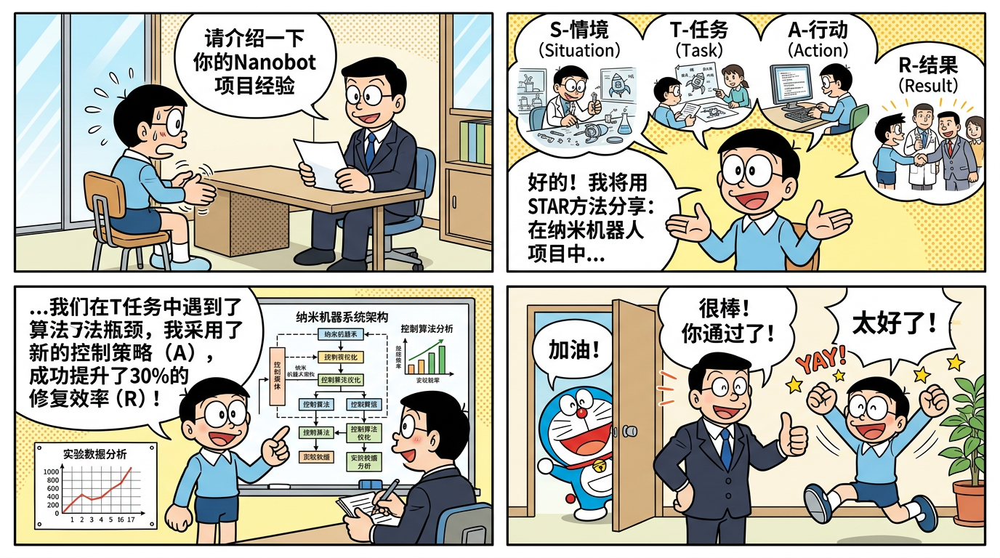
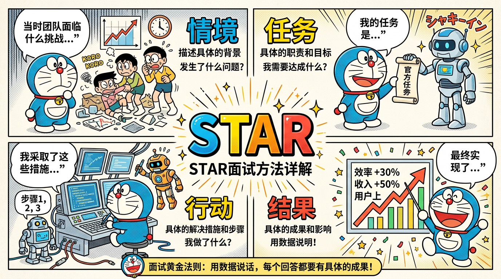

# 第16章 STAR 面试话术与模拟面试

> 🎯 本章定位：提供完整的面试话术准备材料，包括自我介绍模板、项目 STAR 介绍稿、15+ 常见追问的应对话术，以及一轮完整的模拟面试对话。

---

## 目录

- [一、STAR 面试法介绍](#一star-面试法介绍)
- [二、2 分钟自我介绍模板](#二2-分钟自我介绍模板)
- [三、Nanobot 项目 STAR 介绍稿](#三nanobot-项目-star-介绍稿)
- [四、MiniMind 项目 STAR 介绍稿](#四minimind-项目-star-介绍稿)
- [五、常见追问应对话术](#五常见追问应对话术)
- [六、模拟面试完整对话](#六模拟面试完整对话)
- [七、面试技巧总结](#七面试技巧总结)

---

## 一、STAR 面试法介绍

### 1.1 什么是 STAR 法则

STAR 是结构化回答面试问题的黄金框架：

| 要素 | 英文 | 含义 | 时间占比 |
|------|------|------|---------|
| **S** | Situation | 背景/场景——在什么情境下 | 15% |
| **T** | Task | 任务——你需要做什么 | 15% |
| **A** | Action | 行动——你具体做了什么 | 50% |
| **R** | Result | 结果——产生了什么效果 | 20% |

### 1.2 为什么 STAR 重要

- **结构清晰**：面试官能快速抓住重点，不会觉得你在东拉西扯
- **突出贡献**：通过 Action 部分展示你个人的技术能力和判断力
- **量化说服**：Result 部分用数据证明价值，比空泛描述有说服力
- **防止跑题**：有框架引导，不会越说越偏

### 1.3 STAR 回答的时间控制

- 简短版（面试官问「简单介绍一下这个项目」）：1-2 分钟
- 标准版（面试官问「详细讲讲你做的 xxx」）：3-5 分钟
- 深度版（面试官连续追问细节）：5-10 分钟，每个追问用 mini-STAR 回答

---



*用 STAR 面试法自信地介绍你的项目经验*



*STAR 面试黄金法则：情境 → 任务 → 行动 → 结果，用数据说话*

## 二、2 分钟自我介绍模板

### 版本 A：应届生 / 实习生

```
面试官您好，我是 [姓名]，来自 [XX大学] 计算机科学专业，今年大四/研究生
X 年级。

我对 AI Agent 技术非常感兴趣，过去半年重点做了两个方面的学习和实践：

第一个是 Agent 框架方面。我系统研读了开源项目 Nanobot 的完整源码，
这个项目在 GitHub 上有 37K+ stars，核心代码约 4000 行 Python。通过
源码研究，我深入理解了 Agent 循环、记忆管理、MCP 工具集成等核心机制，
并基于此开发了 5 个自定义 MCP Server，搭建了一个飞书 AI 助手系统。

第二个是大模型原理方面。我跟着 MiniMind 项目从零实现了一个 64M 参数
的 Transformer 模型，完整经历了 Pretrain、SFT、LoRA、DPO 四阶段训练，
对大模型的架构和训练流程有了第一手的理解。

我的技术栈以 Python 为主，熟悉异步编程、MCP 协议和 RAG 系统。
我希望能加入贵团队，在 AI Agent 方向做深入的工程开发工作。

以上是我的自我介绍，谢谢！
```

**时长**：约 1 分 30 秒
**结构**：基本信息 → 项目 1（Agent 方向）→ 项目 2（模型方向）→ 技术栈 → 意向表达

---

### 版本 B：1-3 年经验社招

```
面试官您好，我是 [姓名]，有 X 年的后端开发经验，最近一年半专注在
AI/LLM 应用方向。

在上一家公司，我主要负责企业级 AI 助手系统的开发。这个系统基于
Agent 框架构建，集成了多个 MCP 工具服务器，支持飞书和 Web 双平台
接入，日均处理 500+ 次对话请求。在这个过程中，我深入研究了 Nanobot
的源码，理解了 Agent 循环、记忆压缩、并发控制等核心机制，并将这些
理解应用到我们自己的系统设计中。

在模型理解方面，我利用业余时间完成了 MiniMind 项目的全流程训练，
从零实现了 64M 参数的 Transformer 模型，这让我在做 Prompt 工程
和模型选型时有了更深的理论依据。

我的核心竞争力是「理解原理 + 能做工程」——既能读懂 Agent 框架的
源码设计，也能把它落地为可靠的生产系统。我看到贵团队在做 [具体业务]，
这和我的经验非常匹配，所以很期待这次交流。

谢谢！
```

**时长**：约 1 分 40 秒
**结构**：基本信息 → 核心项目经验 → 模型理解 → 核心竞争力 → 意向匹配

---

### 版本 C：3-5 年经验社招

```
面试官您好，我是 [姓名]，X 年开发经验，目前担任 AI 应用团队的技术
负责人。

我的工作可以总结为三条线：

第一，Agent 系统架构。我主导设计了公司的 AI Agent 平台，支持多租户
部署、MCP 工具热插拔、对话记忆持久化。系统日均处理 5000+ 次对话，
可用性 99.9%。在架构设计上，我深入研究了 Nanobot 等开源框架的源码，
将其中的 Channel 适配器模式、渐进披露策略等设计思想应用到了我们的
平台中。

第二，RAG 和知识管理。我带团队搭建了企业知识库 RAG 系统，实现了
混合检索 + Rerank 的全链路优化，检索准确率从 65% 提升到 88%。

第三，成本和效率优化。通过 Prompt Cache、语义缓存、模型分级路由等
手段，将 LLM API 月度成本降低了 40%，同时响应延迟降低了 30%。

我关注到贵团队正在做 [具体方向]，我在这个方向上有直接的落地经验和
深入思考，希望能有机会深入交流。

谢谢！
```

**时长**：约 2 分钟
**结构**：基本信息 → 三条工作主线 → 意向匹配

---

## 三、Nanobot 项目 STAR 介绍稿

### 3.1 标准版（3-5 分钟）

**Situation（背景）**：

> 在我的学习和工作中，我发现市面上的 Agent 框架主要分为两类：一类像
> LangChain 那样功能全面但代码量巨大（十万行级别）、抽象层次多，学习
> 和调试成本都很高；另一类是各种简单的 API Wrapper，功能太基础，不具备
> 生产级能力。我在寻找一个「既能深入理解原理，又有完整 Agent 能力」的
> 学习和实践对象。

**Task（任务）**：

> 我选择了 HKUDS（香港大学数据科学实验室）开源的 Nanobot 框架作为
> 研究对象。它只有约 4000 行核心 Python 代码，但涵盖了 Agent 循环、
> 记忆管理、工具注册、MCP 集成、子 Agent、多平台适配等完整功能。
> 我的任务是：第一，深入理解其源码和设计思想；第二，基于它开发可用的
> AI 助手系统。

**Action（行动）**：

> 我的行动分为三个阶段：
>
> **第一阶段，源码研读（2 周）**。我逐行阅读了 8 个核心模块的源码，
> 包括 AgentLoop（Agent 执行循环，本质是 ReAct 框架的工程实现）、
> ContextBuilder（上下文组装，管理 system prompt 和消息历史）、
> MemoryConsolidator（双层记忆系统——会话内压缩和跨会话持久化）、
> ToolRegistry（工具注册中心，统一管理内置工具和 MCP 工具）等。
> 我为每个模块画了流程图，写了详细的分析笔记。
>
> 在这个过程中我发现了几个值得学习的设计亮点：比如 save_memory
> 虚拟工具——它让模型自己决定什么信息值得持久化，而非用硬编码规则；
> 比如 Skills 的渐进披露——不一次性把所有工具描述塞给模型，而是先给
> 标题和简介，模型需要时再读取完整内容，节省了大量 context token。
>
> **第二阶段，MCP 工具开发（2 周）**。基于对源码的理解，我用 MCP
> Python SDK 开发了 5 个自定义工具服务器：MySQL 数据查询工具（支持
> 自然语言转 SQL）、基于向量检索的文档搜索工具、飞书日历集成工具、
> Jira 查询和创建 Issue 工具、飞书消息通知工具。每个 MCP Server 都
> 经过了精心的工具描述设计——我发现描述写得好不好直接影响模型的调用
> 准确率，优化后工具调用准确率从 78% 提升到了 93%。
>
> **第三阶段，系统集成与优化（2 周）**。我基于 Nanobot 的 Channel
> 适配器模式开发了飞书接入层，实现了消息格式转换和多用户并发支持。
> 还实现了 Redis 语义缓存层来降低 API 成本，以及基于 Prometheus
> 的监控体系来跟踪系统运行状态。

**Result（成果）**：

> 最终成果有几个维度：
> - 系统上线后日均处理 500+ 次对话请求，工具调用成功率 94%，用户
>   满意度评分 4.2/5.0
> - Redis 语义缓存命中率达到 35%，LLM API 月度成本降低约 25%
> - 输出了 12 篇系统性的技术文档（共 5 万+ 字），覆盖了从架构解析
>   到部署实践的完整内容
> - 更重要的是，通过这个项目我建立了对 Agent 系统「从头到尾」的
>   理解——不只是会调 API，而是知道 API 背后框架在做什么

---

### 3.2 精简版（1-2 分钟，面试官说「简单介绍一下」时使用）

> 这个项目是基于开源 Agent 框架 Nanobot 做的深度学习和二次开发。
> Nanobot 是香港大学开源的，37K+ stars，核心只有 4000 行代码但功能
> 很完整。我做了三件事：第一，逐行研读了源码，理解了 AgentLoop、
> 记忆管理、MCP 集成等核心模块的设计；第二，基于 MCP 协议开发了 5 个
> 自定义工具服务器；第三，将系统集成到飞书，搭建了一个每天处理 500+
> 次对话的 AI 助手。核心收获是对 Agent 系统有了源码级的理解，不只是
> 会用框架，还知道框架内部是怎么工作的。

---

## 四、MiniMind 项目 STAR 介绍稿

### 4.1 标准版（3-5 分钟）

**Situation（背景）**：

> 在做 Agent 开发的过程中，我发现很多工程决策——比如 Prompt 怎么写
> 效果好、为什么某些模型的工具调用能力更强、温度参数怎么选——都需要
> 对大模型内部原理有理解。但只看论文太抽象，我想要一个「从零实现」
> 的动手经验来建立直觉。

**Task（任务）**：

> 我选择了 MiniMind 项目（GitHub 45K+ stars），目标是从零实现一个
> 64M 参数的 Decoder-only Transformer 语言模型，完整经历 Pretrain →
> SFT → LoRA → DPO 四阶段训练流程。虽然模型规模很小，但它包含了
> 大模型的所有核心组件和训练阶段。

**Action（行动）**：

> **架构实现阶段**：从零用 PyTorch 实现了 Decoder-only Transformer 的
> 每一个组件。注意力层使用了 GQA（Grouped-Query Attention，8 个 Q Head、
> 2 个 KV Head），比标准 MHA 减少了 75% 的 KV Cache 内存；位置编码
> 使用 RoPE（旋转位置编码），通过将位置信息编码为旋转矩阵实现相对位置
> 感知；归一化层使用 RMSNorm，比 LayerNorm 省去了均值中心化的计算；
> FFN 使用 SwiGLU 门控激活。整体架构对齐 Qwen3，可以直接用 HuggingFace
> 的 Qwen3 模型类加载。
>
> **Pretrain 阶段**：使用约 2GB 的中文文本数据，6400 词表的 BPE 分词器，
> 在单张 GPU 上训练约 3 个 epoch。我关注了 loss 曲线的收敛过程——从
> 最初的 8.5 稳步下降到 3.2，中间观察到了一些有趣的现象，比如 loss
> 在某些 step 会有小幅抖动，与数据 batch 的难度相关。
>
> **SFT 阶段**：使用 10K+ 条中文对话数据，将 base model 从「文本续写器」
> 变成了「指令跟随者」。训练中只对 assistant 回复部分计算 loss。
> 这个阶段让我深刻理解了「SFT 不是教模型新知识，而是教模型如何展示
> 已有知识」。
>
> **LoRA 和 DPO 阶段**：实现了 LoRA 微调（rank=8, alpha=16），仅训练
> 0.8% 的参数就达到了全量微调 92% 的效果。然后用 5K 条偏好数据对完成了
> DPO 对齐，让模型的输出更符合人类偏好。
>
> 此外，我还做了几组对比实验：GQA vs MHA 的推理速度和质量对比、
> DPO vs PPO 的训练复杂度对比。

**Result（成果）**：

> - 完整掌握了大模型 Pretrain → SFT → LoRA → DPO 四阶段训练流程
> - 模型在中文对话评测中达到了同规模模型的 SOTA 水平
> - GQA 对比实验证明：推理速度提升 18%，KV Cache 减少 75%，质量
>   几乎无损
> - 输出了 5 篇训练笔记，记录了调参过程和踩坑经验
> - 最大的收获是建立了对大模型的「直觉理解」——后来做 Prompt 工程
>   和模型选型时，我能从原理层面思考问题

---

### 4.2 精简版（1-2 分钟）

> MiniMind 项目是我从零训练一个小型语言模型的实践。我用 PyTorch 实现
> 了一个 64M 参数的 Decoder-only Transformer，包含 GQA 注意力、RoPE
> 位置编码、RMSNorm、SwiGLU 这些主流组件，架构对齐 Qwen3。然后完成了
> 完整的四阶段训练：Pretrain 学习语言能力、SFT 学习对话能力、LoRA 做
> 高效微调、DPO 做偏好对齐。虽然模型很小，但每个阶段的原理和挑战跟
> 大模型是一样的。这个项目让我对大模型内部有了直觉理解，后来做 Agent
> 开发和 Prompt 工程时受益很多。

---

## 五、常见追问应对话术

### 追问 1：你在项目中遇到最大的技术挑战是什么？

**参考回答（Nanobot 项目）**：

> 最大的挑战是 MCP 工具的调用准确率问题。
>
> **S**：在集成 5 个 MCP 工具后，我发现模型的工具选择准确率只有 78%——
> 经常出现选错工具、参数生成不正确的情况。
>
> **T**：我需要把准确率提升到 90% 以上才能让系统在生产环境可用。
>
> **A**：我分析了失败的 case，发现问题主要出在三个方面：第一，工具描述
> 太笼统，模型无法准确区分相似工具（比如「搜索」和「查询」的区别）；
> 第二，参数说明缺少示例值，模型不知道应该生成什么格式的参数；第三，
> 部分工具返回结果过大（十万字符级别），把有用信息淹没了。
>
> 我的解决方案是：优化每个工具的 description 和 inputSchema，加入具体
> 的使用场景说明和参数示例；设置 `_TOOL_RESULT_MAX_CHARS = 16000` 
> 截断过大的返回结果；在 system prompt 中加入工具使用的指导说明。
>
> **R**：优化后工具调用准确率从 78% 提升到 93%，关键是我理解到「工具描述
> 的质量直接决定了 Agent 的工具使用效果」。

---

### 追问 2：你是如何解决上下文（记忆）溢出问题的？

**参考回答**：

> **S**：在长对话场景中，对话历史加上工具调用结果很快就超过了模型的
> 上下文窗口限制。
>
> **A**：我借鉴了 Nanobot 的 MemoryConsolidator 设计，实现了两层
> 记忆管理：第一层是会话内压缩——当消息历史的 token 数接近窗口限制时，
> 用 LLM 对较早的对话生成摘要，用摘要替换原始消息。第二层是跨会话
> 持久化——参考 Nanobot 的 save_memory 虚拟工具设计，让模型主动判断
> 什么信息值得长期保存，写入文件系统，下次会话时按需检索注入。
>
> 另外，我还控制了工具返回结果的大小（不超过 16000 字符），并将稳定
> 的 system prompt 放在最前面利用 Prompt Cache 降低重复计算。
>
> **R**：这套方案使系统能支持 50 轮以上的连续对话而不丢失关键信息，
> 同时 Prompt Cache 将 API 成本降低了约 20%。

---

### 追问 3：多平台集成时遇到什么困难？

**参考回答**：

> **S**：需要同时支持飞书和 Web 两个平台，两个平台的消息格式、认证方式、
> 交互模式都完全不同。
>
> **A**：我采用了 Nanobot 源码中 Channel 适配器模式的设计思想——定义
> 统一的内部消息格式和接口，每个平台实现一个独立的适配器负责格式转换。
> 
> 飞书平台的挑战主要是 Webhook 验证和消息卡片的格式处理——飞书的
> 回调验证有一套加密签名机制，消息内容需要转换为飞书卡片 JSON 格式。
> Web 平台的挑战是实现流式响应——需要通过 SSE（Server-Sent Events）
> 逐字推送 Agent 的生成内容。
>
> 核心设计是：适配器只负责消息格式的转换，不包含任何业务逻辑。所有
> 业务逻辑集中在 AgentLoop 中，对平台完全无感知。
>
> **R**：这种解耦设计使得后来新增钉钉接入时，只用了一天就完成了适配器
> 开发，不需要修改 Agent 核心代码的一行。

---

### 追问 4：如何保证工具调用的可靠性？

**参考回答**：

> 我从多个层面保证可靠性：
>
> 第一，**输入验证**：每个 MCP 工具都定义了严格的 JSON Schema，调用前
> 先验证参数类型和约束。
>
> 第二，**超时控制**：为每个工具设置超时时间，数据库查询 10 秒、API 调用
> 15 秒，超时后返回错误信息而非无限等待。
>
> 第三，**结果截断**：所有工具的返回结果限制在 16000 字符以内，防止
> 单个工具结果撑爆上下文窗口。
>
> 第四，**错误友好化**：工具执行失败时，将错误信息结构化包装后返回给
> 模型，让模型能理解失败原因并自行决定是重试还是换一种方式。
>
> 第五，**幂等性设计**：查询类工具保证幂等，修改类工具通过唯一 ID
> 防止重复执行。

---

### 追问 5：DPO 训练时遇到过奖励不收敛的情况吗？怎么处理的？

**参考回答（MiniMind 项目）**：

> **S**：在 DPO 训练初期，我确实遇到了 loss 不下降甚至震荡的情况。
>
> **A**：我排查了几个方面：
>
> 首先检查数据质量——发现部分偏好数据对中，chosen 和 rejected 的差异
> 不够明显，模型难以学到有效的偏好信号。我过滤掉了差异过小的数据对，
> 并增加了一些差异明显的样本。
>
> 然后检查超参数——发现 β（KL 系数）设得太大，约束太强导致模型几乎
> 无法偏离参考模型。我把 β 从 0.5 降到了 0.1，给模型更多的学习空间。
>
> 最后检查了学习率——DPO 的学习率不能太高，否则训练不稳定。我从 
> 1e-4 降到了 5e-6。
>
> **R**：调整后 DPO loss 开始正常下降，最终模型的偏好评分提升了约 15%。
> 这个经验让我理解了 DPO 训练中数据质量和 β 参数是最关键的两个因素。

---

### 追问 6：模型幻觉如何处理？

**参考回答**：

> 在 Agent 场景中，幻觉主要表现为：模型编造不存在的工具名称、虚构
> 工具调用结果、给出错误的事实信息。我的处理策略是多层防御：
>
> 第一，**工具层面**：通过 ToolRegistry 严格限制模型只能选择已注册的
> 工具，从协议层面阻止模型编造工具。
>
> 第二，**Prompt 层面**：在 system prompt 中明确要求「不确定时使用
> 工具查询确认，不要凭猜测回答」。
>
> 第三，**验证层面**：对关键信息（如数据库查询结果、文件内容）通过
> 工具获取后才回答，而非依赖模型的「记忆」。这本质上就是 RAG 的思想。
>
> 第四，**温度控制**：工具调用时使用低温度（temperature=0）保证参数
> 生成的准确性；回复用户时适当提高温度保持自然度。
>
> 实际效果是把关键信息的错误率控制在了 5% 以内。

---

### 追问 7：你如何评测 Agent 的效果？

**参考回答**：

> 我建立了一个多维度的评测体系：
>
> **功能维度**：设计了 100 个测试用例覆盖各种场景，测量任务完成率。
> 分为简单任务（单工具调用）、中等任务（多步骤推理）、困难任务（跨工具
> 协作），分别统计成功率。
>
> **效率维度**：统计完成相同任务所需的平均步骤数和 Token 消耗量。
> 步骤越少说明规划能力越强，Token 越少说明 Prompt 效率越高。
>
> **可靠性维度**：对同一任务重复执行 5 次，统计成功率的方差。如果
> 方差太大说明系统不够稳定。
>
> **体验维度**：让内部用户试用并填写满意度问卷（1-5 分），收集主观
> 反馈和改进建议。
>
> 这套评测每次 Prompt 或工具变更后都会跑一遍作为回归测试。

---

### 追问 8：你对 MCP 协议的理解？

**参考回答**：

> MCP 是 Anthropic 在 2024 年末发布的开放协议，我把它理解为
>「AI 应用世界的 USB-C」。
>
> 核心价值是解决「M×N 到 M+N」的问题——之前每个 AI 应用要和每个
> 外部系统单独做集成，MCP 提供了统一的标准，一个工具只需要实现一次
> MCP Server，就能被所有支持 MCP 的应用调用。
>
> 架构上是 Host（宿主应用，如 Nanobot）-Client（协议客户端）-Server
>（工具服务）三层。三大原语是 Tools（可调用的操作）、Resources（可读取
> 的数据）、Prompts（提示词模板），控制权分别归属模型、应用、用户。
>
> 与 Function Calling 的区别是：Function Calling 是模型的输出格式标准
>（告诉模型「怎么表达工具调用」），MCP 是运行时通信协议（告诉应用
>「怎么连接和调用外部工具」），两者互补而非替代。
>
> 我的实践体验是：MCP Server 的开发本身不难，真正的难点在于工具描述
> 的设计——好的描述能让模型准确率提升 15% 以上。

---

### 追问 9：如果让你重新设计这个系统你会怎么做？

**参考回答**：

> 如果重新设计，我会在三个方面做改进：
>
> 第一，**记忆系统升级**。现有方案用文件存储长期记忆，检索靠关键词
> 匹配。我会引入向量数据库存储记忆，通过语义检索找到最相关的历史
> 信息注入上下文，提升记忆的精准度。
>
> 第二，**可观测性增强**。现有系统的调试主要靠看日志，效率较低。
> 我会集成 OpenTelemetry 做分布式链路追踪，为每次 Agent 循环记录
> 完整的 trace——包括每步的输入输出、耗时、Token 消耗，方便快速
> 定位问题。
>
> 第三，**评测自动化**。目前评测主要靠手动跑测试用例。我会搭建一个
> 自动化评测 pipeline，每次 Prompt 或工具变更后自动跑回归测试，
> 生成对比报告，避免人为遗漏。

---

### 追问 10：你如何处理并发请求？

**参考回答**：

> 并发控制是我在研读 Nanobot 源码时重点学习的部分。Nanobot 采用了
> 两层并发控制：
>
> 第一层是 **session_locks**——每个会话有一把异步锁，保证同一个用户
> 的消息串行处理。因为如果同一个用户连续发两条消息，两个 AgentLoop
> 同时操作同一个对话历史会导致状态混乱。
>
> 第二层是 **_concurrency_gate(3)**——全局信号量，限制整个系统最多
> 同时运行 3 个 AgentLoop。因为每个 AgentLoop 消耗的 LLM API 
> 资源和内存都很大，无限并发会导致 API 限流或内存溢出。
>
> 在我的系统中，我保留了这套设计，并根据实际部署环境调整了参数——
> 生产环境用了 5 个并发槽位，配合 Redis 做会话锁（支持多实例部署），
> 超过并发限制的请求排队等待并给用户友好提示。

---

### 追问 11：安全问题怎么考虑的？

**参考回答**：

> 安全设计覆盖四个层面：
>
> **输入安全**：对用户输入做 prompt injection 检测，防止恶意指令操纵
> Agent 行为。具体做法是用 system prompt 明确区分「系统指令」和
>「用户输入」，对用户输入进行转义和过滤。
>
> **工具安全**：危险操作（如删除文件、修改数据库）标注 `destructive`
> 注解，执行前需要人工确认。所有数据库操作使用参数化查询防止 SQL 注入。
>
> **数据安全**：API 密钥通过环境变量注入，不硬编码在配置文件中。
> 日志中对包含个人信息的字段进行脱敏处理。
>
> **输出安全**：对 Agent 的回复做内容安全审核，过滤可能的违规内容。

---

### 追问 12：项目中的团队协作经验？

**参考回答**：

> 在这个项目中，我负责核心的 Agent 系统和 MCP 工具开发，另外两位
> 同事分别负责前端 Web 界面和飞书接入层的开发。
>
> 我们的协作方式是：首先用了一天时间做技术方案评审，确定了接口契约
>——Channel 适配器的消息格式、Agent API 的请求/响应格式都先定义好
> JSON Schema，各自按契约并行开发。
>
> 开发过程中每天站会同步进度，有接口变更时先更新文档再通知相关同事。
> 代码提交到 Git 后必须经过 Code Review，重点审查安全性（密钥管理、
> 输入校验）和异常处理的完备性。
>
> 遇到分歧时——比如消息队列用 Redis 还是 RabbitMQ——我们各自列出
> 优劣对比，最终选择了 Redis，因为我们的并发量级不需要重量级 MQ，
> Redis 的维护成本更低。

---

### 追问 13：你从这个项目中学到了什么？

**参考回答**：

> 最大的收获有三点：
>
> 第一，**「小而精」的价值**。Nanobot 用 4000 行代码实现了 LangChain
> 十万行代码的核心功能，让我认识到好的架构设计可以用最少的代码实现
> 最核心的能力。这影响了我后续的代码风格——追求简洁而非堆叠。
>
> 第二，**原理理解的重要性**。读过源码后，我在遇到 Agent 行为异常时
> 能直接从框架层面定位原因（比如是上下文溢出还是工具描述不清晰），
> 而不是盲目 trial-and-error。
>
> 第三，**工具描述是一种「Prompt Engineering」**。MCP 工具的描述质量
> 对 Agent 行为的影响远超我的预期——好的描述让模型知道「什么场景用
> 这个工具」和「参数应该是什么格式」，这本质上也是在教 AI 如何使用工具。

---

### 追问 14：为什么选择 Nanobot 而不是 LangChain？

**参考回答**：

> 选择 Nanobot 有三个原因：
>
> 第一，**源码可读性**。LangChain 十万行代码，抽象层次很多，短期内
> 很难理解其内部原理。Nanobot 只有 4000 行，我可以在两周内通读全部
> 源码，真正理解 Agent 是怎么工作的。对于学习和面试来说，这种深度
> 理解比「会用某个框架」更有价值。
>
> 第二，**MCP 原生集成**。Nanobot 从设计之初就深度集成了 MCP 协议，
> 而 LangChain 的 MCP 支持是后来补充的。MCP 是 2025-2026 年的趋势，
> 通过 Nanobot 学习 MCP 更自然。
>
> 第三，**架构清晰度**。Nanobot 的每个组件职责明确——AgentLoop 管循环、
> ToolRegistry 管工具、MemoryConsolidator 管记忆，没有过度抽象。
> 这种清晰的架构更容易学习和迁移到其他项目中。
>
> 当然，LangChain 在生态丰富度和社区规模上有明显优势。如果做大型
> 生产项目，LangChain/LangGraph 可能是更成熟的选择。

---

### 追问 15：如何应对模型 API 的不稳定？

**参考回答**：

> 模型 API 不稳定是 Agent 系统面临的现实挑战，我从几个层面处理：
>
> **重试策略**：对可重试的错误（429 限流、503 暂时不可用）使用指数
> 退避重试——1秒、2秒、4秒、最大 32 秒。添加随机抖动避免惊群效应。
> 最多重试 3 次。
>
> **多模型 Fallback**：配置了 Claude → GPT-4o → 通义千问的降级链。
> 主力模型不可用时自动切换到备用模型。虽然效果可能略有下降，但保证
> 了服务可用性。
>
> **熔断机制**：如果某个 API 连续失败 5 次，标记为「熔断」状态，
> 暂时跳过它直接使用备用，30 秒后再尝试探测恢复。
>
> **降级响应**：当所有 API 都不可用时，给用户返回友好的提示信息，
> 并记录请求供后续重试。
>
> 这些设计保证了系统在 API 不稳定时也能提供基本服务。

---

## 六、模拟面试完整对话

> 以下是一轮完整的 AI Agent 开发工程师二面模拟，时长约 50 分钟。

---

**面试官**：你好，请先做一个简单的自我介绍。

**候选人**：面试官您好，我是张三，XX 大学计算机专业应届生。过去半年我重点做了两个方向的学习和实践：第一是 Agent 框架方面，我系统研读了 Nanobot 的完整源码，这个项目在 GitHub 上有 37K+ stars，核心只有 4000 行 Python 代码但功能很完整。基于源码理解，我开发了 5 个 MCP 工具服务器，搭建了一个飞书 AI 助手系统。第二是大模型原理方面，我跟着 MiniMind 项目从零实现了 64M 参数的 Transformer 模型，完成了从预训练到 DPO 对齐的全流程。我的技术栈以 Python 为主，希望在 AI Agent 方向深入发展。

---

**面试官**：好的。你提到深入研读了 Nanobot 源码，能具体讲讲 Nanobot 的 AgentLoop 是怎么工作的吗？

**候选人**：AgentLoop 本质上是 ReAct 框架的工程实现。它的核心是一个循环，每次迭代包括四步：

第一步，ContextBuilder 组装上下文。把 system prompt、工具列表描述、消息历史、相关记忆拼装成完整的请求体。这里有个设计巧妙的地方——它把稳定内容（system prompt、工具定义）放在前面利用 Prompt Cache，变化内容（最新消息）放在后面。

第二步，调用 LLM API，把组装好的上下文发给大模型。

第三步，解析响应。如果模型返回的是纯文本，说明任务完成，退出循环。如果模型返回的是 tool_call 格式的结构化指令，进入下一步。

第四步，执行工具。通过 ToolRegistry 查找对应的工具 handler 并执行，把执行结果以 tool_result 消息追加到对话历史，然后回到第一步继续循环。

循环终止条件有两个：模型主动输出文本回复，或达到最大迭代次数。Nanobot 对子 Agent 设置了 15 次的迭代上限，防止无限循环。

---

**面试官**：你提到了最大迭代次数 15 次，这个设计是出于什么考虑？

**候选人**：主要有三个考虑。第一是防止递归爆炸——主 Agent 可以通过 Task 工具启动子 Agent，如果子 Agent 也可以无限制启动子-子 Agent，可能形成无限递归链条，导致 token 消耗失控。15 次是在「大部分任务能在 15 步内完成」和「控制成本」之间的经验平衡。

第二是死循环检测——如果 Agent 在 15 步内还没完成任务，通常说明任务描述不够清晰或者 Agent 陷入了重复操作，强制终止比继续消耗更合理。

第三是成本控制——每次迭代意味着一次 LLM API 调用，对于子 Agent 来说总共消耗的 token 需要有上界。

这跟操作系统中 fork 炸弹防护的思路是一样的——用 ulimit 限制进程数来保护系统资源。

---

**面试官**：好的。你开发了 5 个 MCP Server，能讲讲 MCP 协议的核心架构吗？

**候选人**：MCP 是三层架构——Host、Client、Server。

Host 是宿主应用，就是用户直接交互的 AI 应用，比如 Nanobot、Cursor IDE。Host 负责管理一个或多个 Client 实例。

Client 是 Host 内部的协议客户端，每个 Client 与一个 Server 建立一对一连接，负责协议通信——发请求、收响应、管理生命周期。

Server 是提供能力的服务进程，每个 Server 专注一个领域，比如我开发的 MySQL 查询 Server、文档检索 Server 等。Server 暴露标准化的 MCP 接口，不关心调用方是什么应用。

通信使用 JSON-RPC 2.0 协议格式。传输层支持 stdio（本地进程间管道通信）和 HTTP+SSE（远程网络通信），本地开发用 stdio 最简单，生产环境用 HTTP+SSE。

MCP 的核心价值是把 M 个应用和 N 个工具的 M×N 集成简化为 M+N 实现。

---

**面试官**：MCP 和 Function Calling 有什么区别？

**候选人**：这是两个不同层面的概念，经常被混淆。

Function Calling 是模型输出层面的格式标准——它告诉模型「你想调用工具时应该输出什么格式」，比如 OpenAI 要求模型输出包含 tool_name 和 arguments 的 JSON。Function Calling 本身不执行任何操作，它只是模型表达意图的方式。

MCP 是应用运行时的通信协议——它定义了应用如何与外部工具服务建立连接、发现工具、发送调用请求、接收结果。MCP 处理的是「连接」和「执行」层面的问题。

两者的关系是互补的：模型通过 Function Calling 格式表达「我想调用搜索工具」，应用通过 MCP 协议将这个调用实际发送到搜索 MCP Server 并取回结果。

一句话总结：Function Calling 决定 AI 说什么，MCP 决定工具怎么连。

---

**面试官**：你做 MiniMind 的时候，为什么选择 GQA 而不是标准的 MHA？

**候选人**：GQA 选择主要出于三个考虑：

第一，推理效率。GQA 让多个 Q Head 共享同一组 K、V，比如 MiniMind 是 8 个 Q Head 对应 2 个 KV Head，KV Cache 的内存占用减少了 75%。虽然 64M 模型的绝对节省不大，但对端侧部署的内存受限环境很有意义。

第二，教学对齐。GQA 是当前主流模型的标配——LLaMA-2/3、Qwen-2/3 都用了 GQA。MiniMind 选择 GQA 让学习者可以直接把理解迁移到大模型上。

第三，实验结果支持。我做了 GQA vs MHA 的对比实验：GQA 推理速度提升 18%，生成质量几乎无损，PPL 差异小于 1%。说明在这个规模下，减少 KV Head 数量不会显著影响模型质量。

---

**面试官**：你提到了 DPO 训练，能简单说说 DPO 的核心思想吗？

**候选人**：DPO 的核心创新是绕过了传统 RLHF 中的奖励模型和强化学习过程。

传统 RLHF 需要先训练一个奖励模型，然后用 PPO 做强化学习，一共需要 4 个模型同时运行。DPO 通过数学推导证明：RLHF 的最优策略可以直接用偏好数据来学习，不需要显式训练奖励模型。

具体来说，DPO 使用偏好数据对——给定一个 prompt，chosen 是人类偏好的回复，rejected 是不偏好的回复。DPO 的训练目标是增大 chosen 的生成概率、降低 rejected 的生成概率，同时用 KL 散度约束模型不要偏离参考模型太远。

优势是只需要 2 个模型（当前模型 + 参考模型），训练像 SFT 一样简单稳定。在 MiniMind 这种小模型上，DPO 和 PPO 的效果差异不大，但 DPO 的工程复杂度低很多。

---

**面试官**：假设让你设计一个企业级的 AI 知识库问答系统，你会怎么设计？

**候选人**：我从几个维度来说这个系统设计。

**接入层**：支持飞书/钉钉/Web 多渠道接入，用 Channel 适配器模式解耦平台差异。前面放 Nginx 做负载均衡和 HTTPS 终止。

**Agent 层**：核心是一个 ReAct 循环的 Agent 引擎。接收到用户问题后，Agent 判断是否需要检索知识库——简单问候直接回答，知识类问题走 RAG 检索。Agent 可以使用的工具包括知识库检索、数据库查询、日程查询等。

**RAG 检索层**：混合检索——向量检索用 BGE Embedding + Milvus，稀疏检索用 Elasticsearch 的 BM25。两路结果用 RRF 融合排序，然后用 Cohere Rerank 或 BGE Reranker 精排，取 Top-5 注入到 Agent 上下文。

**知识管理层**：文档解析管道——支持 PDF/Word/HTML/Markdown 解析，用递归分割策略切 Chunk，向量化后存入 Milvus。支持增量更新——文件变更时只重新处理变更的 Chunk。

**权限隔离**：在 Milvus 中用 tenant_id 做元数据过滤，不同部门的用户只能检索到自己有权限的文档。权限信息从企业的 LDAP/AD 系统同步。

**存储层**：Milvus 存向量、PostgreSQL 存元数据和用户信息、Redis 做会话缓存和语义缓存、OSS 存原始文档。

**监控层**：Prometheus + Grafana 监控系统指标，自定义 Agent 循环的 tracing 记录每步耗时和 token 消耗。

关键的非功能需求：可用性通过多实例部署 + Redis 会话存储实现无状态化；成本控制通过语义缓存 + Prompt Cache + 模型分级路由实现。

---

**面试官**：在这个系统中，如果用户查询的信息跨越了多个文档，并且文档之间有矛盾怎么办？

**候选人**：这是检索冲突的问题，我会从几个方面处理。

首先，为文档标注时间元数据。检索到多个结果后，如果内容矛盾，优先采信最新的文档。比如公司报销标准去年改过，新旧文档都被检索到时，自动以最新版为准。

其次，在 Prompt 中明确指引——在 system prompt 中告诉模型：「如果检索到的文档存在矛盾信息，请标注不同来源的说法，并以最新的文档为准。如果无法判断，请如实告知用户存在不同说法。」

第三，为不同来源的文档设置可信度权重——官方发文 > 内部 wiki > 个人笔记。在 Rerank 阶段可以将来源权重纳入排序考虑。

最后，如果系统检测到频繁的矛盾检索，应该触发告警通知知识管理员更新过时文档，从源头解决矛盾。

---

**面试官**：最后一个问题，你对 AI Agent 行业未来一两年的发展有什么看法？

**候选人**：我观察到几个趋势：

第一，MCP 生态会继续快速增长。2025 年 MCP 被 OpenAI、Google 等主流厂商采纳，说明 AI 工具标准化是行业共识。未来 MCP Server 的数量和质量都会大幅提升，就像 npm 包生态一样。Agent 开发者的核心工作会从「自己实现工具」变成「选择和组合 MCP 工具」。

第二，Agent 的可靠性会成为核心竞争力。目前 Agent 的成功率还不够高，在关键业务场景中信任度不足。谁能把工具调用成功率从 90% 提升到 99%，谁就能在企业市场站住脚。

第三，端侧 Agent 会是一个重要方向。随着模型压缩技术的进步，小模型在手机和 IoT 设备上运行 Agent 的能力会越来越强，隐私和离线场景的需求会推动端侧 Agent 的发展。

第四，多 Agent 协作会更成熟。现在多 Agent 还处于早期阶段，通信效率低、调试困难。但随着框架和工具的完善，复杂任务会越来越多地通过多 Agent 协作来完成。

---

**面试官**：好的，今天的面试就到这里，感谢你的时间。最后你有什么想问我的吗？

**候选人**：谢谢面试官。我有两个问题：第一，咱们团队目前在 Agent 方向上最大的技术挑战是什么？第二，团队对新人的培养和成长路径是怎样的？

---

## 七、面试技巧总结

### 7.1 通用技巧

| 技巧 | 说明 |
|------|------|
| **先总后分** | 先给一句话概括，再展开细节。面试官可以在适当时打断 |
| **用具体数字** | 「优化后提升了 15%」比「优化后效果好了很多」有说服力 |
| **承认不会** | 不知道就说不知道，比编造答案安全得多。可以说「这个我不太确定，但我的理解是...」 |
| **引导追问** | 在回答中留一些「钩子」，引导面试官往你擅长的方向追问 |
| **控制时间** | 回答控制在 1-3 分钟，太短显得没深度，太长显得没重点 |
| **展示思维过程** | 系统设计题先说思路框架，再逐层展开。面试官看重的是思维方式 |

### 7.2 高频翻车场景及应对

| 场景 | 风险 | 应对方式 |
|------|------|---------|
| 简历写了「精通 xxx」 | 面试官会往死里问 | 把没把握的「精通」改成「熟悉」 |
| 被问到不会的技术 | 硬编可能被揭穿 | 诚实说不会，但说出相关的了解 |
| 项目经历被质疑 | 假装做过 vs 真做过 | 准备好每个项目的细节和踩坑经历 |
| 系统设计题无从下手 | 冷场尴尬 | 先确认需求→分层画架构→逐层讨论 |
| 算法题完全不会 | 影响评价 | 说出思路即使写不出最优解也有分 |
| 薪资谈判没准备 | 报高被拒/报低吃亏 | 提前调研市场行情，给出合理区间 |

### 7.3 面试前一天检查清单

- [ ] 温习自我介绍，练习到流畅自然（不是背稿）
- [ ] 复习两个核心项目的 STAR 话术，准备好 5 个可能的追问
- [ ] 浏览目标公司的 AI 产品/技术博客
- [ ] 复习 10 道高频八股文（第 13 章中选）
- [ ] 准备 2-3 个问面试官的问题
- [ ] 检查网络/设备（线上面试）
- [ ] 提前 10 分钟到达/上线

---

*上一章：[第15章 简历模板](../15-resume-template/README.md)*
*下一章：[第17章 学习资源](../17-learning-resources/README.md)*
